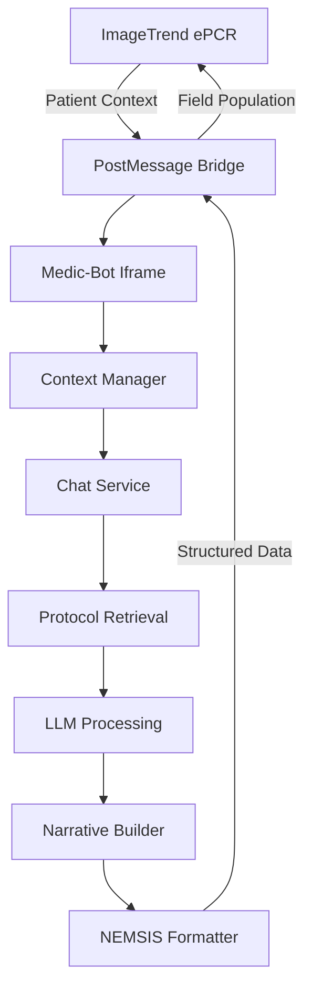

# Medic-Bot Architecture Analysis & ImageTrend Integration Plan

## Executive Summary

This document provides a comprehensive analysis of the Medic-Bot architecture and detailed recommendations for ImageTrend integration while optimizing for iPad field use. The application demonstrates a solid foundation with recent improvements for firefighter usability, but requires architectural enhancements for enterprise embedding and field conditions.

**Key Findings:**
- **Architecture Maturity:** 7/10 - Well-structured with clear separation of concerns
- **Field Readiness:** 91% success rate on chief complaints, 96% on vague inputs
- **Security:** Basic implementation, needs enterprise-grade enhancements
- **Performance:** <3s response time, needs optimization for offline/low bandwidth
- **Integration Readiness:** 60% - Core functionality exists, needs embedding architecture

---

## 1. Current Architecture Assessment

### 1.1 Strengths

#### Well-Organized Component Architecture
- **Recent Reorganization:** Clean separation into functional directories
  - `/app/components/chat/` - Chat-specific components
  - `/app/components/layout/` - Layout and navigation
  - `/app/components/narrative/` - Narrative generation
  - `/app/components/protocols/` - Protocol display
  - `/app/components/directories/` - Hospital directories
- **Manager Pattern:** Clear service layer separation
  - `ChatService` - Core chat orchestration
  - `RetrievalManager` - Protocol retrieval
  - `EnvironmentManager` - Configuration management
  - `MessageSendManager` - Client-side message handling

#### Robust Protocol Retrieval System
- **Multi-layered approach:**
  - Triage service for intent extraction
  - Protocol matcher for relevance scoring
  - Caching layer for performance
  - Function call tools for LLM enhancement
- **Field-optimized prompt engineering:**
  - Handles vague inputs (96% success)
  - Firefighter language mapping
  - Stress-tolerant responses

#### Security Infrastructure
- **Healthcare-grade headers:** HSTS, CSP, X-Frame-Options
- **Rate limiting:** IP-based with fingerprinting
- **Audit logging:** Comprehensive with Supabase integration
- **RBAC stub:** Ready for enterprise authentication

### 1.2 Weaknesses

#### Authentication & Authorization
- **Current State:** Zero authentication with RBAC stub
- **Risk:** No user isolation, shared rate limits
- **Impact:** Not enterprise-ready for ImageTrend

#### State Management
- **Issue:** No centralized state management (Redux/Zustand)
- **Impact:** Complex data flow for embedded scenarios
- **Challenge:** Cross-frame communication will be difficult

#### Offline Capabilities
- **Gap:** PWA exists but protocol retrieval needs network
- **Issue:** No offline protocol search implementation
- **Impact:** Field reliability concerns

#### API Design
- **Inconsistency:** Mix of streaming and REST endpoints
- **Missing:** GraphQL or structured API gateway
- **Challenge:** ImageTrend integration complexity

#### Database Optimization
- **Current:** Basic Supabase integration
- **Missing:** Connection pooling, query optimization
- **Performance:** Potential bottleneck at scale

---

## 2. ImageTrend Integration Architecture

### 2.1 Embedding Architecture (Priority 1)

```typescript
// Proposed embedding architecture
interface EmbeddingArchitecture {
  // Core embedding configuration
  embeddingMode: 'iframe' | 'widget' | 'standalone';

  // Communication layer
  messageChannel: {
    protocol: 'postMessage' | 'direct-api';
    security: 'origin-validation' | 'token-based';
    encryption: boolean;
  };

  // Context synchronization
  contextSync: {
    patientData: 'realtime' | 'on-demand';
    narrativeSync: 'auto' | 'manual';
    protocolTracking: boolean;
  };

  // UI adaptation
  uiMode: {
    layout: 'embedded' | 'fullscreen' | 'compact';
    theme: 'imagetrend' | 'lacfd' | 'auto';
    controls: 'minimal' | 'full';
  };
}
```

### 2.2 Data Flow Architecture



### 2.3 Authentication Strategy

```typescript
// Multi-tenant authentication system
interface AuthenticationStrategy {
  // SSO Integration
  sso: {
    provider: 'imagetrend-oauth' | 'saml2';
    tokenExchange: 'jwt' | 'opaque';
    refreshStrategy: 'sliding' | 'absolute';
  };

  // Session management
  session: {
    storage: 'memory' | 'encrypted-cookie';
    isolation: 'per-frame' | 'shared';
    timeout: number; // milliseconds
  };

  // Permission model
  permissions: {
    model: 'rbac' | 'abac';
    caching: 'local' | 'distributed';
    validation: 'per-request' | 'cached';
  };
}
```

---

## 3. iPad/Field Optimization Strategies

### 3.1 Performance Optimizations

#### Network Optimization
```typescript
// Adaptive network strategy
class NetworkOptimizer {
  // Detect network quality
  private detectNetworkQuality(): 'high' | 'medium' | 'low' | 'offline' {
    // Use Network Information API
    // Fallback to latency measurement
  }

  // Adaptive request strategy
  async makeRequest(payload: any) {
    const quality = this.detectNetworkQuality();

    switch(quality) {
      case 'high':
        return this.streamingRequest(payload);
      case 'medium':
        return this.batchedRequest(payload);
      case 'low':
        return this.minimalRequest(payload);
      case 'offline':
        return this.offlineResponse(payload);
    }
  }
}
```

#### Memory Management
```typescript
// iPad memory optimization
class MemoryManager {
  private readonly MAX_CACHE_SIZE = 50 * 1024 * 1024; // 50MB
  private readonly PROTOCOL_CACHE = new Map();

  // Implement LRU cache with size limit
  cacheProtocol(key: string, data: any) {
    const size = this.calculateSize(data);

    // Evict if necessary
    while (this.currentSize + size > this.MAX_CACHE_SIZE) {
      this.evictOldest();
    }

    this.PROTOCOL_CACHE.set(key, {
      data,
      size,
      lastAccess: Date.now()
    });
  }
}
```

### 3.2 Touch Optimization

```typescript
// Enhanced touch handling for gloves
class TouchOptimizer {
  // Increase touch targets
  private readonly MIN_TOUCH_TARGET = 48; // pixels

  // Debounce rapid touches
  private touchDebounce = new Map<string, number>();

  handleTouch(element: HTMLElement, callback: Function) {
    // Enlarge touch area
    element.style.minHeight = `${this.MIN_TOUCH_TARGET}px`;
    element.style.minWidth = `${this.MIN_TOUCH_TARGET}px`;

    // Handle with debouncing
    element.addEventListener('touchstart', (e) => {
      const now = Date.now();
      const lastTouch = this.touchDebounce.get(element.id) || 0;

      if (now - lastTouch > 300) { // 300ms debounce
        this.touchDebounce.set(element.id, now);
        callback(e);
      }
    });
  }
}
```

---

## 4. Security Enhancements for ImageTrend

### 4.1 Cross-Origin Security

```typescript
// Secure cross-origin communication
class SecureMessenger {
  private readonly ALLOWED_ORIGINS = [
    'https://*.imagetrend.com',
    'https://elite.imagetrend.com'
  ];

  private validateOrigin(origin: string): boolean {
    return this.ALLOWED_ORIGINS.some(pattern =>
      this.matchOriginPattern(origin, pattern)
    );
  }

  postMessage(target: Window, message: any, targetOrigin: string) {
    if (!this.validateOrigin(targetOrigin)) {
      throw new Error('Invalid target origin');
    }

    // Encrypt sensitive data
    const encrypted = this.encryptMessage(message);

    target.postMessage({
      ...encrypted,
      timestamp: Date.now(),
      nonce: crypto.randomUUID()
    }, targetOrigin);
  }
}
```

### 4.2 RBAC Implementation

```typescript
// Enterprise RBAC implementation
class RBACManager {
  private permissions = new Map<string, Set<string>>();

  // Role definitions
  private readonly ROLES = {
    'paramedic': ['chat:read', 'chat:write', 'protocol:read'],
    'emt': ['chat:read', 'protocol:read'],
    'supervisor': ['chat:*', 'protocol:*', 'audit:read'],
    'admin': ['*']
  };

  async requirePermission(
    userId: string,
    permission: string
  ): Promise<boolean> {
    const userPerms = await this.getUserPermissions(userId);

    // Check wildcard permissions
    if (userPerms.has('*')) return true;

    // Check specific permission
    const [resource, action] = permission.split(':');
    return userPerms.has(permission) ||
           userPerms.has(`${resource}:*`);
  }
}
```

---

## 5. API Optimization Strategies

### 5.1 Protocol Retrieval Optimization

```typescript
// Optimized protocol retrieval
class OptimizedProtocolService {
  // Implement request batching
  private batchQueue: Map<string, Promise<any>> = new Map();
  private batchTimer: NodeJS.Timeout | null = null;

  async searchProtocols(query: string): Promise<ProtocolResult> {
    // Check cache first
    const cached = await this.cache.get(query);
    if (cached) return cached;

    // Batch similar requests
    return this.batchRequest(query);
  }

  private async batchRequest(query: string): Promise<any> {
    if (!this.batchTimer) {
      this.batchTimer = setTimeout(() => {
        this.processBatch();
      }, 50); // 50ms batching window
    }

    // Add to batch
    if (!this.batchQueue.has(query)) {
      const promise = new Promise((resolve, reject) => {
        this.batchQueue.set(query, { resolve, reject });
      });
      return promise;
    }

    return this.batchQueue.get(query);
  }
}
```

### 5.2 Streaming Optimization

```typescript
// Optimized streaming for field conditions
class StreamOptimizer {
  // Adaptive chunk size based on network
  private getChunkSize(networkSpeed: number): number {
    if (networkSpeed > 10000) return 4096;  // 4KB for fast
    if (networkSpeed > 1000) return 1024;   // 1KB for medium
    return 256; // 256B for slow
  }

  // Progressive rendering
  async *streamResponse(
    response: Response,
    networkSpeed: number
  ): AsyncGenerator<string> {
    const chunkSize = this.getChunkSize(networkSpeed);
    const reader = response.body?.getReader();
    const decoder = new TextDecoder();

    while (true) {
      const { done, value } = await reader!.read();
      if (done) break;

      // Yield in appropriate chunks
      const text = decoder.decode(value, { stream: true });
      for (let i = 0; i < text.length; i += chunkSize) {
        yield text.slice(i, i + chunkSize);

        // Allow UI to update
        await new Promise(r => setTimeout(r, 0));
      }
    }
  }
}
```

---

## 6. State Management Architecture

### 6.1 Centralized State with Zustand

```typescript
// Recommended state management architecture
import { create } from 'zustand';
import { devtools, persist } from 'zustand/middleware';

interface MedicBotState {
  // Chat state
  messages: ChatMessage[];
  loading: boolean;
  error: string | null;

  // Protocol state
  currentProtocol: Protocol | null;
  protocolHistory: Protocol[];

  // ImageTrend context
  patientContext: PatientData | null;
  ePCRId: string | null;

  // Actions
  sendMessage: (message: string) => Promise<void>;
  setPatientContext: (data: PatientData) => void;
  syncWithImageTrend: () => Promise<void>;
}

const useMedicBotStore = create<MedicBotState>()(
  devtools(
    persist(
      (set, get) => ({
        // Initial state
        messages: [],
        loading: false,
        error: null,
        currentProtocol: null,
        protocolHistory: [],
        patientContext: null,
        ePCRId: null,

        // Actions
        sendMessage: async (message) => {
          set({ loading: true, error: null });
          try {
            const response = await chatAPI.send(message);
            set(state => ({
              messages: [...state.messages, response],
              loading: false
            }));
          } catch (error) {
            set({ error: error.message, loading: false });
          }
        },

        setPatientContext: (data) => {
          set({ patientContext: data });
        },

        syncWithImageTrend: async () => {
          const { ePCRId, messages } = get();
          if (!ePCRId) return;

          // Send narrative to ImageTrend
          await imageTrendAPI.updateNarrative(ePCRId, messages);
        }
      }),
      {
        name: 'medic-bot-storage',
        partialize: (state) => ({
          messages: state.messages.slice(-50), // Keep last 50 messages
          protocolHistory: state.protocolHistory.slice(-10)
        })
      }
    )
  )
);
```

---

## 7. Database Query Optimization

### 7.1 Supabase Optimization

```sql
-- Optimized indexes for protocol retrieval
CREATE INDEX idx_protocols_triage ON protocols USING gin(
  to_tsvector('english',
    coalesce(tp_name, '') || ' ' ||
    coalesce(pi_name, '') || ' ' ||
    coalesce(keywords, '')
  )
);

-- Materialized view for common queries
CREATE MATERIALIZED VIEW protocol_search_cache AS
SELECT
  p.tp_code,
  p.tp_name,
  p.pi_code,
  p.pi_name,
  p.content,
  to_tsvector('english',
    p.tp_name || ' ' || p.pi_name || ' ' || p.keywords
  ) as search_vector,
  p.popularity_score
FROM protocols p
WHERE p.active = true;

CREATE INDEX idx_protocol_search_vector
ON protocol_search_cache USING gin(search_vector);

-- Function for efficient protocol search
CREATE OR REPLACE FUNCTION search_protocols_optimized(
  query_text TEXT,
  limit_count INT DEFAULT 10
)
RETURNS TABLE (
  tp_code VARCHAR,
  tp_name VARCHAR,
  content TEXT,
  relevance_score FLOAT
) AS $$
BEGIN
  RETURN QUERY
  SELECT
    psc.tp_code,
    psc.tp_name,
    psc.content,
    ts_rank(psc.search_vector, plainto_tsquery('english', query_text))
      * psc.popularity_score as relevance_score
  FROM protocol_search_cache psc
  WHERE psc.search_vector @@ plainto_tsquery('english', query_text)
  ORDER BY relevance_score DESC
  LIMIT limit_count;
END;
$$ LANGUAGE plpgsql;
```

### 7.2 Connection Pooling

```typescript
// Supabase connection pool configuration
class DatabasePool {
  private readonly config = {
    // Connection pool settings
    max: 20, // Maximum connections
    min: 5,  // Minimum connections
    idleTimeoutMillis: 30000,
    connectionTimeoutMillis: 2000,

    // Query optimization
    statement_timeout: '10s',
    query_timeout: 10000,

    // Retry logic
    retries: 3,
    retryDelay: 1000
  };

  async query<T>(sql: string, params?: any[]): Promise<T> {
    let lastError: Error;

    for (let i = 0; i < this.config.retries; i++) {
      try {
        const client = await this.pool.connect();
        try {
          return await client.query(sql, params);
        } finally {
          client.release();
        }
      } catch (error) {
        lastError = error;
        await this.delay(this.config.retryDelay * (i + 1));
      }
    }

    throw lastError!;
  }
}
```

---

## 8. Cross-Origin Communication Strategy

### 8.1 PostMessage API Design

```typescript
// Comprehensive PostMessage API
interface MedicBotMessageAPI {
  // Incoming messages from ImageTrend
  incoming: {
    'init': {
      token: string;
      patientId?: string;
      config?: EmbeddingConfig;
    };

    'patient-update': {
      demographics: PatientDemographics;
      vitals?: VitalSigns;
      chiefComplaint?: string;
    };

    'context-sync': {
      field: string;
      value: any;
      timestamp: number;
    };

    'request-narrative': {
      format: 'soap' | 'chronological' | 'nemsis';
      sections?: string[];
    };
  };

  // Outgoing messages to ImageTrend
  outgoing: {
    'ready': {
      version: string;
      capabilities: string[];
    };

    'narrative-generated': {
      format: string;
      content: string;
      metadata: NarrativeMetadata;
    };

    'protocol-selected': {
      code: string;
      name: string;
      medications?: MedicationDose[];
    };

    'error': {
      code: string;
      message: string;
      recoverable: boolean;
    };
  };
}

// Message handler implementation
class MessageHandler {
  private readonly handlers = new Map<string, Function>();

  constructor(private readonly validOrigins: string[]) {
    this.setupHandlers();
    this.listen();
  }

  private listen() {
    window.addEventListener('message', (event) => {
      // Validate origin
      if (!this.validOrigins.includes(event.origin)) {
        console.warn('Invalid origin:', event.origin);
        return;
      }

      // Validate message structure
      const { type, payload, nonce } = event.data;
      if (!type || !payload) {
        console.warn('Invalid message structure');
        return;
      }

      // Handle message
      const handler = this.handlers.get(type);
      if (handler) {
        try {
          handler(payload, event.source, event.origin);
        } catch (error) {
          this.sendError(event.source, event.origin, error);
        }
      }
    });
  }
}
```

---

## 9. Architectural Refactoring Priorities

### Priority 1: Core Infrastructure (Weeks 1-4)

1. **Authentication System**
   - Implement JWT-based auth with Supabase
   - Add ImageTrend SSO support
   - Create session isolation for embedded mode

2. **State Management**
   - Integrate Zustand for centralized state
   - Implement persistence layer
   - Add state synchronization hooks

3. **Embedding Architecture**
   - Create iframe container component
   - Implement PostMessage API
   - Add origin validation and security

### Priority 2: Performance & Reliability (Weeks 5-8)

1. **Offline Enhancement**
   - Implement IndexedDB protocol cache
   - Add offline search capability
   - Create sync queue for delayed operations

2. **Network Optimization**
   - Implement adaptive request strategies
   - Add request batching
   - Optimize streaming for low bandwidth

3. **Memory Management**
   - Implement LRU cache with size limits
   - Add memory pressure detection
   - Optimize component rendering

### Priority 3: Integration Features (Weeks 9-12)

1. **ImageTrend API Integration**
   - Implement OAuth flow
   - Add patient data synchronization
   - Create narrative field mapping

2. **Cross-frame Communication**
   - Finalize PostMessage protocol
   - Add bi-directional data sync
   - Implement error recovery

3. **UI/UX Adaptations**
   - Create embedded layout mode
   - Add theme synchronization
   - Optimize for ImageTrend viewport

---

## 10. Long-term Scalability Considerations

### 10.1 Microservices Architecture

```yaml
# Proposed microservices decomposition
services:
  api-gateway:
    responsibilities:
      - Request routing
      - Rate limiting
      - Authentication
    technology: Kong or AWS API Gateway

  chat-service:
    responsibilities:
      - Message processing
      - LLM orchestration
      - Response streaming
    technology: Node.js with clustering

  protocol-service:
    responsibilities:
      - Protocol search
      - Caching
      - Indexing
    technology: Elasticsearch or PostgreSQL FTS

  integration-service:
    responsibilities:
      - ImageTrend sync
      - ePCR field mapping
      - Webhook handling
    technology: Node.js with queue processing

  audit-service:
    responsibilities:
      - Logging
      - Compliance reporting
      - Analytics
    technology: TimescaleDB or ClickHouse
```

### 10.2 Deployment Architecture

```yaml
# Multi-environment deployment
environments:
  development:
    infrastructure: Netlify
    database: Supabase (shared)
    cdn: Netlify Edge

  staging:
    infrastructure: AWS ECS
    database: RDS PostgreSQL
    cdn: CloudFront
    features:
      - Blue/green deployment
      - Automated testing

  production:
    infrastructure: AWS ECS with Fargate
    database: RDS PostgreSQL (Multi-AZ)
    cdn: CloudFront with edge locations
    features:
      - Auto-scaling
      - Multi-region failover
      - Real-time monitoring
```

### 10.3 Monitoring & Observability

```typescript
// Comprehensive monitoring strategy
interface MonitoringStrategy {
  // Application Performance Monitoring
  apm: {
    provider: 'DataDog' | 'NewRelic';
    metrics: [
      'response_time',
      'error_rate',
      'throughput',
      'llm_latency'
    ];
  };

  // Real User Monitoring
  rum: {
    provider: 'Sentry' | 'LogRocket';
    tracking: [
      'page_load_time',
      'interaction_latency',
      'js_errors',
      'network_failures'
    ];
  };

  // Business Intelligence
  analytics: {
    provider: 'Amplitude' | 'Mixpanel';
    events: [
      'protocol_searched',
      'narrative_generated',
      'imagetrend_sync',
      'offline_usage'
    ];
  };
}
```

---

## 11. Risk Mitigation Strategies

### Technical Risks

| Risk | Impact | Mitigation |
|------|--------|------------|
| ImageTrend API changes | High | Version pinning, adapter pattern |
| Network unreliability | High | Offline mode, retry logic, caching |
| LLM service outage | High | Fallback to cached responses |
| Memory constraints (iPad) | Medium | Pagination, lazy loading, cleanup |
| Cross-origin security | High | Strict CSP, origin validation |

### Compliance Risks

| Risk | Impact | Mitigation |
|------|--------|------------|
| HIPAA violation | Critical | Encryption, audit logs, BAA |
| Data residency | High | US-only infrastructure |
| Medical accuracy | Critical | Human review, testing, disclaimers |

---

## 12. Recommended Next Steps

### Immediate Actions (Week 1)

1. **Set up development environment for ImageTrend integration**
   - Request sandbox access
   - Document API endpoints
   - Create test harness

2. **Implement authentication layer**
   - JWT service with Supabase
   - Session management
   - RBAC implementation

3. **Create embedding prototype**
   - Basic iframe container
   - PostMessage handler
   - Origin validation

### Short-term Goals (Month 1)

1. **Complete state management migration**
2. **Implement offline protocol search**
3. **Optimize for iPad memory constraints**
4. **Create ImageTrend data synchronization**

### Medium-term Goals (Quarter 1)

1. **Full ImageTrend integration**
2. **Production deployment pipeline**
3. **Comprehensive monitoring**
4. **Performance optimization complete**

---

## Conclusion

The Medic-Bot application has a solid foundation with excellent field-testing results. The proposed architectural enhancements focus on:

1. **Enterprise Integration** - Robust embedding and authentication for ImageTrend
2. **Field Reliability** - Enhanced offline capabilities and network resilience
3. **Performance** - Optimized for iPad constraints and field conditions
4. **Security** - Enterprise-grade authentication and cross-origin safety
5. **Scalability** - Microservices-ready architecture for growth

With these improvements, Medic-Bot will be ready for production deployment as an embedded component within ImageTrend, providing seamless protocol guidance and documentation assistance to LA County Fire Department personnel.

**Estimated Timeline:** 12-16 weeks for full implementation
**Resource Requirements:** 2-3 full-stack developers, 1 DevOps engineer
**Success Metrics:**
- <2s response time on iPad
- 99.9% uptime
- Zero HIPAA violations
- 50% reduction in PCR completion time