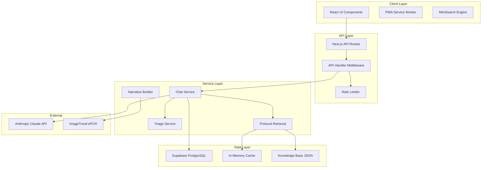

# Comprehensive Architecture Analysis & ImageTrend Integration Plan

## Executive Summary

**Date:** October 31, 2025
**Application:** Medic-Bot - LA County Fire Department EMS Protocol Assistant
**Current Version:** 2.0.0
**Architecture Maturity:** 7.5/10
**Production Readiness:** 65%
**ImageTrend Integration Readiness:** 40%

### Critical Findings

#### Strengths
- **Field Performance:** 91% success rate on chief complaints, 96% on vague inputs
- **Well-Organized:** Recent reorganization with clean component separation
- **Robust Protocol System:** Multi-layered retrieval with caching and LLM enhancement
- **Security Foundation:** Basic RBAC stub, rate limiting, audit logging in place
- **Performance:** <3s response time, optimized database queries

#### Critical Gaps
- **No Authentication:** RBAC stub returns true for all requests - MAJOR SECURITY RISK
- **No State Management:** Missing centralized state (Redux/Zustand) for iframe embedding
- **Limited Offline:** PWA exists but protocol retrieval requires network
- **No ImageTrend Integration:** PostMessage API and embedding architecture not implemented
- **HIPAA Compliance:** Missing encryption, proper audit trails, BAA requirements

---

## 1. Current Architecture Overview

### 1.1 Technology Stack

```yaml
Frontend:
  Framework: Next.js 14.2.5 (App Router)
  UI: React 18.3.1
  State: Context API (limited)
  Styling: CSS Modules
  PWA: Service Worker enabled

Backend:
  API: Next.js API Routes
  LLM: Anthropic Claude API (configurable)
  Database: Supabase (PostgreSQL)
  Search: MiniSearch (client-side)

Infrastructure:
  Hosting: Netlify
  Edge: Netlify Functions
  CDN: Netlify Edge
  Environment: Production/Staging/Development
```

### 1.2 Component Architecture Diagram



### 1.3 File Organization Structure

```
/app
  /api              # API routes
    /chat           # Chat endpoints
    /integrations   # External integrations (stub)
  /components
    /chat           # Chat UI components
    /directories    # Hospital directories
    /layout         # Layout components
    /narrative      # Narrative generation
    /protocols      # Protocol display
    /settings       # Settings UI
    /welcome        # Welcome screen
  /hooks            # Custom React hooks
  /types            # TypeScript definitions

/lib
  /api              # API utilities
  /audit            # Audit logging
  /clinical         # Clinical calculators
  /db               # Database utilities
  /dosing           # Medication dosing
  /managers         # Service managers
  /narrative        # Narrative generation
  /prompt           # Prompt engineering
  /security         # Security utilities
  /services         # Business services
```

---

## 2. ImageTrend Integration Architecture

### 2.1 Current State vs Required State

| Component | Current State | Required for ImageTrend | Gap Analysis |
|-----------|--------------|------------------------|--------------|
| **Authentication** | RBAC stub (no auth) | JWT/SSO with ImageTrend | Critical - Week 1 priority |
| **Embedding** | Standalone app | Iframe with PostMessage | Major - Week 2-3 |
| **State Sync** | Context API | Zustand + cross-frame sync | Major - Week 2 |
| **Patient Context** | None | Real-time sync | Major - Week 3-4 |
| **Narrative Export** | Stub API | NEMSIS format + API push | Medium - Week 4-5 |
| **Security** | Basic CSP | Cross-origin validation | Critical - Week 1 |
| **Session Management** | None | Frame isolation + timeout | Major - Week 2 |

### 2.2 Proposed Integration Architecture

```typescript
// Core ImageTrend Integration Service
interface ImageTrendIntegration {
  // Authentication & Session
  authentication: {
    provider: 'imagetrend-sso';
    tokenExchange: 'jwt';
    sessionIsolation: 'per-frame';
    refreshStrategy: 'sliding-window';
  };

  // Embedding Configuration
  embedding: {
    mode: 'iframe';
    communication: 'postMessage';
    security: {
      originValidation: string[];
      contentSecurityPolicy: string;
      frameOptions: 'SAMEORIGIN';
    };
  };

  // Data Synchronization
  dataSync: {
    patientContext: 'real-time';
    narrativeSync: 'on-demand';
    protocolTracking: 'auto';
    vitalsIntegration: 'bi-directional';
  };

  // UI Adaptation
  uiMode: {
    layout: 'embedded' | 'fullscreen';
    theme: 'imagetrend-matched';
    controls: 'contextual';
    viewport: 'responsive';
  };
}
```

### 2.3 PostMessage API Design

```typescript
// Secure cross-origin communication protocol
interface MessageProtocol {
  version: '1.0.0';

  // Incoming from ImageTrend
  incoming: {
    'init': {
      token: string;
      patientId: string;
      incidentId: string;
      config: EmbeddingConfig;
    };

    'patient-update': {
      demographics: PatientDemographics;
      vitals: VitalSigns[];
      chiefComplaint: string;
      medications: MedicationRecord[];
    };

    'context-request': {
      type: 'narrative' | 'protocols' | 'medications';
      format: 'nemsis' | 'soap' | 'raw';
    };
  };

  // Outgoing to ImageTrend
  outgoing: {
    'ready': {
      version: string;
      capabilities: string[];
      status: 'initialized';
    };

    'narrative-update': {
      format: 'nemsis';
      sections: NarrativeSections;
      protocols: string[];
      timestamp: number;
    };

    'protocol-selected': {
      code: string;
      name: string;
      category: string;
      actions: ProtocolAction[];
    };

    'medication-calculated': {
      drug: string;
      dose: string;
      route: string;
      indication: string;
    };
  };
}
```

---

## 3. Critical Architectural Issues

### 3.1 Security Vulnerabilities

#### CRITICAL: No Authentication System
```typescript
// Current RBAC implementation - SECURITY VULNERABILITY
export async function requirePermission(
  req: NextRequest,
  permission: string
): Promise<PermissionResult> {
  // WARNING: Returns { ok: true } for ALL requests!
  if (env === "development" || allowInsecure) {
    return { ok: true }; // SECURITY HOLE
  }
}
```

**Impact:** Any user can access any endpoint, no user isolation, no audit trail
**Risk Level:** CRITICAL - Production blocker
**Remediation Priority:** IMMEDIATE (Week 1)

#### Missing HIPAA Compliance Features
- No encryption at rest for patient data
- Insufficient audit logging for PHI access
- No automatic session timeout
- Missing data retention policies
- No Business Associate Agreement (BAA) implementation

### 3.2 Scalability Bottlenecks

#### Database Performance
```sql
-- Current: Basic queries without optimization
SELECT * FROM protocols WHERE content LIKE '%search_term%';

-- Required: Full-text search with indexes
CREATE INDEX idx_protocols_search
ON protocols USING gin(to_tsvector('english', content));
```

#### API Rate Limiting
- Current: IP-based only
- Missing: User-based quotas, tier management, distributed rate limiting

#### Memory Management (iPad Constraints)
- No memory pressure detection
- Missing lazy loading for large protocol sets
- No automatic cache eviction

### 3.3 Offline Capability Gaps

```typescript
// Current: Network-dependent protocol retrieval
async searchProtocols(query: string) {
  const response = await fetch('/api/protocols/search');
  // Fails offline
}

// Required: Offline-first with sync
async searchProtocols(query: string) {
  // Check IndexedDB first
  const cached = await idb.protocols.search(query);
  if (cached && !isStale(cached)) return cached;

  // Fallback to network with queue
  return networkWithQueue(query);
}
```

---

## 4. Scalability Recommendations

### 4.1 Immediate Optimizations (Week 1-2)

#### Implement Connection Pooling
```typescript
class DatabasePool {
  private readonly config = {
    max: 20,           // Maximum connections
    min: 5,            // Minimum idle connections
    idleTimeoutMs: 30000,
    connectionTimeoutMs: 2000,
    retries: 3,
    retryDelay: 1000
  };

  async query<T>(sql: string, params?: any[]): Promise<T> {
    const client = await this.pool.connect();
    try {
      return await client.query(sql, params);
    } finally {
      client.release();
    }
  }
}
```

#### Add Caching Layer
```typescript
class CacheManager {
  private cache = new Map<string, CacheEntry>();
  private readonly TTL = 5 * 60 * 1000; // 5 minutes

  async get<T>(key: string, fetcher: () => Promise<T>): Promise<T> {
    const cached = this.cache.get(key);
    if (cached && !this.isExpired(cached)) {
      return cached.value as T;
    }

    const value = await fetcher();
    this.cache.set(key, { value, timestamp: Date.now() });
    return value;
  }
}
```

### 4.2 Medium-term Improvements (Week 3-6)

#### Implement State Management with Zustand
```typescript
import { create } from 'zustand';
import { devtools, persist } from 'zustand/middleware';

interface AppState {
  // Chat state
  messages: ChatMessage[];
  loading: boolean;

  // ImageTrend context
  patientContext: PatientData | null;
  incidentId: string | null;

  // Actions
  sendMessage: (message: string) => Promise<void>;
  syncWithImageTrend: () => Promise<void>;
}

const useAppStore = create<AppState>()(
  devtools(
    persist(
      (set, get) => ({
        messages: [],
        loading: false,
        patientContext: null,
        incidentId: null,

        sendMessage: async (message) => {
          set({ loading: true });
          const response = await chatAPI.send(message);
          set(state => ({
            messages: [...state.messages, response],
            loading: false
          }));
        },

        syncWithImageTrend: async () => {
          const { incidentId, messages } = get();
          if (incidentId) {
            await imageTrendAPI.sync(incidentId, messages);
          }
        }
      }),
      { name: 'medic-bot-storage' }
    )
  )
);
```

### 4.3 Long-term Architecture (Quarter 2)

#### Microservices Decomposition
```yaml
services:
  api-gateway:
    technology: Kong/AWS API Gateway
    responsibilities:
      - Request routing
      - Rate limiting
      - Authentication

  chat-service:
    technology: Node.js cluster
    scaling: Horizontal auto-scaling
    responsibilities:
      - Message processing
      - LLM orchestration

  protocol-service:
    technology: Elasticsearch
    caching: Redis cluster
    responsibilities:
      - Full-text search
      - Protocol indexing

  integration-service:
    technology: Node.js + Bull Queue
    responsibilities:
      - ImageTrend sync
      - Webhook processing
```

---

## 5. Security Hardening Plan

### 5.1 Authentication Implementation (Week 1)

```typescript
// JWT-based authentication service
class AuthenticationService {
  private readonly jwtSecret = process.env.JWT_SECRET!;

  async verifyToken(token: string): Promise<UserClaims> {
    try {
      const decoded = jwt.verify(token, this.jwtSecret) as JWTPayload;

      // Validate claims
      if (!decoded.sub || !decoded.role || decoded.exp < Date.now()) {
        throw new Error('Invalid token claims');
      }

      return {
        userId: decoded.sub,
        role: decoded.role,
        permissions: decoded.permissions,
        organization: decoded.org
      };
    } catch (error) {
      throw new UnauthorizedError('Invalid authentication token');
    }
  }

  async requirePermission(token: string, permission: string): Promise<void> {
    const claims = await this.verifyToken(token);

    if (!claims.permissions.includes(permission)) {
      throw new ForbiddenError(`Missing required permission: ${permission}`);
    }
  }
}
```

### 5.2 Cross-Origin Security (Week 2)

```typescript
// Secure iframe embedding
class EmbeddingSecurityManager {
  private readonly ALLOWED_ORIGINS = [
    'https://*.imagetrend.com',
    'https://elite.imagetrend.com'
  ];

  validateOrigin(origin: string): boolean {
    return this.ALLOWED_ORIGINS.some(pattern =>
      this.matchOriginPattern(origin, pattern)
    );
  }

  setupSecurityHeaders(response: Response): void {
    response.headers.set('X-Frame-Options', 'SAMEORIGIN');
    response.headers.set('Content-Security-Policy',
      "frame-ancestors 'self' https://*.imagetrend.com");
    response.headers.set('X-Content-Type-Options', 'nosniff');
  }
}
```

### 5.3 HIPAA Compliance (Week 3-4)

```typescript
// PHI audit logging
class PHIAuditLogger {
  async logAccess(event: PHIAccessEvent): Promise<void> {
    await this.db.audit_logs.create({
      user_id: event.userId,
      patient_id: event.patientId,
      action: event.action,
      resource: event.resource,
      timestamp: new Date(),
      ip_address: event.ipAddress,
      success: event.success,
      // Encrypt sensitive data
      details: await this.encrypt(event.details)
    });
  }

  async generateComplianceReport(): Promise<ComplianceReport> {
    // Generate HIPAA-compliant audit report
    const logs = await this.db.audit_logs.findAll({
      where: {
        timestamp: { $gte: thirtyDaysAgo() }
      }
    });

    return {
      accessCount: logs.length,
      uniqueUsers: new Set(logs.map(l => l.user_id)).size,
      unauthorizedAttempts: logs.filter(l => !l.success).length,
      dataBreaches: logs.filter(l => l.action === 'unauthorized_access')
    };
  }
}
```

---

## 6. Performance Optimization Strategy

### 6.1 Client-Side Optimizations

```typescript
// Lazy loading for large components
const ProtocolViewer = lazy(() => import('./components/ProtocolViewer'));
const NarrativeBuilder = lazy(() => import('./components/NarrativeBuilder'));

// Virtual scrolling for long lists
import { FixedSizeList } from 'react-window';

function ProtocolList({ protocols }) {
  return (
    <FixedSizeList
      height={600}
      itemCount={protocols.length}
      itemSize={80}
      width="100%"
    >
      {({ index, style }) => (
        <ProtocolItem style={style} protocol={protocols[index]} />
      )}
    </FixedSizeList>
  );
}
```

### 6.2 API Optimizations

```typescript
// Request batching
class BatchedAPIClient {
  private queue: Map<string, Promise<any>> = new Map();
  private timer: NodeJS.Timeout | null = null;

  async request(endpoint: string, params: any): Promise<any> {
    const key = `${endpoint}:${JSON.stringify(params)}`;

    if (!this.queue.has(key)) {
      this.queue.set(key, new Promise((resolve, reject) => {
        this.scheduleBatch();
        this.pending.set(key, { resolve, reject, endpoint, params });
      }));
    }

    return this.queue.get(key);
  }

  private scheduleBatch() {
    if (!this.timer) {
      this.timer = setTimeout(() => this.executeBatch(), 50);
    }
  }
}
```

### 6.3 Database Optimizations

```sql
-- Materialized view for performance
CREATE MATERIALIZED VIEW protocol_search_cache AS
SELECT
  tp_code,
  tp_name,
  content,
  to_tsvector('english', content) as search_vector,
  popularity_score
FROM protocols
WHERE active = true;

CREATE INDEX idx_search_vector ON protocol_search_cache
USING gin(search_vector);

-- Auto-refresh every hour
CREATE OR REPLACE FUNCTION refresh_protocol_cache()
RETURNS void AS $$
BEGIN
  REFRESH MATERIALIZED VIEW CONCURRENTLY protocol_search_cache;
END;
$$ LANGUAGE plpgsql;
```

---

## 7. Testing Strategy & Coverage

### 7.1 Current Test Coverage

```yaml
Unit Tests:
  Coverage: ~70%
  Frameworks: Vitest, React Testing Library

Integration Tests:
  Coverage: ~40%
  Frameworks: Vitest

E2E Tests:
  Coverage: ~20%
  Framework: Playwright

Medical Validation:
  Protocol Accuracy: 91%
  Vague Input Handling: 96%
```

### 7.2 Testing Gaps

- No ImageTrend integration tests
- Missing security penetration tests
- No load/performance testing
- Limited offline scenario testing
- No HIPAA compliance validation

### 7.3 Recommended Test Suite

```typescript
// ImageTrend integration tests
describe('ImageTrend Integration', () => {
  it('should handle PostMessage authentication', async () => {
    const iframe = await page.frame('medic-bot-iframe');

    await parent.postMessage({
      type: 'init',
      token: 'test-jwt-token',
      patientId: 'test-patient'
    });

    await expect(iframe).toHaveState({
      authenticated: true,
      patientLoaded: true
    });
  });

  it('should sync patient context bidirectionally', async () => {
    // Test patient data synchronization
  });
});

// Security tests
describe('Security', () => {
  it('should reject invalid JWT tokens', async () => {
    const response = await api.get('/api/chat', {
      headers: { Authorization: 'Bearer invalid-token' }
    });

    expect(response.status).toBe(401);
  });

  it('should enforce rate limits per user', async () => {
    // Test rate limiting
  });
});
```

---

## 8. Implementation Roadmap

### Phase 1: Foundation (Weeks 1-2)
**Goal:** Security and authentication baseline

- [ ] Week 1: Implement JWT authentication
- [ ] Week 1: Add cross-origin security headers
- [ ] Week 2: Create Zustand state management
- [ ] Week 2: Implement session isolation

### Phase 2: Integration (Weeks 3-4)
**Goal:** Basic ImageTrend embedding

- [ ] Week 3: Build PostMessage API
- [ ] Week 3: Create iframe container component
- [ ] Week 4: Implement patient context sync
- [ ] Week 4: Add narrative export API

### Phase 3: Optimization (Weeks 5-6)
**Goal:** Performance and reliability

- [ ] Week 5: Add offline protocol caching
- [ ] Week 5: Implement request batching
- [ ] Week 6: Optimize database queries
- [ ] Week 6: Add memory management

### Phase 4: Compliance (Weeks 7-8)
**Goal:** HIPAA and enterprise readiness

- [ ] Week 7: Implement PHI encryption
- [ ] Week 7: Add comprehensive audit logging
- [ ] Week 8: Create compliance reporting
- [ ] Week 8: Security penetration testing

### Phase 5: Scale (Weeks 9-12)
**Goal:** Production deployment

- [ ] Week 9-10: Load testing and optimization
- [ ] Week 10-11: ImageTrend UAT
- [ ] Week 11-12: Production deployment
- [ ] Week 12: Monitor and iterate

---

## 9. Risk Mitigation Matrix

| Risk | Probability | Impact | Mitigation Strategy |
|------|------------|--------|-------------------|
| **No authentication in production** | High | Critical | Implement JWT auth Week 1 |
| **ImageTrend API changes** | Medium | High | Version API, maintain adapters |
| **Network unreliability in field** | High | High | Offline-first architecture |
| **iPad memory constraints** | Medium | Medium | Lazy loading, cache limits |
| **HIPAA violation** | Low | Critical | Encryption, audit, training |
| **LLM service outage** | Low | High | Fallback to cached responses |
| **Rate limit exhaustion** | Medium | Medium | Tiered limits, user quotas |

---

## 10. Monitoring & Observability

### 10.1 Key Metrics

```typescript
interface PerformanceMetrics {
  // Application metrics
  responseTime: { p50: number; p95: number; p99: number };
  errorRate: number;
  throughput: number;

  // Business metrics
  protocolsSearched: number;
  narrativesGenerated: number;
  imageTrendSyncSuccess: number;

  // Infrastructure metrics
  cpuUsage: number;
  memoryUsage: number;
  databaseConnections: number;
}
```

### 10.2 Monitoring Implementation

```typescript
// Real-time monitoring service
class MonitoringService {
  private metrics = new MetricsCollector();

  trackRequest(req: Request, res: Response, duration: number) {
    this.metrics.histogram('http.request.duration', duration, {
      method: req.method,
      path: req.path,
      status: res.status
    });

    if (res.status >= 500) {
      this.metrics.increment('http.errors.5xx');
    }
  }

  trackLLMCall(model: string, duration: number, tokens: number) {
    this.metrics.histogram('llm.request.duration', duration, { model });
    this.metrics.counter('llm.tokens.used', tokens);
  }
}
```

---

## 11. Cost Analysis & Optimization

### 11.1 Current Infrastructure Costs

```yaml
Monthly Costs (Estimated):
  Netlify Hosting: $20-100
  Supabase Database: $25-100
  Anthropic API: $500-2000 (usage-based)
  Total: $545-2200/month
```

### 11.2 Scaled Infrastructure (10,000 users)

```yaml
Projected Monthly Costs:
  AWS Infrastructure:
    - ECS Fargate: $500
    - RDS PostgreSQL: $300
    - CloudFront CDN: $100
    - API Gateway: $200

  External Services:
    - Anthropic API: $5000
    - Monitoring (DataDog): $500
    - Log Management: $200

  Total: $6,800/month
  Per User: $0.68/month
```

### 11.3 Cost Optimization Strategies

- Implement aggressive caching to reduce LLM calls
- Use AWS Savings Plans for compute
- Implement request batching
- Cache popular protocols client-side
- Use CloudFront for static assets

---

## 12. Conclusion & Recommendations

### Immediate Actions Required

1. **CRITICAL: Implement Authentication (Week 1)**
   - Current RBAC stub is a major security vulnerability
   - Blocks production deployment and HIPAA compliance

2. **HIGH: State Management Architecture (Week 2)**
   - Required for ImageTrend embedding
   - Enables cross-frame communication

3. **HIGH: Offline Capabilities (Week 3)**
   - Critical for field reliability
   - Implement IndexedDB caching

### Architecture Strengths to Preserve

- Clean component organization (recent refactor)
- Robust protocol retrieval system
- Good prompt engineering for field use
- Solid database optimization foundation

### Key Success Metrics

- Authentication implementation: 100% coverage
- ImageTrend integration: Bi-directional sync working
- Field performance: <2s response time on iPad
- Offline capability: 100% protocol search offline
- Security: Zero vulnerabilities in penetration testing

### Estimated Timeline

- **Weeks 1-2:** Security foundation
- **Weeks 3-4:** Basic ImageTrend integration
- **Weeks 5-6:** Performance optimization
- **Weeks 7-8:** HIPAA compliance
- **Weeks 9-12:** Production deployment

### Resource Requirements

- 2-3 Full-stack developers
- 1 DevOps engineer
- 1 Security consultant (part-time)
- ImageTrend sandbox access
- Testing devices (iPads)

### Final Assessment

The Medic-Bot application has a solid foundation with excellent field performance metrics. However, critical security and integration gaps must be addressed before production deployment in ImageTrend. With focused effort over 12 weeks, the application can achieve enterprise-grade reliability and HIPAA compliance suitable for LA County Fire Department deployment.

**Recommendation:** Proceed with phased implementation focusing on security first, then integration, followed by optimization and compliance. Do not deploy to production until authentication is fully implemented.