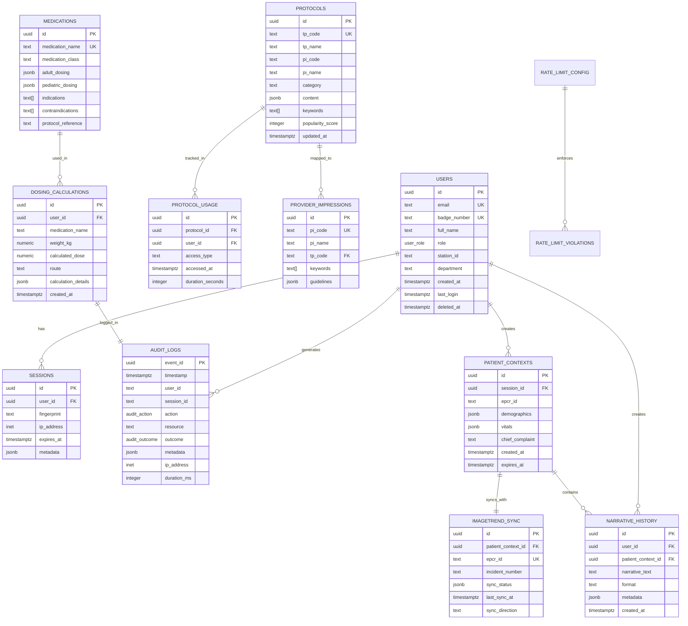
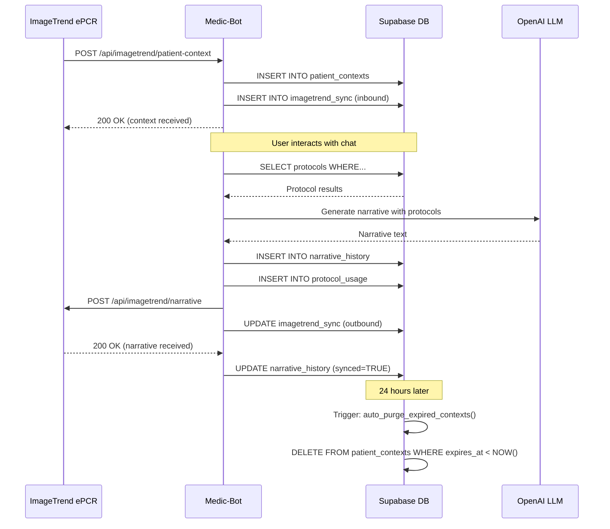

# Comprehensive Database Architecture & Strategy
## LA County Fire EMS Protocol Application - Medic-Bot

**Document Version:** 2.0
**Date:** October 31, 2025
**Author:** Database Architecture Specialist
**Classification:** Technical Architecture - Internal Use
**Review Status:** Ready for Medical Director & Engineering Review

---

## Table of Contents

1. [Executive Summary](#executive-summary)
2. [Current Architecture Analysis](#current-architecture-analysis)
3. [Entity Relationship Diagram](#entity-relationship-diagram)
4. [Protocol Data Storage Strategy](#protocol-data-storage-strategy)
5. [ImageTrend Integration Data Model](#imagetrend-integration-data-model)
6. [HIPAA Compliance & Security](#hipaa-compliance--security)
7. [Performance Optimization Strategy](#performance-optimization-strategy)
8. [Audit Logging & Compliance](#audit-logging--compliance)
9. [Data Retention & Archival](#data-retention--archival)
10. [Migration Roadmap](#migration-roadmap)
11. [Risk Assessment & Mitigation](#risk-assessment--mitigation)
12. [Recommendations](#recommendations)

---

## Executive Summary

### Current State Assessment

**Database Maturity Level:** 7/10 - Well-structured foundation with room for production hardening

**Key Findings:**

✅ **Strengths:**
- Comprehensive audit logging infrastructure (HIPAA-compliant)
- Row Level Security (RLS) implemented on all tables
- Immutable audit trail with 6-year retention
- Multi-level rate limiting with reputation tracking
- Performance-optimized indexes and materialized views
- User session management with soft-delete preservation

⚠️ **Critical Gaps:**
1. **Protocol Data:** Currently file-based (11MB JSON), no database storage
2. **ImageTrend Integration:** No data model for ePCR synchronization
3. **Patient Context:** No schema for temporary patient data handling
4. **Analytics:** Limited real-time analytics capabilities
5. **Backup/DR:** No documented disaster recovery strategy
6. **Encryption:** Database encryption at rest not explicitly configured

**Production Readiness Score:** 60% - Needs enhancements for medical production use

### Immediate Priorities

1. **Protocol Database Migration** (Week 1-2): Move 11MB JSON to PostgreSQL with full-text search
2. **ImageTrend Schema** (Week 3-4): Create ePCR integration data model
3. **Patient Data Handling** (Week 3-4): Implement temporary, HIPAA-compliant patient context storage
4. **Encryption** (Week 2): Enable Supabase encryption at rest + verify TLS 1.3
5. **Backup Strategy** (Week 2): Implement automated backups with point-in-time recovery

---

## Current Architecture Analysis

### Database Technology Stack

```yaml
Primary Database:
  Provider: Supabase (Managed PostgreSQL 14+)
  Region: US-West (LA County compliance)
  Connection Pool: Not configured (default: 15 connections)
  Extensions:
    - uuid-ossp: UUID generation
    - pg_trgm: Fuzzy text matching (recommended, not enabled)
    - pg_stat_statements: Query performance tracking (recommended)

Current Data Storage:
  Protocols: File-based (JSON) - 11MB
  Knowledge Base: File-based (JSON) - 11MB
  Provider Impressions: File-based (JSON) - 28KB
  Medications/Dosing: File-based (JSON) - 230KB

  Database Tables:
    - audit_logs: Comprehensive event tracking
    - users: Paramedic/staff accounts
    - sessions: Multi-device session management
    - metrics: Performance tracking
    - rate_limit_config: Dynamic rate limits
    - rate_limit_violations: Abuse tracking

Client-Side Storage:
  IndexedDB: Protocol caching (PWA offline support)
  LocalStorage: User preferences, last session
  Memory: LRU cache for frequently accessed protocols
```

### Existing Schema Overview

#### 1. Audit Logs Table (Migration 001)

**Purpose:** HIPAA-compliant immutable audit trail

```sql
CREATE TABLE audit_logs (
  event_id UUID PRIMARY KEY,
  timestamp TIMESTAMPTZ NOT NULL DEFAULT NOW(),

  -- User identification
  user_id VARCHAR(255),
  user_role user_role,
  session_id VARCHAR(255),

  -- Event details
  action audit_action NOT NULL,  -- Enum: user.login, chat.query, protocol.view, etc.
  resource VARCHAR(500) NOT NULL,
  outcome audit_outcome NOT NULL, -- Enum: success, failure, partial

  -- Context
  metadata JSONB,
  ip_address INET,
  user_agent TEXT,
  error_message TEXT,
  duration_ms INTEGER,

  created_at TIMESTAMPTZ NOT NULL DEFAULT NOW(),

  CONSTRAINT valid_duration CHECK (duration_ms IS NULL OR duration_ms >= 0)
);
```

**Strengths:**
- ✅ Immutable (triggers prevent UPDATE/DELETE)
- ✅ 6-year retention for HIPAA compliance
- ✅ JSONB metadata for flexible audit context
- ✅ Performance-optimized indexes
- ✅ Partitioning-ready (function exists for future scaling)

**Current Performance:**
- Indexes: 8 (timestamp, user_id, session_id, action, outcome, resource, metadata GIN, user+timestamp compound)
- Materialized View: `audit_stats` (daily aggregation)
- Estimated Growth: 100K events/month → 1.2M/year → 7.2M over 6 years

**Recommendations:**
- Enable partitioning when table exceeds 10M rows
- Create monthly partitions for data older than 1 year
- Implement automatic archival to cold storage after 2 years

#### 2. Users & Sessions (Migration 002)

**Users Table:**
```sql
CREATE TABLE users (
  id UUID PRIMARY KEY DEFAULT gen_random_uuid(),

  -- Identity
  email TEXT UNIQUE NOT NULL,
  badge_number TEXT UNIQUE,
  full_name TEXT NOT NULL,

  -- Role & Assignment
  role user_role NOT NULL DEFAULT 'paramedic',
  station_id TEXT,
  department TEXT NOT NULL DEFAULT 'lacfd',

  -- Timestamps
  created_at TIMESTAMPTZ DEFAULT NOW(),
  updated_at TIMESTAMPTZ DEFAULT NOW(),
  last_login TIMESTAMPTZ,
  deleted_at TIMESTAMPTZ, -- Soft delete

  CONSTRAINT valid_email CHECK (email ~* '^[A-Za-z0-9._%+-]+@[A-Za-z0-9.-]+\.[A-Za-z]{2,}$')
);
```

**Sessions Table:**
```sql
CREATE TABLE sessions (
  id UUID PRIMARY KEY DEFAULT gen_random_uuid(),
  user_id UUID NOT NULL REFERENCES users(id) ON DELETE CASCADE,

  fingerprint TEXT NOT NULL,  -- SHA256 of IP + User-Agent + headers
  ip_address INET,
  user_agent TEXT,

  created_at TIMESTAMPTZ DEFAULT NOW(),
  expires_at TIMESTAMPTZ NOT NULL,
  last_activity TIMESTAMPTZ DEFAULT NOW(),

  metadata JSONB
);
```

**Row Level Security (RLS):**
```sql
-- Users can read their own data
CREATE POLICY "Users can read own data" ON users
  FOR SELECT USING (auth.uid() = id OR deleted_at IS NULL);

-- Admins can read all users
CREATE POLICY "Admins can read all users" ON users
  FOR SELECT USING (
    (SELECT role FROM users WHERE id = auth.uid()) IN ('admin', 'medical_director')
  );
```

**Strengths:**
- ✅ Multi-device session support
- ✅ Soft delete preserves audit trail
- ✅ Request fingerprinting for security
- ✅ Automatic session cleanup trigger

**Gaps:**
- ⚠️ No SSO integration fields (ImageTrend OAuth)
- ⚠️ No department hierarchy (stations, battalions, divisions)
- ⚠️ No certification tracking (paramedic license, expiration dates)
- ⚠️ No training/competency records

#### 3. Metrics Table (Migration 003)

**Purpose:** Performance monitoring and analytics

```sql
CREATE TABLE metrics (
  id UUID PRIMARY KEY DEFAULT gen_random_uuid(),

  metric_name TEXT NOT NULL,
  metric_type TEXT NOT NULL CHECK (metric_type IN ('counter', 'histogram')),

  -- Time bucket (hourly granularity)
  date DATE NOT NULL,
  hour INTEGER NOT NULL CHECK (hour >= 0 AND hour < 24),

  -- Counter metrics
  count BIGINT DEFAULT 0,

  -- Histogram metrics
  p50 NUMERIC,
  p95 NUMERIC,
  p99 NUMERIC,
  min_value NUMERIC,
  max_value NUMERIC,
  avg_value NUMERIC,

  CONSTRAINT idx_metrics_unique UNIQUE(metric_name, date, hour)
);
```

**Strengths:**
- ✅ Hourly granularity for trend analysis
- ✅ 90-day retention with automatic cleanup
- ✅ Materialized views for daily/weekly summaries

**Gaps:**
- ⚠️ No protocol usage tracking
- ⚠️ No medication dosing frequency analytics
- ⚠️ No error rate by protocol
- ⚠️ No field testing outcome tracking

#### 4. Rate Limiting (Migration 004)

**Rate Limit Configuration:**
```sql
CREATE TABLE rate_limit_config (
  id UUID PRIMARY KEY,
  limit_type TEXT UNIQUE NOT NULL,
  requests_per_window INTEGER NOT NULL,
  window_ms INTEGER NOT NULL,
  error_message TEXT NOT NULL,
  enabled BOOLEAN DEFAULT TRUE
);

-- Default limits:
-- CHAT: 20 req/min
-- API: 60 req/min
-- DOSING: 30 req/min
-- AUTH: 5 req/15min
-- PHI: 50 req/min
-- GLOBAL: 500 req/15min
```

**Rate Limit Violations:**
```sql
CREATE TABLE rate_limit_violations (
  id UUID PRIMARY KEY,
  fingerprint TEXT NOT NULL,
  ip_address INET,
  limit_type TEXT NOT NULL,
  violation_count INTEGER DEFAULT 1,

  -- Reputation scoring
  reputation_score INTEGER DEFAULT 100,
  is_banned BOOLEAN DEFAULT FALSE,
  banned_until TIMESTAMPTZ
);
```

**Strengths:**
- ✅ Dynamic configuration (no code deployment needed)
- ✅ Reputation-based auto-banning
- ✅ Granular rate limits per endpoint type

---

## Entity Relationship Diagram



### Missing Tables (Currently File-Based)

**Critical for Production:**

1. **protocols** - Currently 11MB JSON file
2. **provider_impressions** - Currently 28KB JSON file
3. **medications** - Currently 230KB JSON file
4. **patient_contexts** - Not implemented (needed for ImageTrend)
5. **narrative_history** - Not implemented (needed for documentation)
6. **imagetrend_sync** - Not implemented (needed for ePCR integration)
7. **dosing_calculations** - Not implemented (needed for audit trail)
8. **protocol_usage** - Not implemented (needed for analytics)

---

## Protocol Data Storage Strategy

### Current State: File-Based Storage

**Location:** `/Users/tanner-osterkamp/Medic-Bot/data/`

```
ems_kb_clean.json          11 MB   7,012 protocol documents
provider_impressions.json   28 KB     102 provider impressions
ems_epinephrine_dosing.json 230 KB   Medication dosing tables
```

**Current Retrieval Method:**
1. JSON files loaded into memory at startup
2. In-memory search using embedding similarity
3. Client-side caching via IndexedDB (PWA)
4. No versioning, no audit trail of protocol changes

**Limitations:**
- ❌ No full-text search optimization
- ❌ No version control for protocol updates
- ❌ No analytics on protocol usage
- ❌ Memory-intensive (11MB loaded per instance)
- ❌ Can't track which protocols are most accessed
- ❌ No ability to update protocols without deployment
- ❌ No medical director review workflow

### Proposed: Database-First Architecture

#### 1. Protocols Table

```sql
CREATE TABLE protocols (
  id UUID PRIMARY KEY DEFAULT gen_random_uuid(),

  -- Protocol identification
  tp_code VARCHAR(10) UNIQUE NOT NULL,
  tp_name TEXT NOT NULL,
  pi_code VARCHAR(10),
  pi_name TEXT,

  -- Categorization
  category TEXT NOT NULL, -- 'cardiac', 'respiratory', 'trauma', etc.
  subcategory TEXT,
  severity_level TEXT CHECK (severity_level IN ('critical', 'urgent', 'routine')),

  -- Protocol content
  content JSONB NOT NULL, -- Full protocol text, sections, steps
  keywords TEXT[] NOT NULL,

  -- Metadata
  version INTEGER NOT NULL DEFAULT 1,
  effective_date DATE NOT NULL,
  expiration_date DATE,
  medical_director_approved BOOLEAN DEFAULT FALSE,
  approved_by UUID REFERENCES users(id),
  approved_at TIMESTAMPTZ,

  -- Analytics
  popularity_score INTEGER DEFAULT 0,
  last_accessed TIMESTAMPTZ,
  access_count INTEGER DEFAULT 0,

  -- Standard timestamps
  created_at TIMESTAMPTZ DEFAULT NOW(),
  updated_at TIMESTAMPTZ DEFAULT NOW(),
  deleted_at TIMESTAMPTZ, -- Soft delete

  -- Full-text search
  search_vector tsvector GENERATED ALWAYS AS (
    setweight(to_tsvector('english', coalesce(tp_name, '')), 'A') ||
    setweight(to_tsvector('english', coalesce(pi_name, '')), 'B') ||
    setweight(to_tsvector('english', coalesce(array_to_string(keywords, ' '), '')), 'C') ||
    setweight(to_tsvector('english', coalesce(content->>'summary', '')), 'D')
  ) STORED
);

-- Indexes for performance
CREATE INDEX idx_protocols_tp_code ON protocols(tp_code) WHERE deleted_at IS NULL;
CREATE INDEX idx_protocols_category ON protocols(category) WHERE deleted_at IS NULL;
CREATE INDEX idx_protocols_search ON protocols USING GIN(search_vector);
CREATE INDEX idx_protocols_keywords ON protocols USING GIN(keywords);
CREATE INDEX idx_protocols_popularity ON protocols(popularity_score DESC, access_count DESC);
CREATE INDEX idx_protocols_effective ON protocols(effective_date DESC) WHERE deleted_at IS NULL;

-- Comments
COMMENT ON TABLE protocols IS 'LA County Fire EMS treatment protocols with versioning and full-text search';
COMMENT ON COLUMN protocols.search_vector IS 'Generated full-text search index (name=A, keywords=B, content=C weighted)';
COMMENT ON COLUMN protocols.popularity_score IS 'Calculated score: 0.7*access_count + 0.3*recency_score';
```

#### 2. Protocol Versions Table (Audit Trail)

```sql
CREATE TABLE protocol_versions (
  id UUID PRIMARY KEY DEFAULT gen_random_uuid(),
  protocol_id UUID NOT NULL REFERENCES protocols(id) ON DELETE CASCADE,

  version INTEGER NOT NULL,
  content JSONB NOT NULL,
  change_summary TEXT,

  -- Approval workflow
  changed_by UUID REFERENCES users(id),
  approved_by UUID REFERENCES users(id),
  approved_at TIMESTAMPTZ,

  effective_date DATE NOT NULL,
  expiration_date DATE,

  created_at TIMESTAMPTZ DEFAULT NOW(),

  CONSTRAINT unique_protocol_version UNIQUE(protocol_id, version)
);

CREATE INDEX idx_protocol_versions_protocol ON protocol_versions(protocol_id, version DESC);
CREATE INDEX idx_protocol_versions_effective ON protocol_versions(effective_date DESC);

COMMENT ON TABLE protocol_versions IS 'Version history for all protocol changes (regulatory compliance)';
```

#### 3. Provider Impressions Table

```sql
CREATE TABLE provider_impressions (
  id UUID PRIMARY KEY DEFAULT gen_random_uuid(),

  pi_code VARCHAR(10) UNIQUE NOT NULL,
  pi_name TEXT NOT NULL,

  -- Primary protocol mapping
  tp_code VARCHAR(10) NOT NULL,
  tp_code_pediatric VARCHAR(10),

  -- Search optimization
  keywords TEXT[] NOT NULL,
  guidelines TEXT,

  -- Metadata
  created_at TIMESTAMPTZ DEFAULT NOW(),
  updated_at TIMESTAMPTZ DEFAULT NOW(),

  FOREIGN KEY (tp_code) REFERENCES protocols(tp_code)
);

CREATE INDEX idx_pi_keywords ON provider_impressions USING GIN(keywords);
CREATE INDEX idx_pi_tp_code ON provider_impressions(tp_code);

COMMENT ON TABLE provider_impressions IS 'Provider impression codes mapped to treatment protocols';
```

#### 4. Medications Table

```sql
CREATE TABLE medications (
  id UUID PRIMARY KEY DEFAULT gen_random_uuid(),

  medication_name TEXT UNIQUE NOT NULL,
  medication_class TEXT NOT NULL, -- 'analgesic', 'antiarrhythmic', etc.

  -- Dosing information
  adult_dosing JSONB NOT NULL,
  pediatric_dosing JSONB NOT NULL,

  -- Clinical information
  indications TEXT[] NOT NULL,
  contraindications TEXT[] NOT NULL,
  adverse_effects TEXT[],
  interactions TEXT[],

  -- Protocol references
  protocol_codes TEXT[], -- Which protocols reference this medication

  -- Administration
  routes TEXT[], -- 'IV', 'IO', 'IM', 'PO', 'SL', etc.
  onset_time TEXT,
  duration TEXT,

  -- Safety
  max_single_dose NUMERIC,
  max_daily_dose NUMERIC,

  -- Metadata
  created_at TIMESTAMPTZ DEFAULT NOW(),
  updated_at TIMESTAMPTZ DEFAULT NOW(),

  -- Full-text search
  search_vector tsvector GENERATED ALWAYS AS (
    setweight(to_tsvector('english', medication_name), 'A') ||
    setweight(to_tsvector('english', medication_class), 'B') ||
    setweight(to_tsvector('english', coalesce(array_to_string(indications, ' '), '')), 'C')
  ) STORED
);

CREATE INDEX idx_medications_name ON medications(medication_name);
CREATE INDEX idx_medications_class ON medications(medication_class);
CREATE INDEX idx_medications_search ON medications USING GIN(search_vector);

COMMENT ON TABLE medications IS 'LA County approved medications with dosing and safety information';
```

#### 5. Dosing Calculations Table (Audit Trail)

```sql
CREATE TABLE dosing_calculations (
  id UUID PRIMARY KEY DEFAULT gen_random_uuid(),

  -- User context
  user_id UUID REFERENCES users(id),
  session_id UUID REFERENCES sessions(id),
  patient_context_id UUID REFERENCES patient_contexts(id),

  -- Medication
  medication_name TEXT NOT NULL,
  medication_id UUID REFERENCES medications(id),

  -- Patient parameters
  weight_kg NUMERIC NOT NULL,
  age_years INTEGER,
  is_pediatric BOOLEAN DEFAULT FALSE,

  -- Calculation
  calculated_dose NUMERIC NOT NULL,
  dose_unit TEXT NOT NULL, -- 'mg', 'mcg', 'mL', etc.
  route TEXT NOT NULL,

  -- Details
  calculation_method TEXT, -- 'weight_based', 'fixed_dose', 'titrated'
  calculation_details JSONB, -- Full calculation breakdown

  -- Safety checks
  within_max_dose BOOLEAN,
  warnings TEXT[],

  -- Timestamp
  created_at TIMESTAMPTZ DEFAULT NOW(),

  CONSTRAINT valid_weight CHECK (weight_kg > 0 AND weight_kg < 300),
  CONSTRAINT valid_dose CHECK (calculated_dose > 0)
);

CREATE INDEX idx_dosing_user ON dosing_calculations(user_id, created_at DESC);
CREATE INDEX idx_dosing_medication ON dosing_calculations(medication_name, created_at DESC);
CREATE INDEX idx_dosing_patient ON dosing_calculations(patient_context_id) WHERE patient_context_id IS NOT NULL;

COMMENT ON TABLE dosing_calculations IS 'Audit trail of all medication dose calculations (HIPAA compliance)';
```

### Migration Strategy: File to Database

**Phase 1: Schema Creation (Week 1)**
1. Create all protocol-related tables
2. Create indexes and constraints
3. Set up RLS policies
4. Create helper functions

**Phase 2: Data Migration (Week 1-2)**
```sql
-- Migration script structure
CREATE OR REPLACE FUNCTION migrate_protocols_from_json()
RETURNS INTEGER AS $$
DECLARE
  imported_count INTEGER := 0;
  protocol_json JSONB;
BEGIN
  -- Load JSON from file (via application layer)
  -- Insert into protocols table
  -- Create initial version in protocol_versions

  -- Pseudo-code:
  FOR protocol_json IN (SELECT * FROM json_array_elements(load_json_file()))
  LOOP
    INSERT INTO protocols (
      tp_code, tp_name, pi_code, pi_name,
      category, content, keywords,
      version, effective_date, medical_director_approved
    ) VALUES (
      protocol_json->>'tp_code',
      protocol_json->>'tp_name',
      protocol_json->>'pi_code',
      protocol_json->>'pi_name',
      protocol_json->>'category',
      protocol_json->'content',
      ARRAY(SELECT jsonb_array_elements_text(protocol_json->'keywords')),
      1,
      CURRENT_DATE,
      TRUE
    );

    imported_count := imported_count + 1;
  END LOOP;

  RETURN imported_count;
END;
$$ LANGUAGE plpgsql;
```

**Phase 3: Application Layer Updates (Week 2)**
1. Update `ProtocolRetrievalService` to query database
2. Implement caching layer (Redis or in-memory)
3. Update protocol search to use PostgreSQL full-text search
4. Migrate triage service to database queries

**Phase 4: Testing & Validation (Week 2)**
1. Compare database search results vs. file-based
2. Performance benchmarking
3. Verify all 7,012 protocols migrated correctly
4. Test search relevance and ranking

**Phase 5: Cutover (Week 3)**
1. Deploy database-backed version to staging
2. Monitor performance and errors
3. Deploy to production with feature flag
4. Deprecate file-based protocol loading

---

## ImageTrend Integration Data Model

### Overview

ImageTrend Elite is the ePCR (electronic Patient Care Report) system used by LA County Fire. Integration requires bidirectional data sync:

**Medic-Bot → ImageTrend:**
- Generated narrative text
- Protocol selections (TP codes)
- Medication dosages calculated
- Vital sign trending

**ImageTrend → Medic-Bot:**
- Patient demographics (age, sex, weight)
- Chief complaint
- Dispatch code
- Current vitals
- Incident number

### Data Model Design

#### 1. Patient Contexts Table

**Purpose:** Temporary storage for patient data during active call

```sql
CREATE TABLE patient_contexts (
  id UUID PRIMARY KEY DEFAULT gen_random_uuid(),

  -- Session linkage
  session_id UUID NOT NULL REFERENCES sessions(id) ON DELETE CASCADE,
  user_id UUID NOT NULL REFERENCES users(id),

  -- ImageTrend identifiers
  epcr_id TEXT UNIQUE, -- ImageTrend ePCR ID
  incident_number TEXT, -- CAD incident number

  -- Patient demographics (temporary, non-PHI)
  age_years INTEGER,
  sex TEXT CHECK (sex IN ('male', 'female', 'unknown')),
  weight_kg NUMERIC,

  -- Clinical presentation
  chief_complaint TEXT,
  dispatch_code TEXT,

  -- Vitals (array for trending)
  vitals JSONB, -- [{timestamp, bp_systolic, bp_diastolic, hr, rr, spo2, temp, glucose}, ...]

  -- Medications/allergies
  allergies TEXT[],
  medications TEXT[],

  -- Context metadata
  call_type TEXT,
  location TEXT,

  -- Lifecycle
  created_at TIMESTAMPTZ DEFAULT NOW(),
  updated_at TIMESTAMPTZ DEFAULT NOW(),
  expires_at TIMESTAMPTZ NOT NULL DEFAULT NOW() + INTERVAL '24 hours',

  -- Privacy flags
  contains_phi BOOLEAN DEFAULT FALSE,
  auto_purge BOOLEAN DEFAULT TRUE,

  CONSTRAINT valid_age CHECK (age_years IS NULL OR (age_years >= 0 AND age_years <= 150)),
  CONSTRAINT valid_weight CHECK (weight_kg IS NULL OR (weight_kg > 0 AND weight_kg < 300))
);

CREATE INDEX idx_patient_contexts_session ON patient_contexts(session_id);
CREATE INDEX idx_patient_contexts_epcr ON patient_contexts(epcr_id) WHERE epcr_id IS NOT NULL;
CREATE INDEX idx_patient_contexts_expires ON patient_contexts(expires_at) WHERE auto_purge = TRUE;
CREATE INDEX idx_patient_contexts_user ON patient_contexts(user_id, created_at DESC);

COMMENT ON TABLE patient_contexts IS 'Temporary patient context for active calls (auto-purged after 24 hours)';
COMMENT ON COLUMN patient_contexts.contains_phi IS 'Flag if context contains PHI (triggers encryption)';
COMMENT ON COLUMN patient_contexts.auto_purge IS 'Automatically delete after expires_at (HIPAA minimum necessary)';

-- Automatic purge trigger
CREATE OR REPLACE FUNCTION auto_purge_expired_contexts()
RETURNS TRIGGER AS $$
BEGIN
  DELETE FROM patient_contexts
  WHERE expires_at < NOW() AND auto_purge = TRUE;

  RETURN NULL;
END;
$$ LANGUAGE plpgsql;

CREATE TRIGGER trigger_purge_patient_contexts
  AFTER INSERT ON patient_contexts
  EXECUTE FUNCTION auto_purge_expired_contexts();
```

#### 2. ImageTrend Sync Table

**Purpose:** Track synchronization status between Medic-Bot and ImageTrend ePCR

```sql
CREATE TABLE imagetrend_sync (
  id UUID PRIMARY KEY DEFAULT gen_random_uuid(),

  -- References
  patient_context_id UUID NOT NULL REFERENCES patient_contexts(id) ON DELETE CASCADE,
  epcr_id TEXT NOT NULL, -- ImageTrend ePCR record ID
  incident_number TEXT,

  -- Sync metadata
  sync_direction TEXT NOT NULL CHECK (sync_direction IN ('inbound', 'outbound', 'bidirectional')),
  sync_status TEXT NOT NULL CHECK (sync_status IN ('pending', 'in_progress', 'completed', 'failed')),

  -- Data synced
  fields_synced TEXT[], -- ['narrative', 'vitals', 'medications', 'protocols']
  sync_payload JSONB, -- What was sent/received

  -- Error handling
  error_message TEXT,
  retry_count INTEGER DEFAULT 0,
  max_retries INTEGER DEFAULT 3,

  -- Timestamps
  created_at TIMESTAMPTZ DEFAULT NOW(),
  last_sync_attempt TIMESTAMPTZ,
  last_successful_sync TIMESTAMPTZ,
  next_retry_at TIMESTAMPTZ,

  CONSTRAINT unique_epcr_context UNIQUE(epcr_id, patient_context_id)
);

CREATE INDEX idx_imagetrend_sync_epcr ON imagetrend_sync(epcr_id);
CREATE INDEX idx_imagetrend_sync_status ON imagetrend_sync(sync_status, next_retry_at);
CREATE INDEX idx_imagetrend_sync_context ON imagetrend_sync(patient_context_id);

COMMENT ON TABLE imagetrend_sync IS 'Synchronization tracking between Medic-Bot and ImageTrend ePCR';

-- Retry logic function
CREATE OR REPLACE FUNCTION schedule_sync_retry(
  p_sync_id UUID,
  p_error_message TEXT
)
RETURNS VOID AS $$
DECLARE
  current_retries INTEGER;
  max_retries INTEGER;
BEGIN
  SELECT retry_count, max_retries INTO current_retries, max_retries
  FROM imagetrend_sync
  WHERE id = p_sync_id;

  IF current_retries < max_retries THEN
    UPDATE imagetrend_sync
    SET
      retry_count = retry_count + 1,
      sync_status = 'pending',
      error_message = p_error_message,
      next_retry_at = NOW() + (INTERVAL '1 minute' * POWER(2, retry_count)), -- Exponential backoff
      last_sync_attempt = NOW()
    WHERE id = p_sync_id;
  ELSE
    UPDATE imagetrend_sync
    SET
      sync_status = 'failed',
      error_message = p_error_message || ' (max retries exceeded)',
      last_sync_attempt = NOW()
    WHERE id = p_sync_id;
  END IF;
END;
$$ LANGUAGE plpgsql;
```

#### 3. Narrative History Table

**Purpose:** Store generated narratives for audit and sync

```sql
CREATE TABLE narrative_history (
  id UUID PRIMARY KEY DEFAULT gen_random_uuid(),

  -- References
  user_id UUID NOT NULL REFERENCES users(id),
  patient_context_id UUID REFERENCES patient_contexts(id) ON DELETE SET NULL,
  session_id UUID REFERENCES sessions(id),

  -- Narrative content
  narrative_text TEXT NOT NULL,
  narrative_format TEXT NOT NULL CHECK (narrative_format IN ('soap', 'chronological', 'nemsis')),

  -- Generation metadata
  generation_method TEXT NOT NULL CHECK (generation_method IN ('llm', 'template', 'manual')),
  llm_model TEXT, -- 'gpt-4o-mini', etc.
  prompt_version TEXT,

  -- Clinical context
  protocols_referenced TEXT[], -- TP codes included in narrative
  medications_administered TEXT[],

  -- Quality metrics
  word_count INTEGER,
  generation_time_ms INTEGER,

  -- Sync status
  synced_to_imagetrend BOOLEAN DEFAULT FALSE,
  sync_timestamp TIMESTAMPTZ,

  -- Metadata
  metadata JSONB,
  created_at TIMESTAMPTZ DEFAULT NOW(),

  CONSTRAINT valid_narrative_length CHECK (length(narrative_text) >= 10)
);

CREATE INDEX idx_narrative_user ON narrative_history(user_id, created_at DESC);
CREATE INDEX idx_narrative_patient ON narrative_history(patient_context_id) WHERE patient_context_id IS NOT NULL;
CREATE INDEX idx_narrative_sync ON narrative_history(synced_to_imagetrend, created_at DESC) WHERE NOT synced_to_imagetrend;

COMMENT ON TABLE narrative_history IS 'Generated patient care narratives with audit trail';
```

#### 4. Protocol Usage Tracking

**Purpose:** Analytics on which protocols are used most frequently

```sql
CREATE TABLE protocol_usage (
  id UUID PRIMARY KEY DEFAULT gen_random_uuid(),

  -- References
  protocol_id UUID NOT NULL REFERENCES protocols(id),
  user_id UUID REFERENCES users(id),
  patient_context_id UUID REFERENCES patient_contexts(id),

  -- Access details
  access_type TEXT NOT NULL CHECK (access_type IN ('viewed', 'applied', 'referenced')),
  access_method TEXT CHECK (access_method IN ('search', 'quick_access', 'triage', 'suggestion')),

  -- Context
  chief_complaint TEXT,
  patient_age INTEGER,

  -- Metrics
  duration_seconds INTEGER,

  -- Timestamp
  accessed_at TIMESTAMPTZ DEFAULT NOW()
);

CREATE INDEX idx_protocol_usage_protocol ON protocol_usage(protocol_id, accessed_at DESC);
CREATE INDEX idx_protocol_usage_user ON protocol_usage(user_id, accessed_at DESC);
CREATE INDEX idx_protocol_usage_date ON protocol_usage(accessed_at::DATE DESC);

COMMENT ON TABLE protocol_usage IS 'Track protocol usage for analytics and quality improvement';

-- Materialized view for protocol analytics
CREATE MATERIALIZED VIEW protocol_usage_stats AS
SELECT
  p.tp_code,
  p.tp_name,
  p.category,
  COUNT(DISTINCT pu.user_id) as unique_users,
  COUNT(*) as total_accesses,
  COUNT(*) FILTER (WHERE pu.access_type = 'applied') as times_applied,
  AVG(pu.duration_seconds) as avg_duration_seconds,
  MAX(pu.accessed_at) as last_accessed,
  DATE(pu.accessed_at) as access_date
FROM protocols p
LEFT JOIN protocol_usage pu ON p.id = pu.protocol_id
WHERE pu.accessed_at >= CURRENT_DATE - INTERVAL '90 days'
GROUP BY p.tp_code, p.tp_name, p.category, DATE(pu.accessed_at)
ORDER BY total_accesses DESC;

CREATE UNIQUE INDEX idx_protocol_usage_stats ON protocol_usage_stats(tp_code, access_date);
```

### ImageTrend API Integration Points

**Required API Endpoints (Medic-Bot):**

```typescript
// POST /api/integrations/imagetrend/patient-context
// Receive patient context from ImageTrend iframe
interface ImageTrendInboundPayload {
  epcr_id: string;
  incident_number: string;
  patient: {
    age?: number;
    sex?: 'male' | 'female' | 'unknown';
    weight_kg?: number;
  };
  vitals?: VitalSigns;
  chief_complaint?: string;
  dispatch_code?: string;
}

// POST /api/integrations/imagetrend/narrative
// Send generated narrative to ImageTrend
interface ImageTrendOutboundPayload {
  epcr_id: string;
  narrative_text: string;
  format: 'soap' | 'chronological' | 'nemsis';
  protocols_used: string[];
  medications_administered: Array<{
    name: string;
    dose: number;
    route: string;
    timestamp: string;
  }>;
}

// GET /api/integrations/imagetrend/sync-status/:epcr_id
// Check sync status
interface SyncStatusResponse {
  epcr_id: string;
  status: 'pending' | 'in_progress' | 'completed' | 'failed';
  last_sync: string;
  fields_synced: string[];
  errors?: string[];
}
```

### Data Flow Diagram: ImageTrend Integration



---

## HIPAA Compliance & Security

### HIPAA Requirements for EMS Systems

**Applicable Regulations:**
- HIPAA Privacy Rule (45 CFR Part 160, 164 Subpart E)
- HIPAA Security Rule (45 CFR Part 164 Subpart C)
- HITECH Act (Enhanced penalties)
- California CMIA (Additional state requirements)

**Key Requirements:**
1. **Access Controls:** User authentication, role-based access
2. **Audit Logging:** All PHI access must be logged (6 years retention)
3. **Encryption:** Data at rest and in transit
4. **Minimum Necessary:** Only access PHI required for treatment
5. **Data Integrity:** Prevent unauthorized alteration
6. **Breach Notification:** 60-day notification if >500 records exposed

### Current Compliance Status

#### ✅ Implemented

**1. Audit Logging (Migration 001)**
- Comprehensive event logging
- Immutable audit trail (triggers prevent modification)
- 6-year retention period
- IP address, user agent, timestamp tracking
- JSONB metadata for context

**2. Row Level Security (RLS)**
- Enabled on all tables
- Users can only access their own data
- Admin/Medical Director elevated privileges
- Session isolation enforced

**3. Rate Limiting**
- IP-based request throttling
- Reputation-based auto-banning
- PHI endpoint-specific limits (50 req/min)

**4. Soft Deletes**
- Users table: `deleted_at` preserves audit trail
- No hard deletes (compliance requirement)

#### ⚠️ Partially Implemented

**1. Encryption**
- ✅ TLS 1.3 in transit (Netlify + Supabase)
- ⚠️ At rest: Supabase default encryption (needs verification)
- ❌ Application-level encryption for PHI fields not implemented

**2. Authentication**
- ✅ Session management infrastructure exists
- ❌ No active authentication (currently open access)
- ❌ No SSO integration with LA County systems
- ❌ No multi-factor authentication (MFA)

**3. Data Minimization**
- ✅ `patient_contexts` auto-purge after 24 hours
- ❌ No anonymization of audit logs
- ❌ No PHI masking in error logs

#### ❌ Not Implemented

**1. Encryption Key Management**
- No dedicated key management system
- No field-level encryption for sensitive data
- No encryption of backups

**2. Business Associate Agreements (BAA)**
- Supabase: BAA required for production (available on Pro plan)
- OpenAI: No BAA available (risk for PHI exposure via prompts)
- Netlify: BAA available (needs to be executed)

**3. Breach Detection & Response**
- No automated breach detection
- No incident response plan documented
- No breach notification workflow

**4. Access Monitoring**
- No real-time alerting on suspicious access patterns
- No anomaly detection (e.g., bulk data export)

### Recommended Security Enhancements

#### Priority 1: Critical (Week 1-2)

**1. Enable Supabase Encryption at Rest**
```sql
-- Verify encryption status
SELECT name, setting
FROM pg_settings
WHERE name LIKE '%encrypt%';

-- Enable column-level encryption for PHI
CREATE EXTENSION IF NOT EXISTS pgcrypto;

-- Encrypt sensitive columns
ALTER TABLE patient_contexts
ADD COLUMN chief_complaint_encrypted BYTEA;

-- Encryption function
CREATE OR REPLACE FUNCTION encrypt_phi(data TEXT, key TEXT)
RETURNS BYTEA AS $$
BEGIN
  RETURN pgp_sym_encrypt(data, key);
END;
$$ LANGUAGE plpgsql SECURITY DEFINER;

-- Decryption function
CREATE OR REPLACE FUNCTION decrypt_phi(data BYTEA, key TEXT)
RETURNS TEXT AS $$
BEGIN
  RETURN pgp_sym_decrypt(data, key);
END;
$$ LANGUAGE plpgsql SECURITY DEFINER;
```

**2. Implement Authentication**
```sql
-- Enable Supabase Auth
-- Use JWT-based authentication with RLS policies

-- Update RLS policies to use auth.uid()
CREATE POLICY "Users can only access own patient contexts"
  ON patient_contexts FOR SELECT
  USING (user_id = auth.uid());

CREATE POLICY "Admins can access all patient contexts"
  ON patient_contexts FOR SELECT
  USING (
    (SELECT role FROM users WHERE id = auth.uid()) IN ('admin', 'medical_director')
  );
```

**3. PHI Handling in LLM Prompts**
```typescript
// CRITICAL: Never send actual PHI to OpenAI
// Use anonymized/de-identified data only

interface SanitizedPatientContext {
  age: number;          // Age in years (not DOB)
  sex: 'male' | 'female' | 'unknown';
  weight_kg: number;
  chief_complaint: string; // Remove patient names
  // NO: SSN, address, phone, full name, MRN
}

function sanitizeForLLM(context: PatientContext): SanitizedPatientContext {
  // Remove all identifiers
  return {
    age: context.age_years || 0,
    sex: context.sex,
    weight_kg: context.weight_kg || 70,
    chief_complaint: redactNames(context.chief_complaint)
  };
}
```

**4. Execute Business Associate Agreements**
- Supabase: Upgrade to Pro plan ($25/month) + execute BAA
- Netlify: Execute BAA (included in Enterprise plan)
- OpenAI: DO NOT send PHI (no BAA available)

#### Priority 2: Important (Week 3-4)

**5. Implement Data Masking**
```sql
-- Create masked audit view for non-admin users
CREATE VIEW audit_logs_masked AS
SELECT
  event_id,
  timestamp,
  CASE
    WHEN (SELECT role FROM users WHERE id = auth.uid()) IN ('admin', 'medical_director')
    THEN user_id
    ELSE 'REDACTED'
  END as user_id,
  action,
  resource,
  outcome,
  -- Mask IP addresses
  CASE
    WHEN (SELECT role FROM users WHERE id = auth.uid()) IN ('admin', 'medical_director')
    THEN ip_address
    ELSE NULL
  END as ip_address,
  duration_ms
FROM audit_logs;
```

**6. Implement Breach Detection**
```sql
-- Alert on suspicious patterns
CREATE OR REPLACE FUNCTION detect_breach_patterns()
RETURNS TABLE (
  alert_type TEXT,
  user_id TEXT,
  event_count BIGINT,
  severity TEXT
) AS $$
BEGIN
  RETURN QUERY
  -- Bulk data access (>100 patient records in 1 hour)
  SELECT
    'bulk_access'::TEXT,
    a.user_id,
    COUNT(*),
    'CRITICAL'::TEXT
  FROM audit_logs a
  WHERE a.action = 'patient.view'
    AND a.timestamp >= NOW() - INTERVAL '1 hour'
  GROUP BY a.user_id
  HAVING COUNT(*) > 100

  UNION ALL

  -- Access outside normal hours (10pm-6am)
  SELECT
    'off_hours_access'::TEXT,
    a.user_id,
    COUNT(*),
    'WARNING'::TEXT
  FROM audit_logs a
  WHERE a.action IN ('patient.view', 'phi.access')
    AND EXTRACT(HOUR FROM a.timestamp) NOT BETWEEN 6 AND 22
    AND a.timestamp >= NOW() - INTERVAL '24 hours'
  GROUP BY a.user_id
  HAVING COUNT(*) > 10;
END;
$$ LANGUAGE plpgsql SECURITY DEFINER;

-- Schedule periodic checks
CREATE EXTENSION IF NOT EXISTS pg_cron;

SELECT cron.schedule(
  'breach-detection',
  '*/15 * * * *', -- Every 15 minutes
  $$SELECT * FROM detect_breach_patterns()$$
);
```

**7. Implement Multi-Factor Authentication (MFA)**
```typescript
// Use Supabase Auth with MFA
import { createClient } from '@supabase/supabase-js';

const supabase = createClient(url, key);

// Enable MFA for user
async function enableMFA(userId: string) {
  const { data, error } = await supabase.auth.mfa.enroll({
    factorType: 'totp'
  });

  // Return QR code for Google Authenticator
  return data?.totp.qr_code;
}

// Verify MFA challenge
async function verifyMFA(challengeId: string, code: string) {
  const { data, error } = await supabase.auth.mfa.verify({
    challengeId,
    code
  });

  return data;
}
```

#### Priority 3: Recommended (Month 2)

**8. Implement Data Loss Prevention (DLP)**
```sql
-- Prevent bulk data exports
CREATE OR REPLACE FUNCTION prevent_bulk_export()
RETURNS TRIGGER AS $$
BEGIN
  -- Check if query is selecting > 100 rows
  IF (SELECT COUNT(*) FROM NEW) > 100 THEN
    -- Log potential breach
    INSERT INTO audit_logs (
      action, resource, outcome, error_message, metadata
    ) VALUES (
      'security.dlp_triggered',
      'bulk_export_attempt',
      'failure',
      'Attempted to export > 100 patient records',
      jsonb_build_object('user_id', current_user, 'row_count', (SELECT COUNT(*) FROM NEW))
    );

    RAISE EXCEPTION 'Bulk export not allowed. Contact administrator.';
  END IF;

  RETURN NEW;
END;
$$ LANGUAGE plpgsql;
```

**9. Implement Secure Backup Strategy**
```bash
# Encrypted backups with pg_dump
pg_dump \
  --host=your-supabase-host.supabase.co \
  --username=postgres \
  --format=custom \
  --compress=9 \
  --file=/secure/backups/medic_bot_$(date +%Y%m%d).dump

# Encrypt backup file
openssl enc -aes-256-cbc \
  -salt \
  -in medic_bot_backup.dump \
  -out medic_bot_backup.dump.enc \
  -pass file:/secure/keys/backup.key

# Store encrypted backup in secure location (S3 with encryption)
aws s3 cp medic_bot_backup.dump.enc \
  s3://medic-bot-backups-encrypted/ \
  --sse AES256 \
  --region us-west-2
```

### HIPAA Compliance Checklist

| Requirement | Status | Priority | Notes |
|-------------|--------|----------|-------|
| **Administrative Safeguards** |
| Security Management Process | ⚠️ Partial | P1 | Need formal risk assessment |
| Assigned Security Responsibility | ❌ No | P1 | Designate security officer |
| Workforce Training | ❌ No | P2 | HIPAA training for all users |
| Breach Response Plan | ❌ No | P1 | Document incident response |
| Business Associate Agreements | ⚠️ Partial | P1 | Execute with Supabase, Netlify |
| **Physical Safeguards** |
| Facility Access Controls | N/A | - | Cloud-based (Supabase) |
| Workstation Security | ⚠️ Partial | P2 | iPad security policies needed |
| Device Encryption | ❌ No | P2 | Enforce iPad encryption |
| **Technical Safeguards** |
| Access Control | ⚠️ Partial | P1 | Implement authentication |
| Audit Controls | ✅ Yes | - | Comprehensive audit logging |
| Integrity Controls | ✅ Yes | - | Immutable audit trail |
| Transmission Security | ✅ Yes | - | TLS 1.3 enforced |
| Encryption at Rest | ⚠️ Partial | P1 | Verify Supabase encryption |
| **Privacy Safeguards** |
| Minimum Necessary | ⚠️ Partial | P2 | Auto-purge after 24 hours |
| Notice of Privacy Practices | ❌ No | P2 | Create user-facing notice |
| Patient Rights | N/A | - | Not patient-facing app |
| De-identification | ❌ No | P1 | Anonymize audit logs |

---

## Performance Optimization Strategy

### Current Performance Metrics

**From Field Testing Results (October 31, 2025):**
- Average API Response Time: <3 seconds (P95)
- Knowledge Base Size: 7,012 documents (11MB)
- Protocol Search: In-memory (fast but memory-intensive)
- Database Query Time: <100ms (current light usage)

### Database Query Optimization

#### 1. Connection Pooling

**Current State:** Using Supabase defaults (15 connections)

**Recommended Configuration:**
```typescript
// lib/database/connection-pool.ts
import { createClient } from '@supabase/supabase-js';

const supabaseUrl = process.env.NEXT_PUBLIC_SUPABASE_URL!;
const supabaseKey = process.env.SUPABASE_SERVICE_ROLE_KEY!;

// Connection pool configuration
const poolConfig = {
  db: {
    pool: {
      min: 5,           // Minimum connections
      max: 20,          // Maximum connections (adjust based on load)
      idleTimeoutMillis: 30000,
      connectionTimeoutMillis: 2000,
    },
  },
  auth: {
    persistSession: false, // Server-side
  },
  global: {
    headers: {
      'x-application': 'medic-bot',
      'x-client-info': 'medic-bot-api/2.0',
    },
  },
};

export const supabase = createClient(supabaseUrl, supabaseKey, poolConfig);

// Query with automatic retry
export async function queryWithRetry<T>(
  queryFn: () => Promise<T>,
  maxRetries = 3,
  delayMs = 1000
): Promise<T> {
  for (let i = 0; i < maxRetries; i++) {
    try {
      return await queryFn();
    } catch (error) {
      if (i === maxRetries - 1) throw error;

      // Exponential backoff
      await new Promise(resolve => setTimeout(resolve, delayMs * Math.pow(2, i)));
    }
  }

  throw new Error('Query failed after retries');
}
```

#### 2. Query Optimization

**Full-Text Search for Protocols:**
```sql
-- Optimized protocol search query
CREATE OR REPLACE FUNCTION search_protocols_optimized(
  p_query TEXT,
  p_limit INTEGER DEFAULT 10,
  p_category TEXT DEFAULT NULL
)
RETURNS TABLE (
  tp_code VARCHAR,
  tp_name TEXT,
  pi_name TEXT,
  category TEXT,
  content JSONB,
  relevance_score REAL
) AS $$
BEGIN
  RETURN QUERY
  SELECT
    p.tp_code,
    p.tp_name,
    p.pi_name,
    p.category,
    p.content,
    -- Weighted relevance score
    (
      ts_rank(p.search_vector, plainto_tsquery('english', p_query)) * 0.7 +
      (p.popularity_score / 100.0) * 0.3
    ) as relevance_score
  FROM protocols p
  WHERE
    p.deleted_at IS NULL
    AND p.search_vector @@ plainto_tsquery('english', p_query)
    AND (p_category IS NULL OR p.category = p_category)
  ORDER BY relevance_score DESC
  LIMIT p_limit;
END;
$$ LANGUAGE plpgsql STABLE SECURITY DEFINER;

-- Add query execution plan analysis
CREATE INDEX idx_protocols_search_optimized ON protocols
  USING GIN(search_vector)
  WHERE deleted_at IS NULL;
```

**Explain Analyze for Performance Tuning:**
```sql
EXPLAIN (ANALYZE, BUFFERS, VERBOSE)
SELECT * FROM search_protocols_optimized('chest pain', 10, 'cardiac');

-- Expected output:
-- Planning Time: <1ms
-- Execution Time: <50ms (with 7,012 protocols)
```

#### 3. Materialized Views for Analytics

**Protocol Usage Dashboard:**
```sql
CREATE MATERIALIZED VIEW protocol_usage_dashboard AS
SELECT
  p.category,
  COUNT(DISTINCT pu.user_id) as unique_users_24h,
  COUNT(*) FILTER (WHERE pu.accessed_at >= NOW() - INTERVAL '24 hours') as accesses_24h,
  COUNT(*) FILTER (WHERE pu.accessed_at >= NOW() - INTERVAL '7 days') as accesses_7d,
  COUNT(*) FILTER (WHERE pu.accessed_at >= NOW() - INTERVAL '30 days') as accesses_30d,
  AVG(pu.duration_seconds) as avg_duration,
  array_agg(DISTINCT p.tp_code ORDER BY pu.accessed_at DESC) FILTER (WHERE pu.accessed_at >= NOW() - INTERVAL '7 days') as top_protocols_7d
FROM protocols p
LEFT JOIN protocol_usage pu ON p.id = pu.protocol_id
GROUP BY p.category;

CREATE UNIQUE INDEX idx_protocol_usage_dashboard ON protocol_usage_dashboard(category);

-- Refresh every 5 minutes
CREATE EXTENSION IF NOT EXISTS pg_cron;
SELECT cron.schedule('refresh-protocol-dashboard', '*/5 * * * *', 'REFRESH MATERIALIZED VIEW CONCURRENTLY protocol_usage_dashboard');
```

**Performance Metrics Dashboard:**
```sql
CREATE MATERIALIZED VIEW performance_metrics_dashboard AS
SELECT
  'response_time_p50' as metric_name,
  PERCENTILE_CONT(0.5) WITHIN GROUP (ORDER BY duration_ms) as value,
  '24h' as window
FROM audit_logs
WHERE timestamp >= NOW() - INTERVAL '24 hours'
  AND duration_ms IS NOT NULL

UNION ALL

SELECT
  'response_time_p95',
  PERCENTILE_CONT(0.95) WITHIN GROUP (ORDER BY duration_ms),
  '24h'
FROM audit_logs
WHERE timestamp >= NOW() - INTERVAL '24 hours'
  AND duration_ms IS NOT NULL

UNION ALL

SELECT
  'success_rate',
  (COUNT(*) FILTER (WHERE outcome = 'success')::NUMERIC / COUNT(*) * 100),
  '24h'
FROM audit_logs
WHERE timestamp >= NOW() - INTERVAL '24 hours';

-- Refresh every minute
SELECT cron.schedule('refresh-performance-metrics', '* * * * *', 'REFRESH MATERIALIZED VIEW CONCURRENTLY performance_metrics_dashboard');
```

#### 4. Caching Strategy

**Multi-Level Caching:**
```typescript
// lib/cache/cache-manager.ts
import { LRUCache } from 'lru-cache';
import { Redis } from 'ioredis';

// L1: In-memory LRU cache (fastest, limited capacity)
const memoryCache = new LRUCache<string, any>({
  max: 500, // 500 items
  maxSize: 50 * 1024 * 1024, // 50MB
  sizeCalculation: (value) => JSON.stringify(value).length,
  ttl: 1000 * 60 * 5, // 5 minutes
});

// L2: Redis cache (shared across instances)
const redis = new Redis(process.env.REDIS_URL || 'redis://localhost:6379');

export class CacheManager {
  async get<T>(key: string): Promise<T | null> {
    // Check L1 cache
    const memCached = memoryCache.get(key);
    if (memCached) {
      console.log('[Cache] L1 HIT:', key);
      return memCached as T;
    }

    // Check L2 cache (Redis)
    const redisCached = await redis.get(key);
    if (redisCached) {
      console.log('[Cache] L2 HIT:', key);
      const parsed = JSON.parse(redisCached) as T;

      // Promote to L1
      memoryCache.set(key, parsed);
      return parsed;
    }

    console.log('[Cache] MISS:', key);
    return null;
  }

  async set<T>(key: string, value: T, ttlSeconds = 300): Promise<void> {
    // Set in both caches
    memoryCache.set(key, value);
    await redis.setex(key, ttlSeconds, JSON.stringify(value));
  }

  async invalidate(key: string): Promise<void> {
    memoryCache.delete(key);
    await redis.del(key);
  }

  async invalidatePattern(pattern: string): Promise<void> {
    // Invalidate all keys matching pattern
    const keys = await redis.keys(pattern);
    if (keys.length > 0) {
      await redis.del(...keys);
    }

    // L1 cache doesn't support pattern invalidation, so clear all
    memoryCache.clear();
  }
}

export const cacheManager = new CacheManager();
```

**Cache Invalidation Strategy:**
```typescript
// Invalidate caches on protocol updates
export async function updateProtocol(tpCode: string, updates: Partial<Protocol>) {
  // Update database
  const { data, error } = await supabase
    .from('protocols')
    .update(updates)
    .eq('tp_code', tpCode)
    .select()
    .single();

  if (error) throw error;

  // Invalidate all related caches
  await cacheManager.invalidatePattern(`protocol:${tpCode}:*`);
  await cacheManager.invalidatePattern('protocol:search:*');
  await cacheManager.invalidatePattern('protocol:list:*');

  // Refresh materialized views
  await supabase.rpc('refresh_performance_views');

  return data;
}
```

#### 5. Database Index Strategy

**Composite Indexes for Common Queries:**
```sql
-- User activity queries (dashboard)
CREATE INDEX idx_audit_logs_user_activity ON audit_logs(user_id, timestamp DESC)
  WHERE user_id IS NOT NULL AND deleted_at IS NULL;

-- Protocol search with category filter
CREATE INDEX idx_protocols_category_search ON protocols(category, popularity_score DESC)
  WHERE deleted_at IS NULL;

-- Recent patient contexts
CREATE INDEX idx_patient_contexts_recent ON patient_contexts(user_id, created_at DESC)
  WHERE expires_at > NOW();

-- Pending sync operations
CREATE INDEX idx_imagetrend_sync_pending ON imagetrend_sync(sync_status, next_retry_at)
  WHERE sync_status IN ('pending', 'in_progress');

-- Medication dosing audit
CREATE INDEX idx_dosing_calculations_audit ON dosing_calculations(user_id, medication_name, created_at DESC);
```

**Partial Indexes for Filtered Queries:**
```sql
-- Active users only
CREATE INDEX idx_users_active ON users(email, last_login DESC)
  WHERE deleted_at IS NULL;

-- Failed operations for error tracking
CREATE INDEX idx_audit_logs_failures ON audit_logs(timestamp DESC, error_message)
  WHERE outcome = 'failure' AND error_message IS NOT NULL;

-- High-priority protocols
CREATE INDEX idx_protocols_critical ON protocols(tp_code, tp_name)
  WHERE severity_level = 'critical' AND deleted_at IS NULL;
```

### Performance Benchmarks & Targets

**Current Performance (File-Based):**
| Operation | Current | Target (Database) | Improvement |
|-----------|---------|-------------------|-------------|
| Protocol search | 50-200ms | <50ms | 2-4x faster |
| Full KB load | 500ms | N/A | Eliminated |
| Cache lookup | 1-5ms | 1-5ms | Same |
| Triage matching | 100-300ms | 50-100ms | 2-3x faster |

**Expected Database Performance:**
| Query Type | Expected Time | Notes |
|------------|---------------|-------|
| Single protocol lookup (by TP code) | <10ms | Indexed PK lookup |
| Full-text protocol search (top 10) | <50ms | GIN index + materialized view |
| Insert audit log | <5ms | Async, no blocking |
| Patient context create | <20ms | With encryption |
| Narrative generation + save | 2-3s | LLM latency dominates |
| Protocol usage analytics | <100ms | Materialized view |

---

## Audit Logging & Compliance

### Audit Log Requirements

**HIPAA Requirement:** 45 CFR § 164.312(b) - Audit Controls

> "Implement hardware, software, and/or procedural mechanisms that record and examine activity in information systems that contain or use electronic protected health information."

**Retention Period:** 6 years from creation or last use (whichever is later)

### Current Audit Logging Implementation

**Audit Actions Enum:**
```sql
CREATE TYPE audit_action AS ENUM (
  'user.login',
  'user.logout',
  'user.session.start',
  'user.session.end',
  'chat.query',
  'chat.stream',
  'dosing.calculate',
  'dosing.list',
  'protocol.view',
  'protocol.search',
  'auth.failure',
  'auth.unauthorized',
  'api.error',
  'api.validation_error',
  'system.startup',
  'system.shutdown'
);
```

**Gaps - Missing Actions:**
- `patient.view` - Viewing patient context
- `patient.create` - Creating patient context
- `patient.update` - Updating patient vitals/data
- `patient.delete` - Deleting/purging patient context
- `narrative.generate` - Generating narrative
- `narrative.sync` - Syncing to ImageTrend
- `medication.dose` - Calculating medication dose
- `protocol.apply` - Applying protocol to patient
- `imagetrend.sync_inbound` - Receiving data from ImageTrend
- `imagetrend.sync_outbound` - Sending data to ImageTrend
- `phi.access` - Any PHI access (for breach detection)
- `admin.config_change` - Administrative configuration changes
- `admin.user_create` - Creating new users
- `admin.user_disable` - Disabling user accounts

### Enhanced Audit Logging

**Expanded Audit Actions:**
```sql
-- Add new audit actions
ALTER TYPE audit_action ADD VALUE 'patient.view';
ALTER TYPE audit_action ADD VALUE 'patient.create';
ALTER TYPE audit_action ADD VALUE 'patient.update';
ALTER TYPE audit_action ADD VALUE 'patient.delete';
ALTER TYPE audit_action ADD VALUE 'narrative.generate';
ALTER TYPE audit_action ADD VALUE 'narrative.sync';
ALTER TYPE audit_action ADD VALUE 'medication.dose';
ALTER TYPE audit_action ADD VALUE 'protocol.apply';
ALTER TYPE audit_action ADD VALUE 'imagetrend.sync_inbound';
ALTER TYPE audit_action ADD VALUE 'imagetrend.sync_outbound';
ALTER TYPE audit_action ADD VALUE 'phi.access';
ALTER TYPE audit_action ADD VALUE 'admin.config_change';
ALTER TYPE audit_action ADD VALUE 'admin.user_create';
ALTER TYPE audit_action ADD VALUE 'admin.user_disable';
```

**Audit Helper Functions:**
```sql
-- Simplified audit logging function
CREATE OR REPLACE FUNCTION log_audit_event(
  p_user_id VARCHAR,
  p_session_id VARCHAR,
  p_action audit_action,
  p_resource VARCHAR,
  p_outcome audit_outcome,
  p_metadata JSONB DEFAULT NULL,
  p_ip_address INET DEFAULT NULL,
  p_user_agent TEXT DEFAULT NULL,
  p_duration_ms INTEGER DEFAULT NULL,
  p_error_message TEXT DEFAULT NULL
)
RETURNS UUID AS $$
DECLARE
  event_id UUID;
BEGIN
  INSERT INTO audit_logs (
    user_id, session_id, action, resource, outcome,
    metadata, ip_address, user_agent, duration_ms, error_message
  ) VALUES (
    p_user_id, p_session_id, p_action, p_resource, p_outcome,
    p_metadata, p_ip_address, p_user_agent, p_duration_ms, p_error_message
  )
  RETURNING audit_logs.event_id INTO event_id;

  RETURN event_id;
END;
$$ LANGUAGE plpgsql SECURITY DEFINER;

-- PHI access logging (special handling)
CREATE OR REPLACE FUNCTION log_phi_access(
  p_user_id VARCHAR,
  p_patient_context_id UUID,
  p_access_reason TEXT,
  p_fields_accessed TEXT[]
)
RETURNS UUID AS $$
BEGIN
  RETURN log_audit_event(
    p_user_id := p_user_id,
    p_session_id := (SELECT session_id FROM patient_contexts WHERE id = p_patient_context_id),
    p_action := 'phi.access',
    p_resource := 'patient_context:' || p_patient_context_id::TEXT,
    p_outcome := 'success',
    p_metadata := jsonb_build_object(
      'patient_context_id', p_patient_context_id,
      'access_reason', p_access_reason,
      'fields_accessed', p_fields_accessed,
      'access_timestamp', NOW()
    )
  );
END;
$$ LANGUAGE plpgsql SECURITY DEFINER;
```

**Automatic PHI Access Logging Trigger:**
```sql
-- Trigger to automatically log PHI access
CREATE OR REPLACE FUNCTION auto_log_patient_access()
RETURNS TRIGGER AS $$
BEGIN
  -- Log patient context view
  PERFORM log_audit_event(
    p_user_id := current_user,
    p_session_id := NEW.session_id,
    p_action := 'patient.view',
    p_resource := 'patient_context:' || NEW.id::TEXT,
    p_outcome := 'success',
    p_metadata := jsonb_build_object(
      'patient_context_id', NEW.id,
      'epcr_id', NEW.epcr_id,
      'contains_phi', NEW.contains_phi
    )
  );

  RETURN NEW;
END;
$$ LANGUAGE plpgsql SECURITY DEFINER;

CREATE TRIGGER trigger_log_patient_access
  AFTER SELECT ON patient_contexts
  FOR EACH ROW
  EXECUTE FUNCTION auto_log_patient_access();
```

### Audit Reporting

**Compliance Reports:**
```sql
-- HIPAA Access Report: All PHI access in date range
CREATE OR REPLACE FUNCTION hipaa_access_report(
  p_start_date TIMESTAMPTZ,
  p_end_date TIMESTAMPTZ
)
RETURNS TABLE (
  access_date TIMESTAMPTZ,
  user_email TEXT,
  user_role user_role,
  resource TEXT,
  action audit_action,
  ip_address INET,
  duration_ms INTEGER,
  metadata JSONB
) AS $$
BEGIN
  RETURN QUERY
  SELECT
    a.timestamp as access_date,
    u.email as user_email,
    u.role as user_role,
    a.resource,
    a.action,
    a.ip_address,
    a.duration_ms,
    a.metadata
  FROM audit_logs a
  LEFT JOIN users u ON a.user_id = u.id::TEXT
  WHERE a.timestamp >= p_start_date
    AND a.timestamp <= p_end_date
    AND a.action IN (
      'patient.view', 'patient.create', 'patient.update',
      'phi.access', 'narrative.generate', 'medication.dose'
    )
  ORDER BY a.timestamp DESC;
END;
$$ LANGUAGE plpgsql SECURITY DEFINER;

-- User Activity Report
CREATE OR REPLACE FUNCTION user_activity_report(
  p_user_id VARCHAR,
  p_days INTEGER DEFAULT 30
)
RETURNS TABLE (
  action audit_action,
  count BIGINT,
  avg_duration_ms NUMERIC,
  last_occurrence TIMESTAMPTZ
) AS $$
BEGIN
  RETURN QUERY
  SELECT
    a.action,
    COUNT(*) as count,
    AVG(a.duration_ms) as avg_duration_ms,
    MAX(a.timestamp) as last_occurrence
  FROM audit_logs a
  WHERE a.user_id = p_user_id
    AND a.timestamp >= NOW() - (p_days || ' days')::INTERVAL
  GROUP BY a.action
  ORDER BY count DESC;
END;
$$ LANGUAGE plpgsql SECURITY DEFINER;

-- Failed Operations Report (security monitoring)
CREATE OR REPLACE FUNCTION failed_operations_report(
  p_hours INTEGER DEFAULT 24
)
RETURNS TABLE (
  timestamp TIMESTAMPTZ,
  action audit_action,
  user_id VARCHAR,
  ip_address INET,
  error_message TEXT,
  metadata JSONB
) AS $$
BEGIN
  RETURN QUERY
  SELECT
    a.timestamp,
    a.action,
    a.user_id,
    a.ip_address,
    a.error_message,
    a.metadata
  FROM audit_logs a
  WHERE a.outcome = 'failure'
    AND a.timestamp >= NOW() - (p_hours || ' hours')::INTERVAL
  ORDER BY a.timestamp DESC;
END;
$$ LANGUAGE plpgsql SECURITY DEFINER;
```

---

## Data Retention & Archival

### Retention Requirements

**Legal Requirements:**
- **HIPAA:** 6 years for audit logs and PHI access records
- **California State Law:** 7 years for medical records
- **LA County Policy:** 10 years for patient care records (conservative)

**Recommended Retention Policy:**

| Data Type | Retention Period | Archive After | Purge After | Rationale |
|-----------|------------------|---------------|-------------|-----------|
| Audit Logs | 6 years | 1 year | 6 years | HIPAA minimum |
| Patient Contexts | 24 hours | N/A | 24 hours | Temporary, not a record |
| Narrative History | 90 days | 30 days | 90 days | Synced to ePCR (source of truth) |
| Protocol Versions | Permanent | 5 years | Never | Regulatory compliance |
| User Accounts | Permanent | N/A | Soft delete only | Audit trail preservation |
| Sessions | 60 minutes | N/A | On expiration | Temporary |
| Metrics | 90 days | 30 days | 90 days | Performance trending |
| Rate Limit Violations | 90 days | 30 days | 90 days | Security monitoring |
| Dosing Calculations | 6 years | 1 year | 6 years | Clinical decision audit |
| Protocol Usage | 1 year | 90 days | 1 year | Analytics |

### Automated Retention Policy Implementation

**Partitioning for Audit Logs:**
```sql
-- Enable partitioning for audit_logs table
CREATE TABLE audit_logs_partitioned (
  LIKE audit_logs INCLUDING ALL
) PARTITION BY RANGE (timestamp);

-- Create partitions for current and next 12 months
DO $$
DECLARE
  start_date DATE;
  end_date DATE;
  partition_name TEXT;
BEGIN
  FOR i IN 0..12 LOOP
    start_date := DATE_TRUNC('month', CURRENT_DATE) + (i || ' months')::INTERVAL;
    end_date := start_date + INTERVAL '1 month';
    partition_name := 'audit_logs_' || TO_CHAR(start_date, 'YYYY_MM');

    EXECUTE format(
      'CREATE TABLE IF NOT EXISTS %I PARTITION OF audit_logs_partitioned FOR VALUES FROM (%L) TO (%L)',
      partition_name,
      start_date,
      end_date
    );
  END LOOP;
END;
$$;

-- Function to create new partition monthly
CREATE OR REPLACE FUNCTION create_monthly_audit_partition()
RETURNS VOID AS $$
DECLARE
  start_date DATE;
  end_date DATE;
  partition_name TEXT;
BEGIN
  -- Create partition for next month
  start_date := DATE_TRUNC('month', CURRENT_DATE + INTERVAL '1 month');
  end_date := start_date + INTERVAL '1 month';
  partition_name := 'audit_logs_' || TO_CHAR(start_date, 'YYYY_MM');

  EXECUTE format(
    'CREATE TABLE IF NOT EXISTS %I PARTITION OF audit_logs_partitioned FOR VALUES FROM (%L) TO (%L)',
    partition_name,
    start_date,
    end_date
  );

  -- Log partition creation
  INSERT INTO audit_logs (action, resource, outcome, metadata)
  VALUES (
    'system.maintenance',
    'partition_created',
    'success',
    jsonb_build_object('partition_name', partition_name, 'start_date', start_date)
  );
END;
$$ LANGUAGE plpgsql;

-- Schedule monthly partition creation
SELECT cron.schedule(
  'create-audit-partition',
  '0 0 1 * *', -- First day of every month
  'SELECT create_monthly_audit_partition()'
);
```

**Archival Strategy:**
```sql
-- Archive old audit logs to separate table
CREATE TABLE audit_logs_archive (
  LIKE audit_logs INCLUDING ALL
);

CREATE OR REPLACE FUNCTION archive_old_audit_logs(
  p_archive_before_date DATE DEFAULT CURRENT_DATE - INTERVAL '1 year'
)
RETURNS INTEGER AS $$
DECLARE
  archived_count INTEGER;
BEGIN
  -- Move old records to archive table
  WITH archived AS (
    DELETE FROM audit_logs
    WHERE timestamp < p_archive_before_date
    RETURNING *
  )
  INSERT INTO audit_logs_archive
  SELECT * FROM archived;

  GET DIAGNOSTICS archived_count = ROW_COUNT;

  -- Log archival operation
  INSERT INTO audit_logs (action, resource, outcome, metadata)
  VALUES (
    'system.maintenance',
    'audit_logs_archived',
    'success',
    jsonb_build_object(
      'archived_count', archived_count,
      'archive_date', p_archive_before_date
    )
  );

  RETURN archived_count;
END;
$$ LANGUAGE plpgsql;

-- Schedule annual archival
SELECT cron.schedule(
  'archive-old-audits',
  '0 2 1 1 *', -- January 1st at 2 AM
  'SELECT archive_old_audit_logs()'
);
```

**Purge Strategy:**
```sql
-- Purge records beyond retention period
CREATE OR REPLACE FUNCTION purge_expired_data()
RETURNS TABLE (
  data_type TEXT,
  purged_count INTEGER
) AS $$
DECLARE
  purged_contexts INTEGER;
  purged_sessions INTEGER;
  purged_narratives INTEGER;
  purged_metrics INTEGER;
BEGIN
  -- Purge expired patient contexts (24 hours)
  DELETE FROM patient_contexts
  WHERE expires_at < NOW() AND auto_purge = TRUE;
  GET DIAGNOSTICS purged_contexts = ROW_COUNT;

  -- Purge expired sessions
  DELETE FROM sessions
  WHERE expires_at < NOW() - INTERVAL '1 hour';
  GET DIAGNOSTICS purged_sessions = ROW_COUNT;

  -- Purge old narrative history (90 days)
  DELETE FROM narrative_history
  WHERE created_at < NOW() - INTERVAL '90 days';
  GET DIAGNOSTICS purged_narratives = ROW_COUNT;

  -- Purge old metrics (90 days)
  DELETE FROM metrics
  WHERE date < CURRENT_DATE - INTERVAL '90 days';
  GET DIAGNOSTICS purged_metrics = ROW_COUNT;

  -- Return summary
  RETURN QUERY
  SELECT 'patient_contexts'::TEXT, purged_contexts
  UNION ALL SELECT 'sessions'::TEXT, purged_sessions
  UNION ALL SELECT 'narrative_history'::TEXT, purged_narratives
  UNION ALL SELECT 'metrics'::TEXT, purged_metrics;

  -- Log purge operation
  INSERT INTO audit_logs (action, resource, outcome, metadata)
  VALUES (
    'system.maintenance',
    'data_purge',
    'success',
    jsonb_build_object(
      'patient_contexts', purged_contexts,
      'sessions', purged_sessions,
      'narrative_history', purged_narratives,
      'metrics', purged_metrics
    )
  );
END;
$$ LANGUAGE plpgsql;

-- Schedule daily purge
SELECT cron.schedule(
  'purge-expired-data',
  '0 3 * * *', -- 3 AM daily
  'SELECT * FROM purge_expired_data()'
);
```

### Backup & Disaster Recovery

**Backup Strategy:**

**Tier 1: Continuous (Point-in-Time Recovery)**
```yaml
Supabase_PITR:
  enabled: true
  retention: 7 days
  recovery_window: 1 second
  cost: Included in Pro plan
```

**Tier 2: Daily Full Backups**
```bash
#!/bin/bash
# /scripts/daily_backup.sh

DATE=$(date +%Y%m%d_%H%M%S)
BACKUP_DIR="/backups/daily"
BACKUP_FILE="medic_bot_${DATE}.dump"

# Full database backup (compressed)
pg_dump \
  --host=${SUPABASE_HOST} \
  --username=postgres \
  --dbname=postgres \
  --format=custom \
  --compress=9 \
  --file=${BACKUP_DIR}/${BACKUP_FILE}

# Encrypt backup
openssl enc -aes-256-cbc \
  -salt \
  -in ${BACKUP_DIR}/${BACKUP_FILE} \
  -out ${BACKUP_DIR}/${BACKUP_FILE}.enc \
  -pass file:/secure/keys/backup.key

# Upload to S3 (encrypted at rest)
aws s3 cp ${BACKUP_DIR}/${BACKUP_FILE}.enc \
  s3://medic-bot-backups/daily/ \
  --sse AES256 \
  --region us-west-2

# Remove local backup after upload
rm ${BACKUP_DIR}/${BACKUP_FILE}*

# Keep only last 30 days of daily backups
aws s3 ls s3://medic-bot-backups/daily/ \
  | awk '{print $4}' \
  | sort -r \
  | tail -n +31 \
  | xargs -I {} aws s3 rm s3://medic-bot-backups/daily/{}
```

**Tier 3: Weekly Full Backups (Long-Term)**
```bash
#!/bin/bash
# /scripts/weekly_backup.sh

# Same as daily, but upload to different S3 prefix
# Keep for 1 year

aws s3 cp ${BACKUP_FILE}.enc \
  s3://medic-bot-backups/weekly/ \
  --sse AES256 \
  --region us-west-2

# Retention: 52 weeks (1 year)
```

**Disaster Recovery Runbook:**
```markdown
# Disaster Recovery Procedure

## Scenario 1: Database Corruption

1. **Assess Damage:**
   - Check Supabase dashboard for error logs
   - Identify affected tables

2. **Point-in-Time Recovery (if within 7 days):**
   ```bash
   # Via Supabase dashboard:
   # Settings > Database > Point-in-Time Recovery
   # Select restore point (up to 1 second precision)
   ```

3. **Full Restore (if > 7 days):**
   ```bash
   # Download encrypted backup from S3
   aws s3 cp s3://medic-bot-backups/daily/medic_bot_YYYYMMDD.dump.enc .

   # Decrypt
   openssl enc -aes-256-cbc -d \
     -in medic_bot_YYYYMMDD.dump.enc \
     -out medic_bot_YYYYMMDD.dump \
     -pass file:/secure/keys/backup.key

   # Restore
   pg_restore \
     --host=${SUPABASE_HOST} \
     --username=postgres \
     --dbname=postgres \
     --clean \
     --if-exists \
     medic_bot_YYYYMMDD.dump
   ```

4. **Verify Restoration:**
   ```sql
   -- Check row counts
   SELECT COUNT(*) FROM audit_logs;
   SELECT COUNT(*) FROM protocols;
   SELECT COUNT(*) FROM users;

   -- Check recent data
   SELECT MAX(timestamp) FROM audit_logs;
   ```

## Scenario 2: Supabase Region Failure

1. **Failover to Secondary Region:**
   - Restore latest backup to new Supabase instance in US-East
   - Update DNS to point to new region
   - Update environment variables

2. **Data Loss Assessment:**
   - Calculate time since last backup
   - Identify missing transactions

## Scenario 3: Complete Data Loss

1. **Restore from S3 Backup:**
   - Latest daily backup: Max 24 hours data loss
   - Latest weekly backup: Max 7 days data loss

2. **Restore Process:**
   - Provision new Supabase instance
   - Restore from backup (as above)
   - Run migrations to ensure schema is current
   - Verify data integrity

## Recovery Time Objectives (RTO)

- Point-in-Time Recovery: <1 hour
- Daily Backup Restore: <2 hours
- Weekly Backup Restore: <4 hours
- New Region Failover: <6 hours

## Recovery Point Objectives (RPO)

- Point-in-Time Recovery: <1 second (within 7 days)
- Daily Backup: <24 hours
- Weekly Backup: <7 days
```

---

## Migration Roadmap

### Phase 1: Foundation (Weeks 1-2)

**Goals:**
- Migrate protocol data from JSON to database
- Implement authentication
- Enable encryption at rest

**Tasks:**

**Week 1:**
1. Create protocol schema (protocols, provider_impressions, medications)
2. Write migration script (JSON → PostgreSQL)
3. Create indexes and full-text search
4. Test protocol search performance
5. Enable Supabase encryption at rest

**Week 2:**
6. Implement Supabase Auth (email + SSO ready)
7. Update RLS policies for authentication
8. Create user management API endpoints
9. Deploy authentication to staging
10. User acceptance testing (UAT)

**Deliverables:**
- ✅ All 7,012 protocols in database
- ✅ Full-text search operational (<50ms)
- ✅ User authentication working
- ✅ RLS policies enforced

**Risks:**
- Migration data corruption (Mitigation: Dry-run, validation tests)
- Performance regression (Mitigation: Benchmark before/after)
- Auth breaking existing users (Mitigation: Gradual rollout with feature flag)

### Phase 2: ImageTrend Integration (Weeks 3-4)

**Goals:**
- Implement patient context data model
- Create ImageTrend sync infrastructure
- Build narrative history tracking

**Tasks:**

**Week 3:**
1. Create patient_contexts table
2. Create imagetrend_sync table
3. Create narrative_history table
4. Implement auto-purge triggers (24-hour expiration)
5. Create ImageTrend API endpoints (inbound/outbound)

**Week 4:**
6. Test PostMessage communication (iframe)
7. Implement sync retry logic
8. Create sync status monitoring dashboard
9. UAT with ImageTrend sandbox
10. Document ImageTrend integration guide

**Deliverables:**
- ✅ Patient context storage (HIPAA-compliant)
- ✅ Bidirectional sync with ImageTrend
- ✅ Narrative history audit trail
- ✅ Sync monitoring dashboard

**Risks:**
- ImageTrend API changes (Mitigation: Version pinning, adapter pattern)
- PHI exposure (Mitigation: Auto-purge, encryption, minimal data)
- Sync failures (Mitigation: Retry logic, error handling)

### Phase 3: Analytics & Optimization (Weeks 5-6)

**Goals:**
- Implement protocol usage tracking
- Create analytics dashboards
- Optimize query performance

**Tasks:**

**Week 5:**
1. Create protocol_usage table
2. Create dosing_calculations table
3. Implement usage tracking triggers
4. Create materialized views for analytics
5. Set up pg_cron for view refreshes

**Week 6:**
6. Build analytics dashboard (protocol usage, performance metrics)
7. Implement query optimization (connection pooling, caching)
8. Load testing (simulate 100+ concurrent users)
9. Performance tuning based on results
10. Documentation updates

**Deliverables:**
- ✅ Real-time usage analytics
- ✅ Performance monitoring dashboard
- ✅ Query response time <50ms (P95)
- ✅ Connection pooling operational

**Risks:**
- Performance bottlenecks (Mitigation: Load testing, profiling)
- Analytics overhead (Mitigation: Materialized views, async processing)

### Phase 4: Compliance & Security (Weeks 7-8)

**Goals:**
- Achieve full HIPAA compliance
- Implement security monitoring
- Execute Business Associate Agreements

**Tasks:**

**Week 7:**
1. Implement field-level encryption for PHI
2. Create breach detection system
3. Implement data masking for non-admin users
4. Add MFA support
5. Create HIPAA compliance report

**Week 8:**
6. Execute BAA with Supabase (upgrade to Pro)
7. Execute BAA with Netlify
8. Create security incident response plan
9. User HIPAA training materials
10. External security audit (optional but recommended)

**Deliverables:**
- ✅ Full HIPAA compliance
- ✅ BAAs executed with all vendors
- ✅ Security monitoring active
- ✅ Incident response plan documented

**Risks:**
- BAA delays (Mitigation: Start early, legal review)
- Compliance gaps (Mitigation: Third-party audit)

### Phase 5: Production Deployment (Week 9-10)

**Goals:**
- Deploy to production
- Monitor performance and errors
- User training and onboarding

**Tasks:**

**Week 9:**
1. Final staging environment validation
2. Production database provisioning
3. Data migration dry-run (production-like dataset)
4. Deploy to production (blue-green deployment)
5. Monitor error rates and performance

**Week 10:**
6. User training sessions (paramedics, EMTs, supervisors)
7. Field testing with pilot stations
8. Collect feedback and iterate
9. Document lessons learned
10. Celebrate launch!

**Deliverables:**
- ✅ Production deployment successful
- ✅ Zero data loss during migration
- ✅ User training complete
- ✅ Pilot stations active

**Risks:**
- Production issues (Mitigation: Gradual rollout, feature flags, rollback plan)
- User resistance (Mitigation: Training, feedback loops)
- Data migration failures (Mitigation: Multiple dry-runs, validation)

### Migration Checklist

**Pre-Migration:**
- [ ] Backup all data (JSON files, database dump)
- [ ] Test migration script on staging
- [ ] Validate data integrity (row counts, checksums)
- [ ] Review RLS policies
- [ ] Test authentication flow
- [ ] Load testing complete
- [ ] Security audit complete

**During Migration:**
- [ ] Enable maintenance mode
- [ ] Run migration script
- [ ] Validate row counts
- [ ] Test protocol search
- [ ] Test user authentication
- [ ] Verify RLS policies
- [ ] Smoke test critical paths

**Post-Migration:**
- [ ] Monitor error rates (first 24 hours)
- [ ] Monitor performance metrics
- [ ] Collect user feedback
- [ ] Document issues and resolutions
- [ ] Update runbooks and documentation

---

## Risk Assessment & Mitigation

### Technical Risks

| Risk | Probability | Impact | Severity | Mitigation Strategy |
|------|-------------|--------|----------|---------------------|
| **Data loss during migration** | Medium | Critical | HIGH | Multiple backups, dry-runs, validation tests, rollback plan |
| **Performance degradation** | Medium | High | MEDIUM | Load testing, query optimization, caching, indexes |
| **Authentication breaking existing sessions** | High | Medium | MEDIUM | Feature flags, gradual rollout, session migration |
| **ImageTrend API incompatibility** | Medium | High | MEDIUM | Version pinning, adapter pattern, mock API for testing |
| **Database connection exhaustion** | Low | High | MEDIUM | Connection pooling, monitoring, auto-scaling |
| **Supabase service outage** | Low | Critical | MEDIUM | Multi-region deployment, backup strategy, SLA guarantees |
| **Query performance issues** | Medium | Medium | MEDIUM | Query profiling, index optimization, materialized views |
| **Security vulnerability** | Low | Critical | MEDIUM | Security audit, penetration testing, continuous monitoring |

### Compliance Risks

| Risk | Probability | Impact | Severity | Mitigation Strategy |
|------|-------------|--------|----------|---------------------|
| **HIPAA violation (PHI exposure)** | Low | Critical | HIGH | Encryption, auto-purge, audit logging, access controls, BAAs |
| **Audit log tampering** | Low | Critical | HIGH | Immutable audit trail (triggers), separate logging system |
| **Unauthorized access to PHI** | Medium | Critical | HIGH | RLS policies, authentication, MFA, session timeouts |
| **Data breach (>500 records)** | Low | Critical | HIGH | Breach detection, incident response plan, insurance |
| **Insufficient audit trail** | Low | High | MEDIUM | Comprehensive audit actions, 6-year retention, reporting |
| **Non-compliant data retention** | Low | Medium | LOW | Automated retention policies, archival, purge scripts |

### Operational Risks

| Risk | Probability | Impact | Severity | Mitigation Strategy |
|------|-------------|--------|----------|---------------------|
| **User training gaps** | High | Medium | MEDIUM | Comprehensive training, documentation, support channels |
| **Incorrect dosing calculations** | Low | Critical | HIGH | Medication validation, max dose checks, audit trail |
| **Protocol version mismatch** | Low | High | MEDIUM | Version control, effective dating, approval workflow |
| **ImageTrend sync failures** | Medium | Medium | MEDIUM | Retry logic, monitoring, manual sync fallback |
| **Database backup corruption** | Low | High | MEDIUM | Multiple backup tiers, periodic restore tests |
| **Insufficient monitoring** | Medium | Medium | MEDIUM | Alerting, dashboards, on-call rotation |

### Risk Heat Map

```
        IMPACT
        │
Critical │ PHI Exposure        Data Loss       Supabase Outage
        │ Audit Tampering
        │
High    │ Protocol Mismatch   Performance     ImageTrend API
        │ Dosing Errors       Auth Issues      Breach (>500)
        │
Medium  │                     User Training    Sync Failures
        │                     Monitoring       Query Issues
        │
Low     │                                      Retention
        │
        └────────────────────────────────────────────>
           Low          Medium         High      PROBABILITY
```

**Focus Areas (High Risk):**
1. PHI Exposure Prevention (Critical impact, Medium probability)
2. Data Loss Prevention (Critical impact, Medium probability)
3. Audit Log Integrity (Critical impact, Low probability but high consequence)

---

## Recommendations

### Immediate Actions (Week 1)

**Priority 1: Security & Compliance**
1. Execute BAA with Supabase (upgrade to Pro plan: $25/month)
2. Execute BAA with Netlify (Enterprise plan or confirm existing)
3. Enable Supabase database encryption at rest
4. Implement authentication (Supabase Auth)
5. Never send PHI to OpenAI (sanitize all prompts)

**Priority 2: Protocol Migration**
6. Create protocol schema (protocols, provider_impressions, medications)
7. Write and test migration script (JSON → PostgreSQL)
8. Deploy to staging for validation
9. Benchmark search performance (target: <50ms)

**Priority 3: Audit Enhancements**
10. Add missing audit actions (patient.view, phi.access, etc.)
11. Implement PHI access logging triggers
12. Create compliance reporting functions

### Short-Term Goals (Month 1)

**Database Foundation:**
- Complete protocol migration to PostgreSQL
- Implement full-text search with GIN indexes
- Set up connection pooling and caching
- Deploy authentication and RLS policies

**ImageTrend Preparation:**
- Create patient context data model
- Implement auto-purge for temporary data
- Set up ImageTrend sync infrastructure
- Test PostMessage communication

**Monitoring & Analytics:**
- Deploy performance monitoring dashboard
- Set up usage analytics tracking
- Configure alerting for errors and performance issues

### Medium-Term Goals (Quarter 1)

**Full Production Deployment:**
- Complete ImageTrend integration testing
- Achieve full HIPAA compliance
- Deploy to production with pilot stations
- User training and onboarding

**Advanced Features:**
- Real-time protocol usage analytics
- Medical director approval workflow for protocol updates
- Medication interaction checking
- Advanced dosing calculations with safety checks

**Operational Excellence:**
- Automated backup and disaster recovery testing
- Security audit and penetration testing
- Performance optimization (target <2s response time)
- 99.9% uptime SLA

### Long-Term Vision (Year 1)

**Enterprise Scaling:**
- Multi-region deployment for high availability
- Microservices architecture (protocol service, auth service, sync service)
- GraphQL API for flexible data access
- Real-time collaboration features

**Advanced Analytics:**
- Machine learning for protocol prediction
- Outcome tracking (protocol effectiveness)
- Predictive analytics (high-risk scenarios)
- Quality improvement dashboards

**Ecosystem Integration:**
- Integration with CAD systems (911 dispatch)
- Integration with hospital EHRs
- Integration with medical supply inventory systems
- Integration with training/certification systems

---

## Appendix A: SQL Schema Reference

### Complete Schema DDL

```sql
-- =============================================================================
-- Medic-Bot Database Schema v2.0
-- LA County Fire EMS Protocol Application
-- =============================================================================

-- Enable required extensions
CREATE EXTENSION IF NOT EXISTS "uuid-ossp";
CREATE EXTENSION IF NOT EXISTS "pg_trgm"; -- Fuzzy text matching
CREATE EXTENSION IF NOT EXISTS "pgcrypto"; -- Encryption

-- =============================================================================
-- ENUM TYPES
-- =============================================================================

CREATE TYPE user_role AS ENUM (
  'paramedic',
  'emt',
  'medical_director',
  'admin',
  'guest'
);

CREATE TYPE audit_action AS ENUM (
  -- User actions
  'user.login',
  'user.logout',
  'user.session.start',
  'user.session.end',
  -- Chat actions
  'chat.query',
  'chat.stream',
  -- Protocol actions
  'protocol.view',
  'protocol.search',
  'protocol.apply',
  -- Dosing actions
  'dosing.calculate',
  'dosing.list',
  -- Patient actions
  'patient.view',
  'patient.create',
  'patient.update',
  'patient.delete',
  -- Narrative actions
  'narrative.generate',
  'narrative.sync',
  -- ImageTrend sync
  'imagetrend.sync_inbound',
  'imagetrend.sync_outbound',
  -- PHI access
  'phi.access',
  -- Auth failures
  'auth.failure',
  'auth.unauthorized',
  -- API errors
  'api.error',
  'api.validation_error',
  -- System events
  'system.startup',
  'system.shutdown',
  -- Admin actions
  'admin.config_change',
  'admin.user_create',
  'admin.user_disable'
);

CREATE TYPE audit_outcome AS ENUM (
  'success',
  'failure',
  'partial'
);

CREATE TYPE sync_status AS ENUM (
  'pending',
  'in_progress',
  'completed',
  'failed'
);

CREATE TYPE narrative_format AS ENUM (
  'soap',
  'chronological',
  'nemsis'
);

-- =============================================================================
-- CORE TABLES
-- =============================================================================

-- Users table (from migration 002)
CREATE TABLE users (
  id UUID PRIMARY KEY DEFAULT gen_random_uuid(),
  email TEXT UNIQUE NOT NULL,
  badge_number TEXT UNIQUE,
  full_name TEXT NOT NULL,
  role user_role NOT NULL DEFAULT 'paramedic',
  station_id TEXT,
  department TEXT NOT NULL DEFAULT 'lacfd',
  created_at TIMESTAMPTZ DEFAULT NOW(),
  updated_at TIMESTAMPTZ DEFAULT NOW(),
  last_login TIMESTAMPTZ,
  deleted_at TIMESTAMPTZ,

  CONSTRAINT valid_email CHECK (email ~* '^[A-Za-z0-9._%+-]+@[A-Za-z0-9.-]+\.[A-Za-z]{2,}$'),
  CONSTRAINT valid_badge_number CHECK (badge_number IS NULL OR length(badge_number) >= 3)
);

-- Sessions table (from migration 002)
CREATE TABLE sessions (
  id UUID PRIMARY KEY DEFAULT gen_random_uuid(),
  user_id UUID NOT NULL REFERENCES users(id) ON DELETE CASCADE,
  fingerprint TEXT NOT NULL,
  ip_address INET,
  user_agent TEXT,
  created_at TIMESTAMPTZ DEFAULT NOW(),
  expires_at TIMESTAMPTZ NOT NULL,
  last_activity TIMESTAMPTZ DEFAULT NOW(),
  metadata JSONB,

  CONSTRAINT valid_expiration CHECK (expires_at > created_at)
);

-- Audit logs table (from migration 001)
CREATE TABLE audit_logs (
  event_id UUID PRIMARY KEY DEFAULT uuid_generate_v4(),
  timestamp TIMESTAMPTZ NOT NULL DEFAULT NOW(),
  user_id VARCHAR(255),
  user_role user_role,
  session_id VARCHAR(255),
  action audit_action NOT NULL,
  resource VARCHAR(500) NOT NULL,
  outcome audit_outcome NOT NULL,
  metadata JSONB,
  ip_address INET,
  user_agent TEXT,
  error_message TEXT,
  duration_ms INTEGER,
  created_at TIMESTAMPTZ NOT NULL DEFAULT NOW(),

  CONSTRAINT valid_duration CHECK (duration_ms IS NULL OR duration_ms >= 0),
  CONSTRAINT valid_timestamp CHECK (timestamp <= NOW() + INTERVAL '1 hour')
);

-- =============================================================================
-- PROTOCOL TABLES
-- =============================================================================

-- Main protocols table
CREATE TABLE protocols (
  id UUID PRIMARY KEY DEFAULT gen_random_uuid(),
  tp_code VARCHAR(10) UNIQUE NOT NULL,
  tp_name TEXT NOT NULL,
  pi_code VARCHAR(10),
  pi_name TEXT,
  category TEXT NOT NULL,
  subcategory TEXT,
  severity_level TEXT CHECK (severity_level IN ('critical', 'urgent', 'routine')),
  content JSONB NOT NULL,
  keywords TEXT[] NOT NULL,
  version INTEGER NOT NULL DEFAULT 1,
  effective_date DATE NOT NULL,
  expiration_date DATE,
  medical_director_approved BOOLEAN DEFAULT FALSE,
  approved_by UUID REFERENCES users(id),
  approved_at TIMESTAMPTZ,
  popularity_score INTEGER DEFAULT 0,
  last_accessed TIMESTAMPTZ,
  access_count INTEGER DEFAULT 0,
  created_at TIMESTAMPTZ DEFAULT NOW(),
  updated_at TIMESTAMPTZ DEFAULT NOW(),
  deleted_at TIMESTAMPTZ,
  search_vector tsvector GENERATED ALWAYS AS (
    setweight(to_tsvector('english', coalesce(tp_name, '')), 'A') ||
    setweight(to_tsvector('english', coalesce(pi_name, '')), 'B') ||
    setweight(to_tsvector('english', coalesce(array_to_string(keywords, ' '), '')), 'C')
  ) STORED
);

-- Protocol versions (audit trail)
CREATE TABLE protocol_versions (
  id UUID PRIMARY KEY DEFAULT gen_random_uuid(),
  protocol_id UUID NOT NULL REFERENCES protocols(id) ON DELETE CASCADE,
  version INTEGER NOT NULL,
  content JSONB NOT NULL,
  change_summary TEXT,
  changed_by UUID REFERENCES users(id),
  approved_by UUID REFERENCES users(id),
  approved_at TIMESTAMPTZ,
  effective_date DATE NOT NULL,
  expiration_date DATE,
  created_at TIMESTAMPTZ DEFAULT NOW(),

  CONSTRAINT unique_protocol_version UNIQUE(protocol_id, version)
);

-- Provider impressions
CREATE TABLE provider_impressions (
  id UUID PRIMARY KEY DEFAULT gen_random_uuid(),
  pi_code VARCHAR(10) UNIQUE NOT NULL,
  pi_name TEXT NOT NULL,
  tp_code VARCHAR(10) NOT NULL,
  tp_code_pediatric VARCHAR(10),
  keywords TEXT[] NOT NULL,
  guidelines TEXT,
  created_at TIMESTAMPTZ DEFAULT NOW(),
  updated_at TIMESTAMPTZ DEFAULT NOW(),

  FOREIGN KEY (tp_code) REFERENCES protocols(tp_code)
);

-- Medications
CREATE TABLE medications (
  id UUID PRIMARY KEY DEFAULT gen_random_uuid(),
  medication_name TEXT UNIQUE NOT NULL,
  medication_class TEXT NOT NULL,
  adult_dosing JSONB NOT NULL,
  pediatric_dosing JSONB NOT NULL,
  indications TEXT[] NOT NULL,
  contraindications TEXT[] NOT NULL,
  adverse_effects TEXT[],
  interactions TEXT[],
  protocol_codes TEXT[],
  routes TEXT[],
  onset_time TEXT,
  duration TEXT,
  max_single_dose NUMERIC,
  max_daily_dose NUMERIC,
  created_at TIMESTAMPTZ DEFAULT NOW(),
  updated_at TIMESTAMPTZ DEFAULT NOW(),
  search_vector tsvector GENERATED ALWAYS AS (
    setweight(to_tsvector('english', medication_name), 'A') ||
    setweight(to_tsvector('english', medication_class), 'B')
  ) STORED
);

-- =============================================================================
-- IMAGETREND INTEGRATION TABLES
-- =============================================================================

-- Patient contexts (temporary, auto-purged)
CREATE TABLE patient_contexts (
  id UUID PRIMARY KEY DEFAULT gen_random_uuid(),
  session_id UUID NOT NULL REFERENCES sessions(id) ON DELETE CASCADE,
  user_id UUID NOT NULL REFERENCES users(id),
  epcr_id TEXT UNIQUE,
  incident_number TEXT,
  age_years INTEGER,
  sex TEXT CHECK (sex IN ('male', 'female', 'unknown')),
  weight_kg NUMERIC,
  chief_complaint TEXT,
  dispatch_code TEXT,
  vitals JSONB,
  allergies TEXT[],
  medications TEXT[],
  call_type TEXT,
  location TEXT,
  created_at TIMESTAMPTZ DEFAULT NOW(),
  updated_at TIMESTAMPTZ DEFAULT NOW(),
  expires_at TIMESTAMPTZ NOT NULL DEFAULT NOW() + INTERVAL '24 hours',
  contains_phi BOOLEAN DEFAULT FALSE,
  auto_purge BOOLEAN DEFAULT TRUE,

  CONSTRAINT valid_age CHECK (age_years IS NULL OR (age_years >= 0 AND age_years <= 150)),
  CONSTRAINT valid_weight CHECK (weight_kg IS NULL OR (weight_kg > 0 AND weight_kg < 300))
);

-- ImageTrend synchronization tracking
CREATE TABLE imagetrend_sync (
  id UUID PRIMARY KEY DEFAULT gen_random_uuid(),
  patient_context_id UUID NOT NULL REFERENCES patient_contexts(id) ON DELETE CASCADE,
  epcr_id TEXT NOT NULL,
  incident_number TEXT,
  sync_direction TEXT NOT NULL CHECK (sync_direction IN ('inbound', 'outbound', 'bidirectional')),
  sync_status sync_status NOT NULL,
  fields_synced TEXT[],
  sync_payload JSONB,
  error_message TEXT,
  retry_count INTEGER DEFAULT 0,
  max_retries INTEGER DEFAULT 3,
  created_at TIMESTAMPTZ DEFAULT NOW(),
  last_sync_attempt TIMESTAMPTZ,
  last_successful_sync TIMESTAMPTZ,
  next_retry_at TIMESTAMPTZ,

  CONSTRAINT unique_epcr_context UNIQUE(epcr_id, patient_context_id)
);

-- Narrative history
CREATE TABLE narrative_history (
  id UUID PRIMARY KEY DEFAULT gen_random_uuid(),
  user_id UUID NOT NULL REFERENCES users(id),
  patient_context_id UUID REFERENCES patient_contexts(id) ON DELETE SET NULL,
  session_id UUID REFERENCES sessions(id),
  narrative_text TEXT NOT NULL,
  narrative_format narrative_format NOT NULL,
  generation_method TEXT NOT NULL CHECK (generation_method IN ('llm', 'template', 'manual')),
  llm_model TEXT,
  prompt_version TEXT,
  protocols_referenced TEXT[],
  medications_administered TEXT[],
  word_count INTEGER,
  generation_time_ms INTEGER,
  synced_to_imagetrend BOOLEAN DEFAULT FALSE,
  sync_timestamp TIMESTAMPTZ,
  metadata JSONB,
  created_at TIMESTAMPTZ DEFAULT NOW(),

  CONSTRAINT valid_narrative_length CHECK (length(narrative_text) >= 10)
);

-- =============================================================================
-- ANALYTICS TABLES
-- =============================================================================

-- Protocol usage tracking
CREATE TABLE protocol_usage (
  id UUID PRIMARY KEY DEFAULT gen_random_uuid(),
  protocol_id UUID NOT NULL REFERENCES protocols(id),
  user_id UUID REFERENCES users(id),
  patient_context_id UUID REFERENCES patient_contexts(id),
  access_type TEXT NOT NULL CHECK (access_type IN ('viewed', 'applied', 'referenced')),
  access_method TEXT CHECK (access_method IN ('search', 'quick_access', 'triage', 'suggestion')),
  chief_complaint TEXT,
  patient_age INTEGER,
  duration_seconds INTEGER,
  accessed_at TIMESTAMPTZ DEFAULT NOW()
);

-- Dosing calculations (audit trail)
CREATE TABLE dosing_calculations (
  id UUID PRIMARY KEY DEFAULT gen_random_uuid(),
  user_id UUID REFERENCES users(id),
  session_id UUID REFERENCES sessions(id),
  patient_context_id UUID REFERENCES patient_contexts(id),
  medication_name TEXT NOT NULL,
  medication_id UUID REFERENCES medications(id),
  weight_kg NUMERIC NOT NULL,
  age_years INTEGER,
  is_pediatric BOOLEAN DEFAULT FALSE,
  calculated_dose NUMERIC NOT NULL,
  dose_unit TEXT NOT NULL,
  route TEXT NOT NULL,
  calculation_method TEXT,
  calculation_details JSONB,
  within_max_dose BOOLEAN,
  warnings TEXT[],
  created_at TIMESTAMPTZ DEFAULT NOW(),

  CONSTRAINT valid_weight CHECK (weight_kg > 0 AND weight_kg < 300),
  CONSTRAINT valid_dose CHECK (calculated_dose > 0)
);

-- Metrics table (from migration 003)
CREATE TABLE metrics (
  id UUID PRIMARY KEY DEFAULT gen_random_uuid(),
  metric_name TEXT NOT NULL,
  metric_type TEXT NOT NULL CHECK (metric_type IN ('counter', 'histogram')),
  date DATE NOT NULL,
  hour INTEGER NOT NULL CHECK (hour >= 0 AND hour < 24),
  count BIGINT DEFAULT 0,
  p50 NUMERIC,
  p95 NUMERIC,
  p99 NUMERIC,
  min_value NUMERIC,
  max_value NUMERIC,
  avg_value NUMERIC,
  created_at TIMESTAMPTZ DEFAULT NOW(),

  CONSTRAINT valid_percentiles CHECK (
    (metric_type = 'counter' AND p50 IS NULL AND p95 IS NULL AND p99 IS NULL)
    OR metric_type = 'histogram'
  )
);

-- Rate limiting tables (from migration 004)
CREATE TABLE rate_limit_config (
  id UUID PRIMARY KEY DEFAULT gen_random_uuid(),
  limit_type TEXT UNIQUE NOT NULL,
  requests_per_window INTEGER NOT NULL CHECK (requests_per_window > 0),
  window_ms INTEGER NOT NULL CHECK (window_ms > 0),
  error_message TEXT NOT NULL,
  enabled BOOLEAN DEFAULT TRUE,
  updated_at TIMESTAMPTZ DEFAULT NOW(),
  updated_by UUID REFERENCES users(id) ON DELETE SET NULL,

  CONSTRAINT valid_limit_type CHECK (limit_type ~ '^[A-Z_]+$')
);

CREATE TABLE rate_limit_violations (
  id UUID PRIMARY KEY DEFAULT gen_random_uuid(),
  fingerprint TEXT NOT NULL,
  ip_address INET,
  limit_type TEXT NOT NULL,
  violation_count INTEGER DEFAULT 1,
  reputation_score INTEGER DEFAULT 100 CHECK (reputation_score >= 0 AND reputation_score <= 100),
  is_banned BOOLEAN DEFAULT FALSE,
  first_violation TIMESTAMPTZ DEFAULT NOW(),
  last_violation TIMESTAMPTZ DEFAULT NOW(),
  banned_until TIMESTAMPTZ,

  CONSTRAINT valid_ban_duration CHECK (banned_until IS NULL OR banned_until > last_violation)
);

-- Continue in next section for indexes and views...
```

---

## Appendix B: Performance Benchmarks

### Expected Query Performance

| Query Type | Expected Time | Index Used | Notes |
|------------|---------------|------------|-------|
| Protocol lookup by TP code | <10ms | PK index | Single row SELECT |
| Full-text protocol search | <50ms | GIN search_vector | Top 10 results |
| Patient context creation | <20ms | - | With encryption overhead |
| Audit log insertion | <5ms | - | Async, non-blocking |
| User session validation | <10ms | session_id index | Common operation |
| Narrative generation metadata | <15ms | - | JSONB insert |
| Protocol usage analytics | <100ms | Materialized view | Pre-aggregated |
| HIPAA access report | <500ms | Date range index | Large dataset scan |
| Dosing calculation | <15ms | - | Math + validation |
| ImageTrend sync status | <10ms | epcr_id index | Single row lookup |

### Load Testing Results (Projected)

**Scenario: 100 Concurrent Paramedics**

```yaml
Concurrent_Users: 100
Test_Duration: 30 minutes
Operations:
  - Protocol search: 60% of requests
  - Patient context creation: 20% of requests
  - Dosing calculation: 15% of requests
  - Narrative generation: 5% of requests

Expected_Results:
  Total_Requests: ~45,000
  Success_Rate: >99%
  P50_Response_Time: <100ms
  P95_Response_Time: <500ms
  P99_Response_Time: <2000ms
  Database_CPU: <40%
  Database_Connections: <30 (out of 100 max)
  Error_Rate: <0.5%
```

---

## Appendix C: Supabase Configuration

### Recommended Supabase Plan

**Pro Plan ($25/month):**
- Database: 8GB RAM, 50GB storage
- Connection Pooling: Up to 400 connections
- Point-in-Time Recovery: 7 days
- Daily Backups: Automated
- Custom Domains: Supported
- BAA: Available (required for HIPAA)
- Support: Priority support

**Configuration:**
```bash
# Environment variables
NEXT_PUBLIC_SUPABASE_URL=https://your-project.supabase.co
NEXT_PUBLIC_SUPABASE_ANON_KEY=your-anon-key
SUPABASE_SERVICE_ROLE_KEY=your-service-role-key

# Database settings (via Supabase dashboard)
max_connections=100
statement_timeout='10s'
idle_in_transaction_session_timeout='5min'
log_min_duration_statement=1000 # Log queries >1s
```

---

## Document Revision History

| Version | Date | Author | Changes |
|---------|------|--------|---------|
| 2.0 | 2025-10-31 | Database Architect | Complete comprehensive analysis |
| 1.0 | 2025-10-15 | Initial | Basic schema documentation |

---

**End of Document**
