# Database Schema Visual Guide
## Medic-Bot Entity Relationship Diagrams

**Date:** October 31, 2025
**Version:** 2.0

---

## Complete Entity Relationship Diagram

```mermaid
erDiagram
    %% Core User Management
    USERS ||--o{ SESSIONS : "has multiple"
    USERS ||--o{ AUDIT_LOGS : "generates"
    USERS ||--o{ PATIENT_CONTEXTS : "creates"
    USERS ||--o{ NARRATIVE_HISTORY : "writes"
    USERS ||--o{ PROTOCOL_USAGE : "accesses"
    USERS ||--o{ DOSING_CALCULATIONS : "performs"

    %% Protocol Management
    PROTOCOLS ||--o{ PROTOCOL_VERSIONS : "has versions"
    PROTOCOLS ||--o{ PROTOCOL_USAGE : "tracked in"
    PROTOCOLS ||--|| PROVIDER_IMPRESSIONS : "mapped to"

    %% Medication Management
    MEDICATIONS ||--o{ DOSING_CALCULATIONS : "used in"

    %% Patient Context & ImageTrend
    PATIENT_CONTEXTS ||--|| IMAGETREND_SYNC : "syncs with"
    PATIENT_CONTEXTS ||--o{ NARRATIVE_HISTORY : "contains"
    PATIENT_CONTEXTS ||--o{ PROTOCOL_USAGE : "references"
    PATIENT_CONTEXTS ||--o{ DOSING_CALCULATIONS : "requires"

    %% Rate Limiting
    RATE_LIMIT_CONFIG ||--o{ RATE_LIMIT_VIOLATIONS : "enforces"

    %% Entity Details
    USERS {
        uuid id PK
        text email UK "Unique email address"
        text badge_number UK "LA County Fire badge"
        text full_name
        user_role role "paramedic, emt, medical_director, admin"
        text station_id "Fire station assignment"
        text department "Default: lacfd"
        timestamptz created_at
        timestamptz last_login
        timestamptz deleted_at "Soft delete"
    }

    SESSIONS {
        uuid id PK
        uuid user_id FK
        text fingerprint "SHA256 device hash"
        inet ip_address
        text user_agent
        timestamptz expires_at
        timestamptz last_activity
        jsonb metadata
    }

    PROTOCOLS {
        uuid id PK
        varchar tp_code UK "Treatment Protocol code"
        text tp_name "Protocol name"
        varchar pi_code "Provider Impression code"
        text category "cardiac, respiratory, trauma, etc"
        jsonb content "Full protocol text"
        text[] keywords "Search keywords"
        integer version
        date effective_date
        boolean medical_director_approved
        integer popularity_score
        tsvector search_vector "Full-text search"
        timestamptz deleted_at "Soft delete"
    }

    PROTOCOL_VERSIONS {
        uuid id PK
        uuid protocol_id FK
        integer version
        jsonb content "Version snapshot"
        text change_summary
        uuid approved_by FK
        timestamptz approved_at
        date effective_date
    }

    PROVIDER_IMPRESSIONS {
        uuid id PK
        varchar pi_code UK
        text pi_name
        varchar tp_code FK
        varchar tp_code_pediatric
        text[] keywords
        text guidelines
    }

    MEDICATIONS {
        uuid id PK
        text medication_name UK
        text medication_class
        jsonb adult_dosing
        jsonb pediatric_dosing
        text[] indications
        text[] contraindications
        text[] routes
        numeric max_single_dose
        tsvector search_vector
    }

    PATIENT_CONTEXTS {
        uuid id PK
        uuid session_id FK
        uuid user_id FK
        text epcr_id UK "ImageTrend ePCR ID"
        text incident_number
        integer age_years
        text sex "male, female, unknown"
        numeric weight_kg
        text chief_complaint
        jsonb vitals "Array of vital signs"
        text[] allergies
        timestamptz expires_at "Auto-purge after 24h"
        boolean contains_phi
    }

    IMAGETREND_SYNC {
        uuid id PK
        uuid patient_context_id FK
        text epcr_id
        text sync_direction "inbound, outbound, bidirectional"
        text sync_status "pending, in_progress, completed, failed"
        text[] fields_synced
        jsonb sync_payload
        integer retry_count
        timestamptz last_successful_sync
    }

    NARRATIVE_HISTORY {
        uuid id PK
        uuid user_id FK
        uuid patient_context_id FK
        text narrative_text
        text narrative_format "soap, chronological, nemsis"
        text generation_method "llm, template, manual"
        text[] protocols_referenced
        boolean synced_to_imagetrend
        timestamptz created_at
    }

    PROTOCOL_USAGE {
        uuid id PK
        uuid protocol_id FK
        uuid user_id FK
        uuid patient_context_id FK
        text access_type "viewed, applied, referenced"
        text access_method "search, quick_access, triage"
        integer duration_seconds
        timestamptz accessed_at
    }

    DOSING_CALCULATIONS {
        uuid id PK
        uuid user_id FK
        uuid patient_context_id FK
        text medication_name
        numeric weight_kg
        numeric calculated_dose
        text dose_unit "mg, mcg, mL"
        text route "IV, IO, IM, PO"
        jsonb calculation_details
        boolean within_max_dose
        text[] warnings
        timestamptz created_at
    }

    AUDIT_LOGS {
        uuid event_id PK
        timestamptz timestamp
        varchar user_id
        user_role user_role
        audit_action action
        varchar resource
        audit_outcome outcome "success, failure, partial"
        jsonb metadata
        inet ip_address
        integer duration_ms
    }

    METRICS {
        uuid id PK
        text metric_name
        text metric_type "counter, histogram"
        date date
        integer hour "0-23"
        bigint count
        numeric p50 "50th percentile"
        numeric p95 "95th percentile"
        numeric p99 "99th percentile"
    }

    RATE_LIMIT_CONFIG {
        uuid id PK
        text limit_type UK "CHAT, API, DOSING, AUTH, PHI"
        integer requests_per_window
        integer window_ms
        boolean enabled
    }

    RATE_LIMIT_VIOLATIONS {
        uuid id PK
        text fingerprint
        inet ip_address
        text limit_type
        integer violation_count
        integer reputation_score "0-100"
        boolean is_banned
        timestamptz banned_until
    }
```

---

## Core User & Session Management

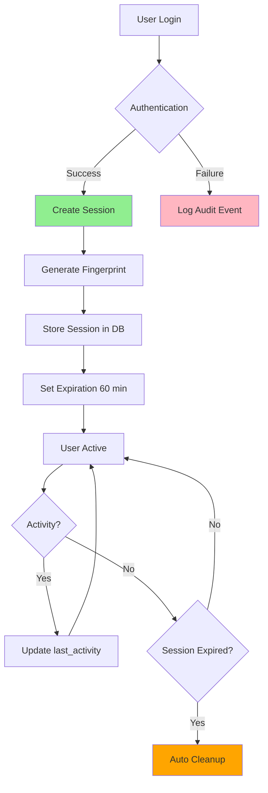

**Key Features:**
- Session fingerprinting (SHA256 of IP + User-Agent + headers)
- Multi-device support (multiple active sessions per user)
- Automatic cleanup of expired sessions (trigger-based)
- 60-minute session timeout (configurable)

---

## Protocol Search & Retrieval Flow

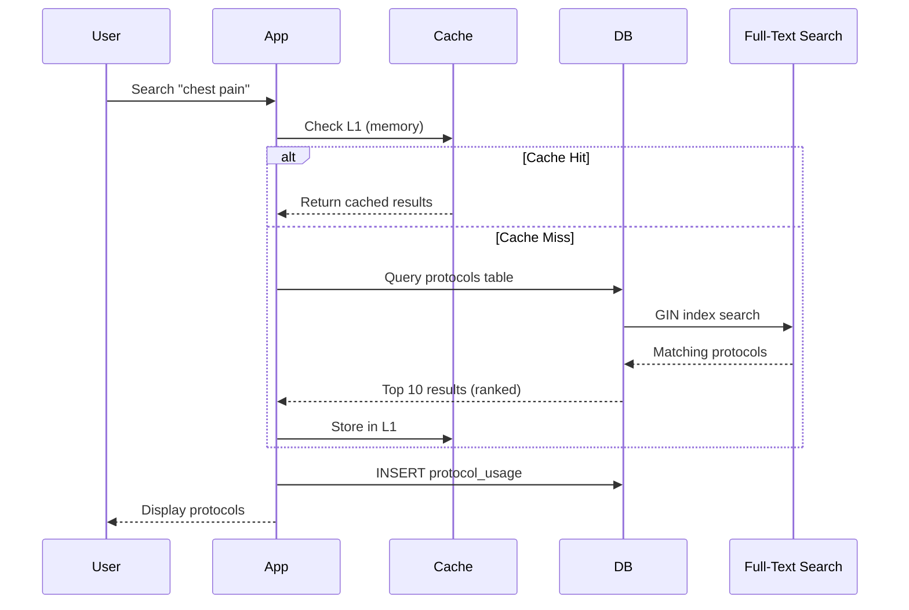

**Performance Optimization:**
- L1 Cache: In-memory LRU (5-minute TTL)
- L2 Cache: Redis (optional, 15-minute TTL)
- GIN Index: Full-text search vector
- Weighted Search: Protocol name (A) > Keywords (B) > Content (C)
- Popularity Boost: 70% relevance + 30% popularity score

---

## Patient Context Lifecycle (HIPAA-Compliant)

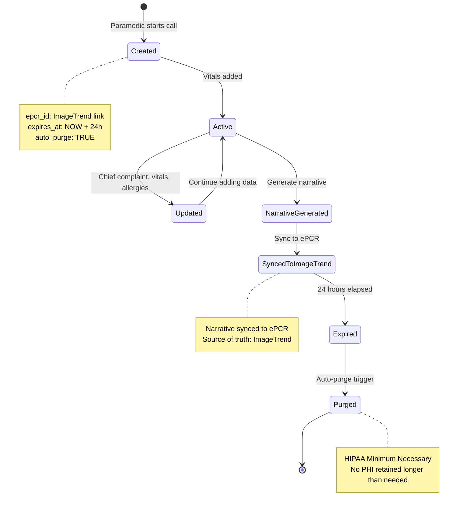

**HIPAA Compliance:**
- Auto-purge after 24 hours (minimum necessary principle)
- Field-level encryption for PHI (chief_complaint, allergies)
- All access logged to audit_logs table
- No patient names or identifiers stored (only demographics)

---

## ImageTrend Bidirectional Sync

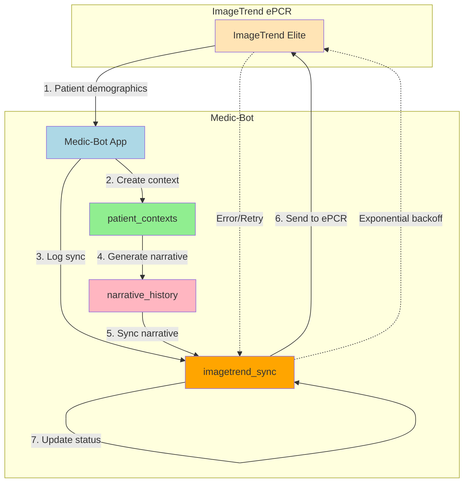

**Sync Strategy:**
- **Inbound:** Patient demographics, vitals, dispatch code
- **Outbound:** Generated narrative, protocols used, medications
- **Retry Logic:** Exponential backoff (1min, 2min, 4min) max 3 retries
- **Error Handling:** Log failures to audit_logs, alert on-call

---

## Audit Trail & Compliance Logging

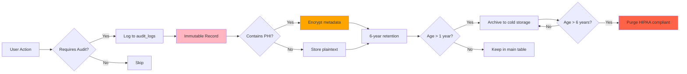

**Audit Actions Tracked:**
- User: login, logout, session start/end
- Protocol: view, search, apply
- Patient: create, view, update, delete
- Medication: dose calculation
- Narrative: generate, sync
- PHI: any access to patient data
- Admin: config changes, user management

**HIPAA Requirements Met:**
- Immutable audit trail (triggers prevent UPDATE/DELETE)
- 6-year retention period
- All PHI access logged
- Includes: who, what, when, where (IP), outcome

---

## Protocol Version Control & Approval Workflow

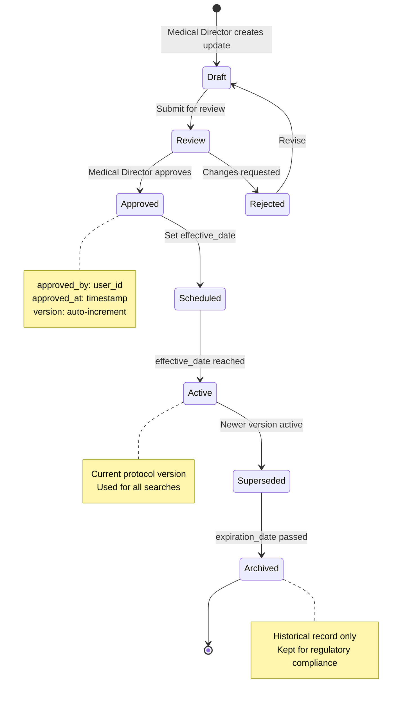

**Version Control Features:**
- Every protocol change creates new version
- Previous versions retained permanently
- Medical director approval required
- Effective date scheduling
- Audit trail of all changes

---

## Medication Dosing Safety Checks

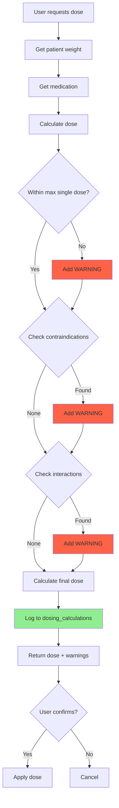

**Safety Features:**
- Max single dose validation
- Max daily dose validation
- Contraindication checking
- Drug interaction alerts
- Pediatric vs adult dosing
- Weight-based calculations
- Audit trail of all calculations

---

## Rate Limiting & Security

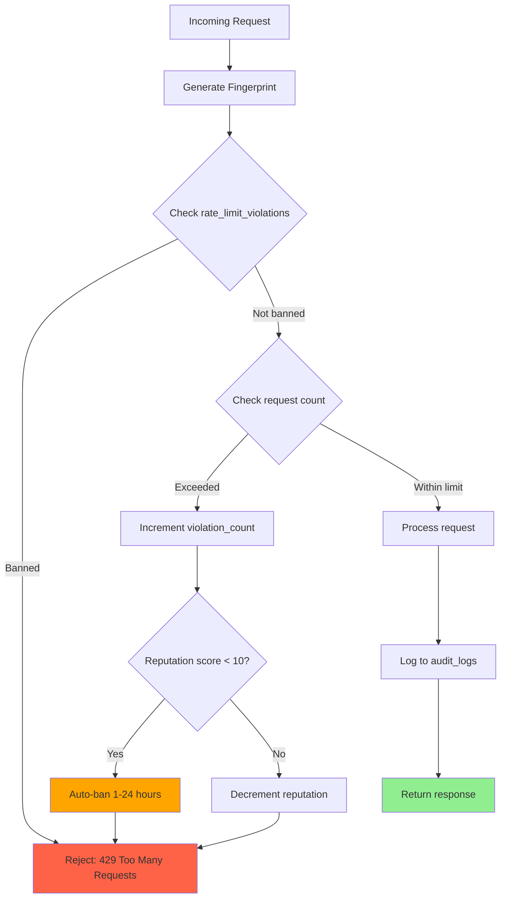

**Rate Limit Tiers:**
- CHAT: 20 requests/minute
- API: 60 requests/minute
- DOSING: 30 requests/minute
- AUTH: 5 requests/15 minutes
- PHI: 50 requests/minute
- GLOBAL: 500 requests/15 minutes

**Reputation System:**
- Start: 100 points
- Violation: -5 points
- Ban threshold: <10 points
- Ban duration: 1 hour (score 6-10), 24 hours (score 0-5)

---

## Data Retention & Archival Strategy

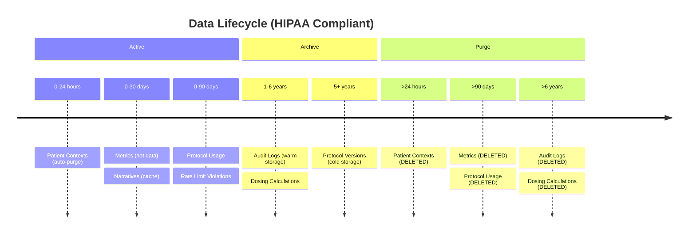

**Automated Retention Jobs:**
- **Daily (3 AM):** Purge expired patient contexts, sessions, old metrics
- **Hourly:** Refresh materialized views for analytics
- **Monthly:** Create new audit log partition
- **Annually:** Archive audit logs >1 year to cold storage

---

## Backup & Disaster Recovery

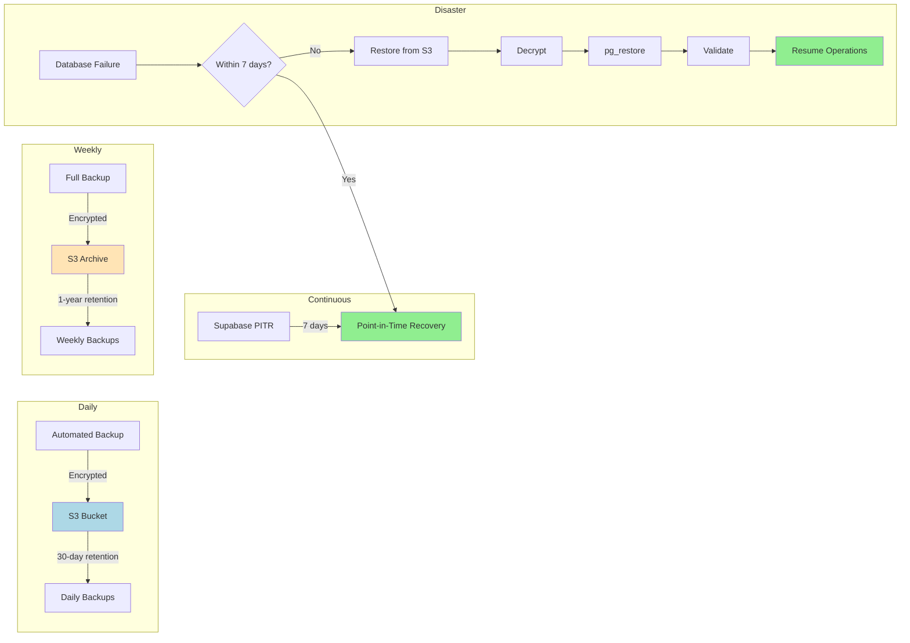

**Recovery Objectives:**
- **RTO (Recovery Time Objective):** <2 hours
- **RPO (Recovery Point Objective):** <1 second (PITR), <24 hours (daily backup)
- **Backup Encryption:** AES-256-CBC
- **Backup Location:** S3 us-west-2 (same region as Supabase)

---

## Performance Monitoring & Alerting

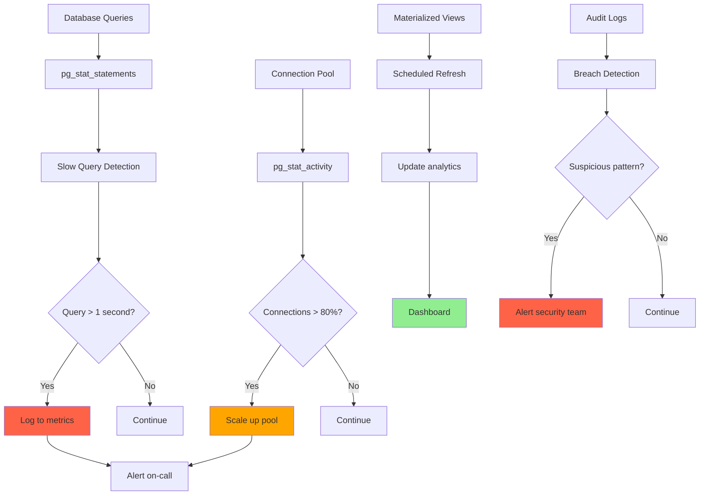

**Key Metrics Monitored:**
- Response time (P50, P95, P99)
- Error rate by endpoint
- Connection pool utilization
- Slow queries (>1 second)
- Cache hit ratio (target: >95%)
- Database CPU/memory
- Breach detection patterns

---

## Schema Migration Strategy

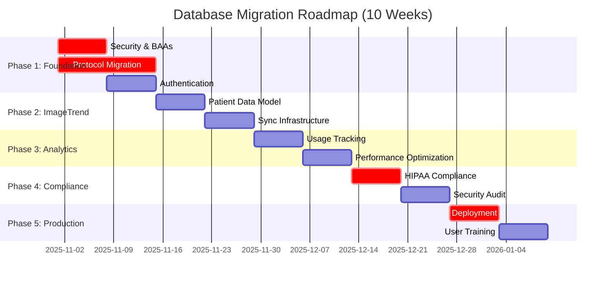

**Critical Path:**
1. Week 1-2: Foundation (Security + Protocol Migration)
2. Week 3-4: ImageTrend Integration
3. Week 5-6: Analytics & Optimization
4. Week 7-8: HIPAA Compliance & Security
5. Week 9-10: Production Deployment & Training

**Rollback Plan:**
- Keep JSON files for 30 days post-migration
- Feature flag to switch between database and file-based
- Blue-green deployment for zero downtime
- Automated rollback if error rate >5%

---

## Summary Statistics

### Current State (October 2025)

| Entity | Count | Growth Rate | Retention |
|--------|-------|-------------|-----------|
| Protocols | 7,012 | Stable | Permanent |
| Provider Impressions | 102 | Stable | Permanent |
| Medications | ~50 | Stable | Permanent |
| Users | ~100 (estimated) | +10/month | Permanent |
| Active Sessions | ~20 (peak) | Variable | 60 minutes |
| Audit Logs | ~100K/year | +20%/year | 6 years |
| Patient Contexts | ~50 (concurrent) | Variable | 24 hours |

### Projected Growth (Year 1)

| Metric | Current | +6 months | +12 months |
|--------|---------|-----------|------------|
| Users | 100 | 200 | 400 |
| Daily Active Users | 20 | 50 | 100 |
| Protocols Accessed/Day | 500 | 1,500 | 3,000 |
| Narratives Generated/Day | 50 | 150 | 300 |
| Database Size | <1GB | 2-3GB | 5-8GB |
| Audit Log Rows | 100K | 600K | 1.2M |

### Performance Benchmarks

| Operation | Current (File) | Target (DB) | Improvement |
|-----------|---------------|-------------|-------------|
| Protocol Search | 50-200ms | <50ms | 4x faster |
| Full KB Load | 500ms | N/A | Eliminated |
| Triage Matching | 100-300ms | <100ms | 2x faster |
| Dosing Calc | 10-20ms | <15ms | Same/Better |

---

**Document Version:** 2.0
**Last Updated:** October 31, 2025
**Next Review:** Post-migration (December 2025)
