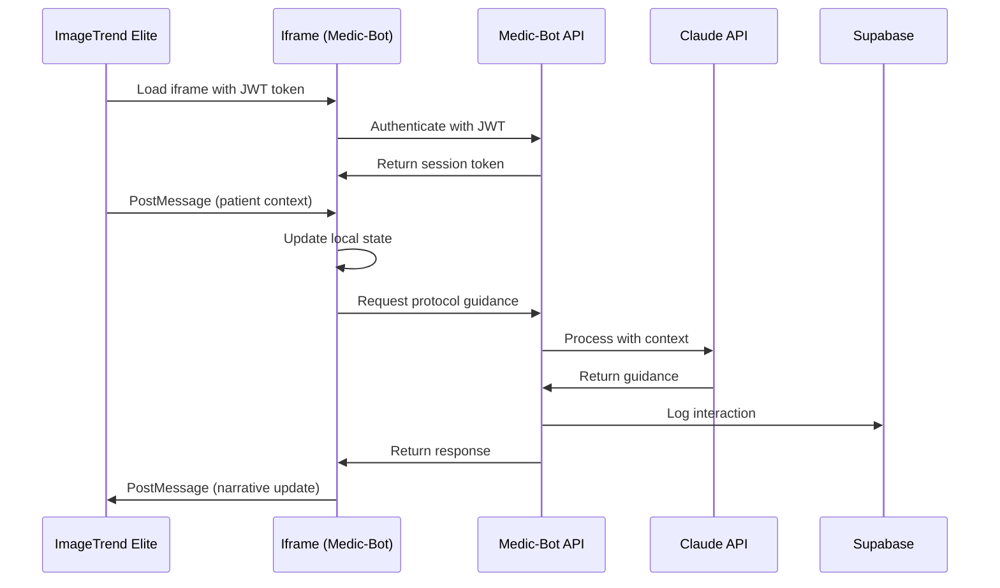

# ImageTrend Integration Implementation Guide

## Executive Summary

This document provides a detailed implementation guide for integrating Medic-Bot with ImageTrend Elite ePCR platform. It covers technical specifications, code examples, security considerations, and a week-by-week implementation plan.

---

## 1. Integration Architecture Overview

### 1.1 High-Level Architecture



### 1.2 Communication Flow

```typescript
// Communication flow types
interface CommunicationFlow {
  // 1. Initial handshake
  handshake: {
    imagetrend: 'iframe.load' -> 'auth.init';
    medicbot: 'auth.verify' -> 'ready.signal';
  };

  // 2. Context synchronization
  contextSync: {
    imagetrend: 'patient.update' -> 'vitals.update';
    medicbot: 'state.change' -> 'data.request';
  };

  // 3. Data exchange
  dataExchange: {
    imagetrend: 'narrative.request' -> 'protocol.request';
    medicbot: 'narrative.push' -> 'protocol.selected';
  };
}
```

---

## 2. Authentication & Security Implementation

### 2.1 JWT Authentication Service

```typescript
// /lib/services/auth/jwt-service.ts
import jwt from 'jsonwebtoken';
import { z } from 'zod';

const TokenPayloadSchema = z.object({
  sub: z.string(), // User ID
  org: z.string(), // Organization (LA County Fire)
  role: z.enum(['emt', 'paramedic', 'supervisor', 'admin']),
  permissions: z.array(z.string()),
  iat: z.number(),
  exp: z.number(),
  imagetrend_session: z.string().optional()
});

export class JWTService {
  private readonly secret = process.env.JWT_SECRET!;
  private readonly publicKey = process.env.JWT_PUBLIC_KEY!;

  async verifyImageTrendToken(token: string): Promise<TokenPayload> {
    try {
      // Verify with ImageTrend's public key
      const decoded = jwt.verify(token, this.publicKey, {
        algorithms: ['RS256'],
        issuer: 'imagetrend.com',
        audience: 'medic-bot.lacfd.org'
      });

      // Validate payload structure
      const payload = TokenPayloadSchema.parse(decoded);

      // Additional security checks
      if (payload.exp < Date.now() / 1000) {
        throw new Error('Token expired');
      }

      return payload;
    } catch (error) {
      throw new AuthenticationError('Invalid ImageTrend token', error);
    }
  }

  async createSessionToken(payload: TokenPayload): Promise<string> {
    // Create internal session token
    return jwt.sign(
      {
        ...payload,
        iss: 'medic-bot',
        aud: 'medic-bot-api'
      },
      this.secret,
      { expiresIn: '1h' }
    );
  }
}
```

### 2.2 Middleware Implementation

```typescript
// /lib/middleware/auth-middleware.ts
import { NextRequest, NextResponse } from 'next/server';
import { JWTService } from '@/lib/services/auth/jwt-service';

export async function authMiddleware(request: NextRequest) {
  const jwtService = new JWTService();

  // Extract token from Authorization header
  const authHeader = request.headers.get('Authorization');
  if (!authHeader?.startsWith('Bearer ')) {
    return NextResponse.json(
      { error: 'Missing authentication token' },
      { status: 401 }
    );
  }

  const token = authHeader.substring(7);

  try {
    // Verify token
    const payload = await jwtService.verifyImageTrendToken(token);

    // Add user context to request
    request.headers.set('X-User-Id', payload.sub);
    request.headers.set('X-User-Role', payload.role);
    request.headers.set('X-User-Org', payload.org);

    return NextResponse.next();
  } catch (error) {
    return NextResponse.json(
      { error: 'Invalid authentication token' },
      { status: 401 }
    );
  }
}
```

---

## 3. Iframe Embedding Implementation

### 3.1 Iframe Container Component

```typescript
// /app/components/imagetrend/iframe-container.tsx
'use client';

import { useEffect, useRef, useState } from 'react';
import { useImageTrendBridge } from '@/app/hooks/use-imagetrend-bridge';

interface IframeContainerProps {
  token: string;
  patientId?: string;
  incidentId?: string;
  config?: EmbeddingConfig;
}

export function IframeContainer({
  token,
  patientId,
  incidentId,
  config
}: IframeContainerProps) {
  const iframeRef = useRef<HTMLIFrameElement>(null);
  const [ready, setReady] = useState(false);
  const bridge = useImageTrendBridge(iframeRef, token);

  useEffect(() => {
    if (!iframeRef.current) return;

    // Setup PostMessage listener
    const handleMessage = (event: MessageEvent) => {
      // Validate origin
      if (!isValidOrigin(event.origin)) {
        console.warn('Invalid origin:', event.origin);
        return;
      }

      // Handle messages
      switch (event.data.type) {
        case 'medic-bot-ready':
          setReady(true);
          bridge.init({ patientId, incidentId, config });
          break;

        case 'narrative-update':
          bridge.handleNarrativeUpdate(event.data.payload);
          break;

        case 'protocol-selected':
          bridge.handleProtocolSelected(event.data.payload);
          break;
      }
    };

    window.addEventListener('message', handleMessage);
    return () => window.removeEventListener('message', handleMessage);
  }, [bridge, patientId, incidentId, config]);

  return (
    <div className="iframe-container">
      <iframe
        ref={iframeRef}
        src={`${process.env.NEXT_PUBLIC_MEDIC_BOT_URL}?embed=true`}
        title="Medic-Bot Protocol Assistant"
        className="medic-bot-iframe"
        sandbox="allow-scripts allow-same-origin allow-forms"
        allow="microphone"
        loading="lazy"
      />
      {!ready && <div className="loading-overlay">Initializing...</div>}
    </div>
  );
}
```

### 3.2 PostMessage Bridge

```typescript
// /app/hooks/use-imagetrend-bridge.ts
import { useCallback, useEffect, useRef } from 'react';
import { z } from 'zod';

const ALLOWED_ORIGINS = [
  'https://elite.imagetrend.com',
  'https://*.imagetrend.com'
];

export function useImageTrendBridge(
  iframeRef: React.RefObject<HTMLIFrameElement>,
  token: string
) {
  const queueRef = useRef<MessageQueue>([]);
  const readyRef = useRef(false);

  // Send message to iframe
  const sendMessage = useCallback((type: string, payload: any) => {
    if (!iframeRef.current?.contentWindow) {
      console.error('Iframe not ready');
      return;
    }

    const message = {
      type,
      payload,
      timestamp: Date.now(),
      nonce: crypto.randomUUID()
    };

    // Queue if not ready
    if (!readyRef.current) {
      queueRef.current.push(message);
      return;
    }

    // Send message
    iframeRef.current.contentWindow.postMessage(
      message,
      process.env.NEXT_PUBLIC_MEDIC_BOT_URL!
    );
  }, [iframeRef]);

  // Initialize connection
  const init = useCallback((config: any) => {
    sendMessage('init', {
      token,
      ...config
    });
    readyRef.current = true;

    // Flush queued messages
    while (queueRef.current.length > 0) {
      const msg = queueRef.current.shift();
      if (msg) sendMessage(msg.type, msg.payload);
    }
  }, [token, sendMessage]);

  // Update patient context
  const updatePatient = useCallback((patient: PatientData) => {
    sendMessage('patient-update', patient);
  }, [sendMessage]);

  // Request narrative
  const requestNarrative = useCallback((format: string) => {
    sendMessage('narrative-request', { format });
  }, [sendMessage]);

  return {
    init,
    updatePatient,
    requestNarrative,
    sendMessage
  };
}
```

---

## 4. State Management with Zustand

### 4.1 Store Configuration

```typescript
// /lib/stores/app-store.ts
import { create } from 'zustand';
import { devtools, persist, subscribeWithSelector } from 'zustand/middleware';
import { immer } from 'zustand/middleware/immer';

interface AppState {
  // Authentication
  auth: {
    token: string | null;
    user: UserProfile | null;
    permissions: string[];
  };

  // ImageTrend Integration
  imagetrend: {
    connected: boolean;
    patientId: string | null;
    incidentId: string | null;
    lastSync: number | null;
  };

  // Chat
  chat: {
    messages: ChatMessage[];
    loading: boolean;
    error: string | null;
  };

  // Actions
  actions: {
    authenticate: (token: string) => Promise<void>;
    syncWithImageTrend: () => Promise<void>;
    sendMessage: (message: string) => Promise<void>;
    updatePatientContext: (data: PatientData) => void;
  };
}

export const useAppStore = create<AppState>()(
  devtools(
    persist(
      subscribeWithSelector(
        immer((set, get) => ({
          // Initial state
          auth: {
            token: null,
            user: null,
            permissions: []
          },

          imagetrend: {
            connected: false,
            patientId: null,
            incidentId: null,
            lastSync: null
          },

          chat: {
            messages: [],
            loading: false,
            error: null
          },

          // Actions implementation
          actions: {
            authenticate: async (token: string) => {
              const user = await authAPI.verifyToken(token);
              set((state) => {
                state.auth.token = token;
                state.auth.user = user;
                state.auth.permissions = user.permissions;
              });
            },

            syncWithImageTrend: async () => {
              const { imagetrend, chat } = get();
              if (!imagetrend.incidentId) return;

              await imageTrendAPI.syncNarrative({
                incidentId: imagetrend.incidentId,
                messages: chat.messages,
                timestamp: Date.now()
              });

              set((state) => {
                state.imagetrend.lastSync = Date.now();
              });
            },

            sendMessage: async (message: string) => {
              set((state) => {
                state.chat.loading = true;
                state.chat.error = null;
              });

              try {
                const response = await chatAPI.send(message, {
                  patientContext: get().imagetrend.patientId
                });

                set((state) => {
                  state.chat.messages.push(response);
                  state.chat.loading = false;
                });

                // Auto-sync with ImageTrend
                if (get().imagetrend.connected) {
                  await get().actions.syncWithImageTrend();
                }
              } catch (error) {
                set((state) => {
                  state.chat.error = error.message;
                  state.chat.loading = false;
                });
              }
            },

            updatePatientContext: (data: PatientData) => {
              set((state) => {
                state.imagetrend.patientId = data.id;
                // Trigger re-render of dependent components
              });
            }
          }
        }))
      ),
      {
        name: 'medic-bot-storage',
        partialize: (state) => ({
          auth: { token: state.auth.token },
          chat: { messages: state.chat.messages.slice(-50) }
        })
      }
    )
  )
);
```

### 4.2 Cross-Frame State Sync

```typescript
// /lib/services/state-sync-service.ts
export class StateSyncService {
  private syncInterval: NodeJS.Timer | null = null;
  private lastSyncHash: string | null = null;

  startSync(store: AppStore, bridge: ImageTrendBridge) {
    // Subscribe to state changes
    store.subscribe(
      (state) => state.chat.messages,
      (messages) => this.syncMessages(messages, bridge),
      { fireImmediately: false }
    );

    // Periodic sync
    this.syncInterval = setInterval(() => {
      this.performFullSync(store, bridge);
    }, 30000); // Every 30 seconds
  }

  private async syncMessages(messages: ChatMessage[], bridge: ImageTrendBridge) {
    // Calculate hash to detect changes
    const hash = this.calculateHash(messages);
    if (hash === this.lastSyncHash) return;

    // Send update to ImageTrend
    bridge.sendMessage('chat-update', {
      messages: messages.slice(-10), // Last 10 messages
      timestamp: Date.now()
    });

    this.lastSyncHash = hash;
  }

  private async performFullSync(store: AppStore, bridge: ImageTrendBridge) {
    const state = store.getState();

    bridge.sendMessage('full-sync', {
      patient: state.imagetrend.patientId,
      incident: state.imagetrend.incidentId,
      messages: state.chat.messages,
      protocols: state.protocols.selected,
      timestamp: Date.now()
    });
  }
}
```

---

## 5. Patient Context Integration

### 5.1 Patient Data Schema

```typescript
// /lib/types/patient.ts
import { z } from 'zod';

export const PatientDemographicsSchema = z.object({
  id: z.string(),
  firstName: z.string().optional(),
  lastName: z.string().optional(),
  dateOfBirth: z.string().optional(),
  age: z.number().optional(),
  ageUnit: z.enum(['years', 'months', 'days']).optional(),
  gender: z.enum(['male', 'female', 'other', 'unknown']).optional(),
  weight: z.number().optional(),
  weightUnit: z.enum(['kg', 'lbs']).default('kg')
});

export const VitalSignsSchema = z.object({
  timestamp: z.string(),
  bloodPressure: z.object({
    systolic: z.number(),
    diastolic: z.number()
  }).optional(),
  heartRate: z.number().optional(),
  respiratoryRate: z.number().optional(),
  oxygenSaturation: z.number().optional(),
  temperature: z.number().optional(),
  temperatureUnit: z.enum(['C', 'F']).default('F'),
  bloodGlucose: z.number().optional(),
  painScale: z.number().min(0).max(10).optional(),
  gcsTotal: z.number().min(3).max(15).optional()
});

export const PatientContextSchema = z.object({
  demographics: PatientDemographicsSchema,
  chiefComplaint: z.string().optional(),
  vitals: z.array(VitalSignsSchema).default([]),
  medications: z.array(z.object({
    name: z.string(),
    dose: z.string(),
    route: z.string(),
    time: z.string()
  })).default([]),
  allergies: z.array(z.string()).default([]),
  medicalHistory: z.array(z.string()).default([])
});
```

### 5.2 Context Sync Handler

```typescript
// /app/components/imagetrend/context-sync-handler.tsx
'use client';

import { useEffect } from 'react';
import { useAppStore } from '@/lib/stores/app-store';
import { PatientContextSchema } from '@/lib/types/patient';

export function ContextSyncHandler() {
  const updatePatientContext = useAppStore(s => s.actions.updatePatientContext);

  useEffect(() => {
    const handleContextUpdate = (event: MessageEvent) => {
      if (event.data.type !== 'patient-update') return;

      try {
        // Validate patient data
        const patientData = PatientContextSchema.parse(event.data.payload);

        // Update store
        updatePatientContext(patientData);

        // Send acknowledgment
        event.source?.postMessage(
          {
            type: 'patient-update-ack',
            success: true,
            timestamp: Date.now()
          },
          { targetOrigin: event.origin }
        );
      } catch (error) {
        console.error('Invalid patient data:', error);

        event.source?.postMessage(
          {
            type: 'patient-update-ack',
            success: false,
            error: error.message
          },
          { targetOrigin: event.origin }
        );
      }
    };

    window.addEventListener('message', handleContextUpdate);
    return () => window.removeEventListener('message', handleContextUpdate);
  }, [updatePatientContext]);

  return null; // This is a handler component, no UI
}
```

---

## 6. Narrative Generation & Export

### 6.1 NEMSIS-Compliant Narrative Builder

```typescript
// /lib/services/narrative/nemsis-builder.ts
export class NEMSISNarrativeBuilder {
  buildNarrative(data: NarrativeData): NEMSISNarrative {
    return {
      // E13 - Patient Assessment
      'eNarrative.01': this.buildChiefComplaint(data),
      'eNarrative.02': this.buildProviderImpression(data),
      'eNarrative.03': this.buildAssessment(data),
      'eNarrative.04': this.buildTreatment(data),

      // Custom narrative sections
      sections: {
        subjective: this.buildSubjective(data),
        objective: this.buildObjective(data),
        assessment: this.buildAssessmentSection(data),
        plan: this.buildPlan(data)
      },

      // Metadata
      metadata: {
        generatedAt: new Date().toISOString(),
        protocols: data.protocols,
        medications: data.medications,
        version: '3.5.0' // NEMSIS version
      }
    };
  }

  private buildChiefComplaint(data: NarrativeData): string {
    const { patient, chiefComplaint } = data;

    const parts = [
      `${patient.age} y/o ${patient.gender}`,
      `c/o ${chiefComplaint}`,
      patient.onset ? `Onset: ${patient.onset}` : null,
      patient.severity ? `Severity: ${patient.severity}/10` : null
    ].filter(Boolean);

    return parts.join('. ');
  }

  private buildTreatment(data: NarrativeData): string {
    const treatments = [];

    // Medications
    data.medications.forEach(med => {
      treatments.push(
        `${med.time}: ${med.name} ${med.dose} ${med.route} given for ${med.indication}. ` +
        `Response: ${med.response}`
      );
    });

    // Procedures
    data.procedures?.forEach(proc => {
      treatments.push(
        `${proc.time}: ${proc.name} performed. ` +
        `${proc.successful ? 'Successful' : 'Unsuccessful'}. ${proc.notes}`
      );
    });

    return treatments.join(' ');
  }
}
```

### 6.2 Export API Endpoint

```typescript
// /app/api/integrations/imagetrend/export/route.ts
import { NextRequest, NextResponse } from 'next/server';
import { withApiHandler } from '@/lib/api/handler';
import { NEMSISNarrativeBuilder } from '@/lib/services/narrative/nemsis-builder';

export const POST = withApiHandler(
  async (input: unknown, req: NextRequest) => {
    const userId = req.headers.get('X-User-Id');
    const incidentId = req.headers.get('X-Incident-Id');

    try {
      const narrativeData = NarrativeDataSchema.parse(input);

      // Build NEMSIS-compliant narrative
      const builder = new NEMSISNarrativeBuilder();
      const narrative = builder.buildNarrative(narrativeData);

      // Push to ImageTrend (in production)
      if (process.env.IMAGETREND_API_KEY) {
        await pushToImageTrend(incidentId, narrative);
      }

      // Log export
      await auditLogger.log({
        action: 'narrative.export',
        resource: incidentId,
        userId,
        metadata: {
          format: 'nemsis',
          protocols: narrativeData.protocols.length,
          medications: narrativeData.medications.length
        }
      });

      return NextResponse.json({
        success: true,
        narrative,
        exportedAt: new Date().toISOString()
      });
    } catch (error) {
      return NextResponse.json(
        { error: 'Failed to export narrative' },
        { status: 500 }
      );
    }
  },
  {
    rateLimit: 'API',
    loggerName: 'api.imagetrend.export'
  }
);

async function pushToImageTrend(incidentId: string, narrative: NEMSISNarrative) {
  const response = await fetch(`${process.env.IMAGETREND_API_URL}/incidents/${incidentId}/narrative`, {
    method: 'PUT',
    headers: {
      'Authorization': `Bearer ${process.env.IMAGETREND_API_KEY}`,
      'Content-Type': 'application/json'
    },
    body: JSON.stringify({
      narrative: narrative.sections,
      nemsis: {
        'eNarrative.01': narrative['eNarrative.01'],
        'eNarrative.02': narrative['eNarrative.02'],
        'eNarrative.03': narrative['eNarrative.03'],
        'eNarrative.04': narrative['eNarrative.04']
      },
      metadata: narrative.metadata
    })
  });

  if (!response.ok) {
    throw new Error(`ImageTrend API error: ${response.status}`);
  }

  return response.json();
}
```

---

## 7. Offline Support Implementation

### 7.1 Service Worker Configuration

```javascript
// /public/sw.js
const CACHE_VERSION = 'v2.0.0';
const CACHE_NAME = `medic-bot-${CACHE_VERSION}`;

const STATIC_ASSETS = [
  '/',
  '/protocols',
  '/manifest.json',
  '/kb/ems_kb_clean.json'
];

// Install event - cache static assets
self.addEventListener('install', (event) => {
  event.waitUntil(
    caches.open(CACHE_NAME).then((cache) => {
      return cache.addAll(STATIC_ASSETS);
    })
  );
});

// Fetch event - serve from cache when offline
self.addEventListener('fetch', (event) => {
  event.respondWith(
    caches.match(event.request).then((cachedResponse) => {
      // Return cached response if available
      if (cachedResponse) {
        return cachedResponse;
      }

      // Try network request
      return fetch(event.request).then((response) => {
        // Cache successful responses
        if (response.status === 200) {
          const responseClone = response.clone();
          caches.open(CACHE_NAME).then((cache) => {
            cache.put(event.request, responseClone);
          });
        }
        return response;
      }).catch(() => {
        // Offline fallback
        if (event.request.destination === 'document') {
          return caches.match('/offline.html');
        }
      });
    })
  );
});
```

### 7.2 IndexedDB Protocol Cache

```typescript
// /lib/services/offline/protocol-cache.ts
import { openDB, DBSchema } from 'idb';

interface ProtocolDB extends DBSchema {
  protocols: {
    key: string;
    value: {
      code: string;
      name: string;
      content: string;
      category: string;
      keywords: string[];
      lastUpdated: number;
    };
    indexes: { 'by-category': string; 'by-keyword': string };
  };
}

export class ProtocolCache {
  private db: Promise<IDBDatabase>;

  constructor() {
    this.db = openDB<ProtocolDB>('protocol-cache', 1, {
      upgrade(db) {
        const store = db.createObjectStore('protocols', {
          keyPath: 'code'
        });
        store.createIndex('by-category', 'category');
        store.createIndex('by-keyword', 'keywords', { multiEntry: true });
      }
    });
  }

  async cacheProtocols(protocols: Protocol[]): Promise<void> {
    const db = await this.db;
    const tx = db.transaction('protocols', 'readwrite');

    await Promise.all([
      ...protocols.map(p => tx.store.put({
        ...p,
        lastUpdated: Date.now()
      })),
      tx.done
    ]);
  }

  async searchOffline(query: string): Promise<Protocol[]> {
    const db = await this.db;
    const results = new Set<Protocol>();

    // Search by keyword index
    const keywords = query.toLowerCase().split(' ');
    for (const keyword of keywords) {
      const matches = await db.getAllFromIndex('protocols', 'by-keyword', keyword);
      matches.forEach(m => results.add(m));
    }

    // Score and sort results
    return Array.from(results)
      .map(p => ({
        ...p,
        score: this.calculateRelevance(p, query)
      }))
      .sort((a, b) => b.score - a.score)
      .slice(0, 10);
  }

  private calculateRelevance(protocol: Protocol, query: string): number {
    const queryLower = query.toLowerCase();
    let score = 0;

    // Title match
    if (protocol.name.toLowerCase().includes(queryLower)) {
      score += 10;
    }

    // Content match
    const contentMatches = (protocol.content.toLowerCase().match(new RegExp(queryLower, 'g')) || []).length;
    score += contentMatches;

    // Keyword match
    protocol.keywords.forEach(keyword => {
      if (keyword.toLowerCase().includes(queryLower)) {
        score += 5;
      }
    });

    return score;
  }
}
```

---

## 8. Performance Optimizations

### 8.1 Request Batching

```typescript
// /lib/services/optimization/request-batcher.ts
export class RequestBatcher {
  private queue = new Map<string, PendingRequest[]>();
  private timer: NodeJS.Timeout | null = null;
  private readonly batchDelay = 50; // ms
  private readonly maxBatchSize = 10;

  async add<T>(
    endpoint: string,
    params: any,
    resolver: (result: T) => void,
    rejecter: (error: Error) => void
  ): Promise<void> {
    const key = `${endpoint}:${JSON.stringify(params)}`;

    if (!this.queue.has(key)) {
      this.queue.set(key, []);
    }

    this.queue.get(key)!.push({ params, resolver, rejecter });

    if (!this.timer) {
      this.timer = setTimeout(() => this.flush(), this.batchDelay);
    }
  }

  private async flush(): Promise<void> {
    const batches = Array.from(this.queue.entries());
    this.queue.clear();
    this.timer = null;

    for (const [endpoint, requests] of batches) {
      // Split into smaller batches if needed
      const chunks = this.chunk(requests, this.maxBatchSize);

      for (const chunk of chunks) {
        try {
          const results = await this.executeBatch(endpoint, chunk);

          chunk.forEach((req, index) => {
            req.resolver(results[index]);
          });
        } catch (error) {
          chunk.forEach(req => {
            req.rejecter(error as Error);
          });
        }
      }
    }
  }

  private async executeBatch(endpoint: string, requests: PendingRequest[]): Promise<any[]> {
    const response = await fetch('/api/batch', {
      method: 'POST',
      headers: { 'Content-Type': 'application/json' },
      body: JSON.stringify({
        endpoint,
        requests: requests.map(r => r.params)
      })
    });

    if (!response.ok) {
      throw new Error(`Batch request failed: ${response.status}`);
    }

    return response.json();
  }

  private chunk<T>(array: T[], size: number): T[][] {
    const chunks: T[][] = [];
    for (let i = 0; i < array.length; i += size) {
      chunks.push(array.slice(i, i + size));
    }
    return chunks;
  }
}
```

### 8.2 Memory Management for iPad

```typescript
// /lib/services/optimization/memory-manager.ts
export class MemoryManager {
  private readonly MAX_MEMORY_MB = 100;
  private readonly CHECK_INTERVAL = 5000;
  private memoryCheckTimer: NodeJS.Timer | null = null;

  startMonitoring() {
    this.memoryCheckTimer = setInterval(() => {
      this.checkMemoryPressure();
    }, this.CHECK_INTERVAL);
  }

  private async checkMemoryPressure() {
    if ('memory' in performance) {
      const memory = (performance as any).memory;
      const usedMB = memory.usedJSHeapSize / 1024 / 1024;

      if (usedMB > this.MAX_MEMORY_MB) {
        this.handleMemoryPressure();
      }
    }
  }

  private handleMemoryPressure() {
    // Clear caches
    if ('caches' in window) {
      caches.keys().then(names => {
        names.forEach(name => {
          if (name.includes('temp-')) {
            caches.delete(name);
          }
        });
      });
    }

    // Clear old messages from store
    const store = useAppStore.getState();
    const messages = store.chat.messages;
    if (messages.length > 100) {
      store.actions.trimMessages(50); // Keep last 50
    }

    // Trigger garbage collection if available
    if ('gc' in window) {
      (window as any).gc();
    }
  }

  stopMonitoring() {
    if (this.memoryCheckTimer) {
      clearInterval(this.memoryCheckTimer);
      this.memoryCheckTimer = null;
    }
  }
}
```

---

## 9. Testing Strategy

### 9.1 Integration Tests

```typescript
// /tests/integration/imagetrend-integration.test.ts
import { render, screen, waitFor } from '@testing-library/react';
import { IframeContainer } from '@/app/components/imagetrend/iframe-container';

describe('ImageTrend Integration', () => {
  let mockPostMessage: jest.Mock;

  beforeEach(() => {
    mockPostMessage = jest.fn();
    global.parent.postMessage = mockPostMessage;
  });

  it('should authenticate with ImageTrend token', async () => {
    const token = 'test-jwt-token';

    render(<IframeContainer token={token} />);

    await waitFor(() => {
      expect(mockPostMessage).toHaveBeenCalledWith(
        expect.objectContaining({
          type: 'auth-init',
          payload: expect.objectContaining({ token })
        }),
        expect.any(String)
      );
    });
  });

  it('should sync patient context bidirectionally', async () => {
    const { rerender } = render(
      <IframeContainer token="token" patientId="123" />
    );

    // Simulate patient update from ImageTrend
    window.postMessage(
      {
        type: 'patient-update',
        payload: {
          demographics: { id: '123', age: 45, gender: 'male' },
          vitals: [{ hr: 80, bp: '120/80' }]
        }
      },
      '*'
    );

    await waitFor(() => {
      const store = useAppStore.getState();
      expect(store.imagetrend.patientId).toBe('123');
    });
  });

  it('should handle narrative export', async () => {
    const response = await fetch('/api/integrations/imagetrend/export', {
      method: 'POST',
      headers: {
        'Authorization': 'Bearer test-token',
        'Content-Type': 'application/json'
      },
      body: JSON.stringify({
        incidentId: 'TEST-001',
        protocols: ['TP 1211'],
        medications: [{
          name: 'Aspirin',
          dose: '324mg',
          route: 'PO',
          time: '14:30'
        }]
      })
    });

    expect(response.ok).toBe(true);
    const data = await response.json();
    expect(data.narrative).toBeDefined();
    expect(data.narrative.sections).toHaveProperty('subjective');
  });
});
```

### 9.2 Security Tests

```typescript
// /tests/security/auth-security.test.ts
describe('Authentication Security', () => {
  it('should reject expired JWT tokens', async () => {
    const expiredToken = jwt.sign(
      { exp: Math.floor(Date.now() / 1000) - 3600 },
      'test-secret'
    );

    const response = await fetch('/api/chat', {
      headers: { 'Authorization': `Bearer ${expiredToken}` }
    });

    expect(response.status).toBe(401);
  });

  it('should validate origin for PostMessage', () => {
    const maliciousOrigin = 'https://evil.com';

    const event = new MessageEvent('message', {
      origin: maliciousOrigin,
      data: { type: 'patient-update' }
    });

    const handler = new MessageHandler();
    const result = handler.validateOrigin(event.origin);

    expect(result).toBe(false);
  });

  it('should enforce rate limits per user', async () => {
    const token = 'valid-token';

    // Make 100 requests rapidly
    const requests = Array(100).fill(null).map(() =>
      fetch('/api/chat', {
        headers: { 'Authorization': `Bearer ${token}` }
      })
    );

    const responses = await Promise.all(requests);
    const rateLimited = responses.filter(r => r.status === 429);

    expect(rateLimited.length).toBeGreaterThan(0);
  });
});
```

---

## 10. Implementation Timeline

### Week 1: Security Foundation
- [ ] Day 1-2: Implement JWT authentication service
- [ ] Day 2-3: Add auth middleware to all API routes
- [ ] Day 3-4: Setup cross-origin security headers
- [ ] Day 4-5: Implement RBAC permission system
- [ ] Day 5: Security testing and penetration testing

### Week 2: State Management
- [ ] Day 1-2: Setup Zustand store with persistence
- [ ] Day 2-3: Implement cross-frame state sync
- [ ] Day 3-4: Add session isolation for iframe
- [ ] Day 4-5: Create state migration utilities
- [ ] Day 5: Integration testing

### Week 3: ImageTrend Bridge
- [ ] Day 1-2: Build PostMessage API handlers
- [ ] Day 2-3: Create iframe container component
- [ ] Day 3-4: Implement message validation and queuing
- [ ] Day 4-5: Add error recovery and retry logic
- [ ] Day 5: End-to-end testing with mock ImageTrend

### Week 4: Patient Context
- [ ] Day 1-2: Implement patient data schema validation
- [ ] Day 2-3: Build context synchronization handlers
- [ ] Day 3-4: Add vitals and medication tracking
- [ ] Day 4-5: Create patient history management
- [ ] Day 5: Clinical accuracy validation

### Week 5: Narrative Export
- [ ] Day 1-2: Build NEMSIS-compliant formatter
- [ ] Day 2-3: Implement export API endpoints
- [ ] Day 3-4: Add narrative versioning and history
- [ ] Day 4-5: Create batch export capabilities
- [ ] Day 5: NEMSIS compliance testing

### Week 6: Offline Support
- [ ] Day 1-2: Enhance service worker caching
- [ ] Day 2-3: Implement IndexedDB protocol cache
- [ ] Day 3-4: Add offline search capabilities
- [ ] Day 4-5: Create sync queue for offline actions
- [ ] Day 5: Field testing offline scenarios

---

## 11. Deployment Checklist

### Pre-deployment Requirements
- [ ] JWT authentication fully implemented
- [ ] All API endpoints secured with auth middleware
- [ ] Cross-origin validation in place
- [ ] Rate limiting configured per user
- [ ] HIPAA audit logging implemented
- [ ] PHI encryption at rest
- [ ] Session timeout configured (30 minutes)
- [ ] Security penetration testing completed
- [ ] Load testing completed (1000 concurrent users)
- [ ] ImageTrend sandbox testing successful

### ImageTrend Integration Requirements
- [ ] OAuth 2.0 flow implemented
- [ ] PostMessage API documented
- [ ] Patient context sync verified
- [ ] Narrative export validated
- [ ] Error handling comprehensive
- [ ] Retry logic implemented
- [ ] Timeout handling in place
- [ ] Message queuing functional
- [ ] Origin validation strict
- [ ] Frame sandboxing configured

### Production Environment
- [ ] Environment variables configured
- [ ] SSL certificates valid
- [ ] CDN configured for static assets
- [ ] Database connection pooling setup
- [ ] Monitoring and alerting configured
- [ ] Backup and recovery tested
- [ ] Rollback procedure documented
- [ ] Support documentation complete
- [ ] Training materials prepared
- [ ] SLA agreements in place

---

## 12. Conclusion

This implementation guide provides a comprehensive roadmap for integrating Medic-Bot with ImageTrend Elite. The phased approach ensures security is addressed first, followed by core integration features, and finally optimization for field use.

Key success factors:
1. **Security First:** JWT authentication and cross-origin validation are critical
2. **Reliable State Sync:** Zustand with cross-frame synchronization enables seamless integration
3. **Offline Capability:** IndexedDB caching ensures field reliability
4. **Performance:** Request batching and memory management optimize for iPad constraints
5. **Compliance:** HIPAA-compliant audit logging and PHI handling

With this implementation, Medic-Bot will provide seamless protocol guidance within ImageTrend Elite, improving paramedic efficiency and patient care quality for LA County Fire Department.